# Object Detection with YOLO26

## Overview

YOLO26 is the latest version of YOLO model family developed by [Ultralytics](https://www.ultralytics.com/). It demonstrates decent accuracy in real-time computer vision tasks and proposes accessible deployment. YOLO26 is integrated into Supervisely Ecosystem in the form of [Train YOLO v8-26](https://ecosystem.supervisely.com/apps/yolo/supervisely_integration/train) and [Serve YOLO v8-26 apps](https://ecosystem.supervisely.com/apps/yolo/supervisely_integration/serve) - for training and inference respectively.

<figure>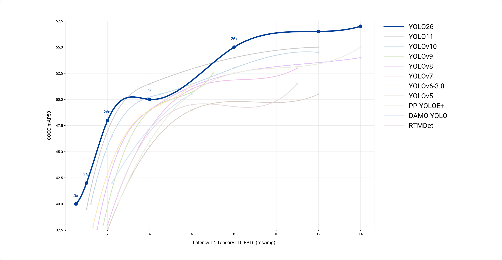<figcaption></figcaption></figure>

## What's New

**DFL Elimination**

While effective, the Distribution Focal Loss (DFL) module added complexity during export and reduced hardware compatibility. YOLO26 removes DFL entirely, streamlining inference and expanding support for edge and low-power devices.

**True End-to-End, NMS-Free Inference**

Unlike conventional detectors that depend on NMS as a post-processing step, YOLO26 operates as a fully end-to-end model. It produces predictions directly, lowering latency and enabling faster, lighter, and more robust production deployment.

**ProgLoss + STAL**

Enhanced loss designs boost overall detection accuracy, with especially strong gains in small-object detection—crucial for IoT, robotics, aerial imagery, and other edge-focused use cases.

**MuSGD Optimizer**

YOLO26 introduces MuSGD, a hybrid optimizer that blends SGD with Muon. Inspired by Moonshot AI’s Kimi K2, it brings advanced optimization techniques from LLM training into computer vision, resulting in more stable training and quicker convergence.

**Up to 43% Faster CPU Inference**

Purpose-built for edge computing, YOLO26 achieves major CPU inference speedups, delivering real-time performance even on devices without GPUs.

**Enhanced Instance Segmentation**

Adds semantic segmentation loss to improve convergence and upgrades the proto module to exploit multi-scale features, producing higher-quality segmentation masks.

## Training YOLO26 in Supervisely

This section shows how to train YOLO26 using [Train YOLO v8–26](https://ecosystem.supervisely.com/apps/yolo/supervisely_integration/train) app inside Supervisely Ecosystem.

### Prerequisites

- A Supervisely project with annotated images for **object detection** or **instance segmentation**.  
- A running [agent](../../getting-started/connect-your-computer.md) with GPU access (recommended for training).

We will take [Surgical Tools dataset](https://datasetninja.com/labeled-surgical-tools-and-images) from Dataset Ninja as an example.

<figure>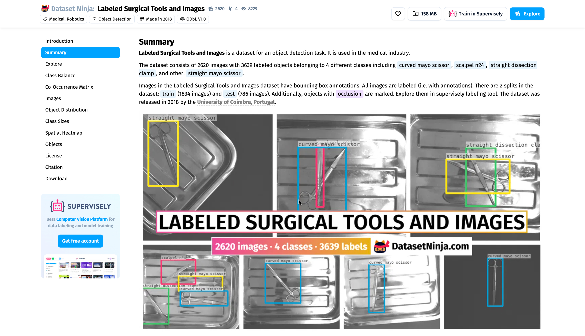<figcaption></figcaption></figure>

### Step 1: Launch the Training App

1. Open App Ecosystem.  
2. Choose Train YOLO v8 – 26 app.  
3. Select images project for model training.

<figure>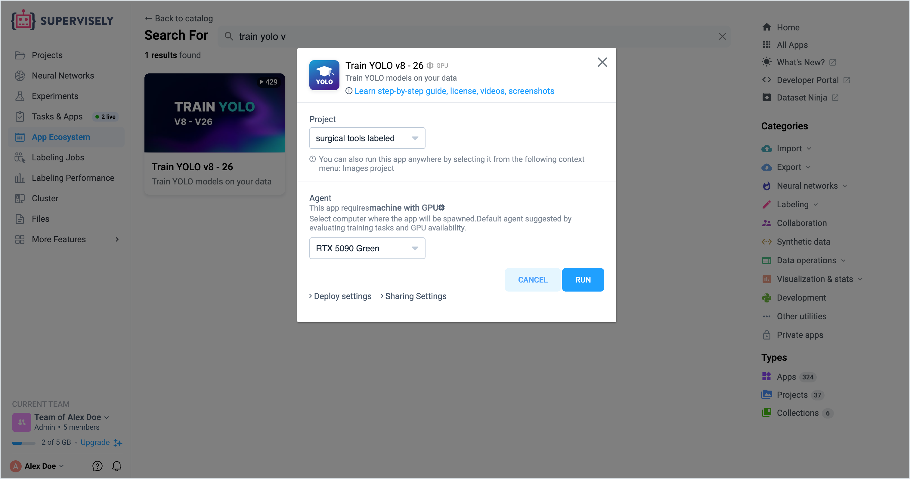<figcaption></figcaption></figure>

Alternatively, you can launch training app from context menu of your images project:

<figure>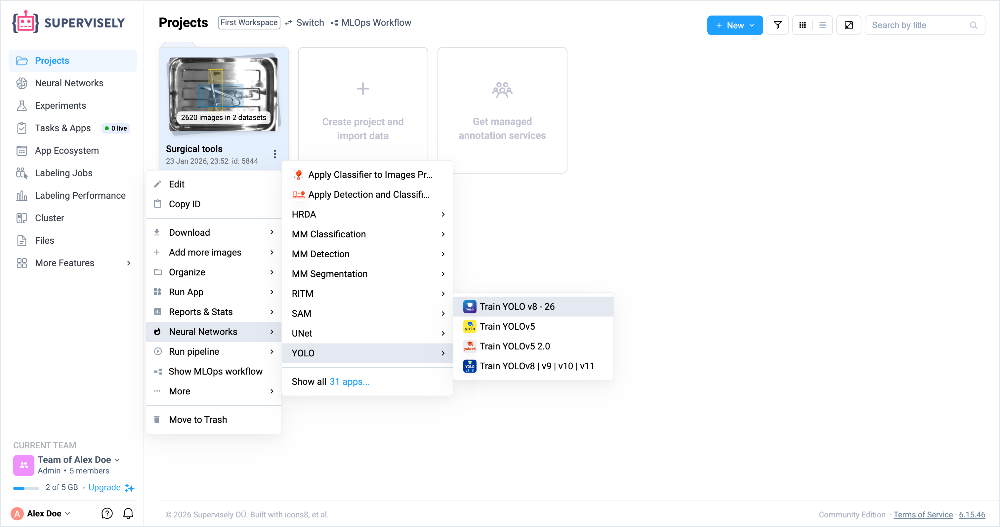<figcaption></figcaption></figure>

### Step 2: Choose YOLO26 Model Variant and Task Type

Choose a YOLO26 pretrained checkpoint, either from Ultralytics (COCO) or from your previous experiment in Team Files, adjusting the variant to your preferred balance of speed, accuracy, and hardware performance.

<figure>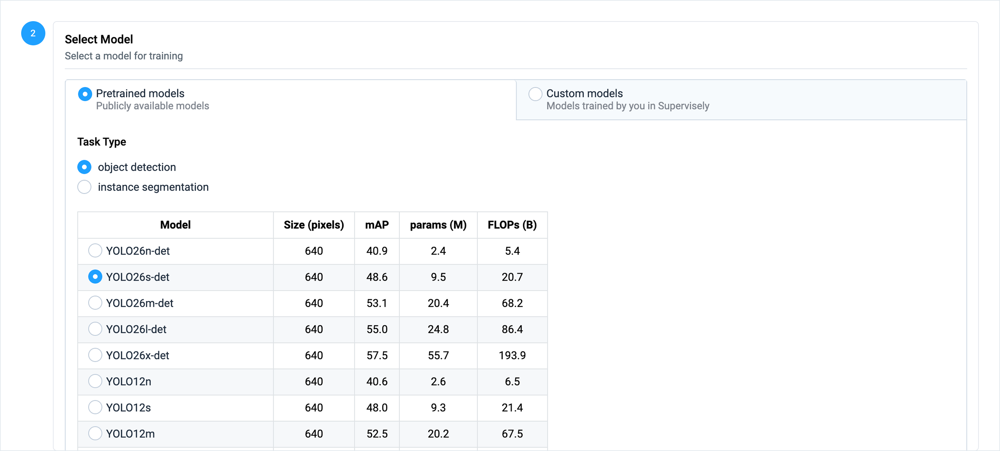<figcaption></figcaption></figure>

### Step 3: Select Annotation Classes for Training

Pick the subset of classes that YOLO26 should learn (you can train on all or only a part of total).

<figure>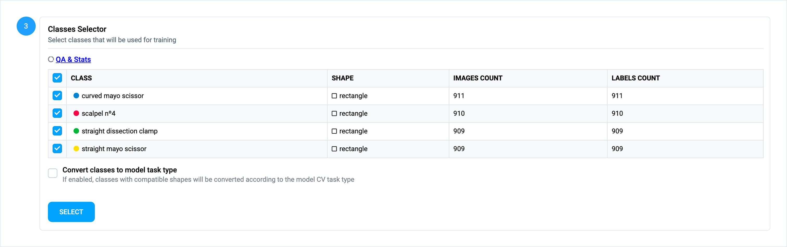<figcaption></figcaption></figure>

### Step 4: Configure Dataset Split

Select suitable data split method (random / based on item tags / based on datasets / based on collections).

<figure>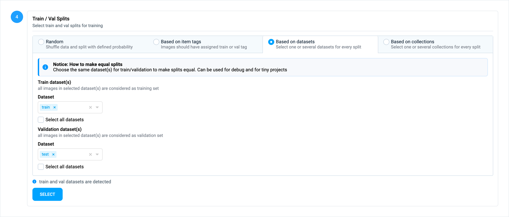<figcaption></figcaption></figure>

### Step 5: Configure Training Hyperparameters

Set training parameters such as batch size, number of epochs, learning rate and many others.

<figure>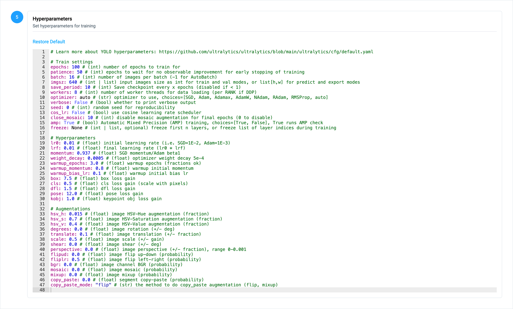<figcaption></figcaption></figure>

### Step 6: Run Training

Enter an experiment name and click **Start** to launch training. Monitor training progress epoch by epoch in app UI.

<figure>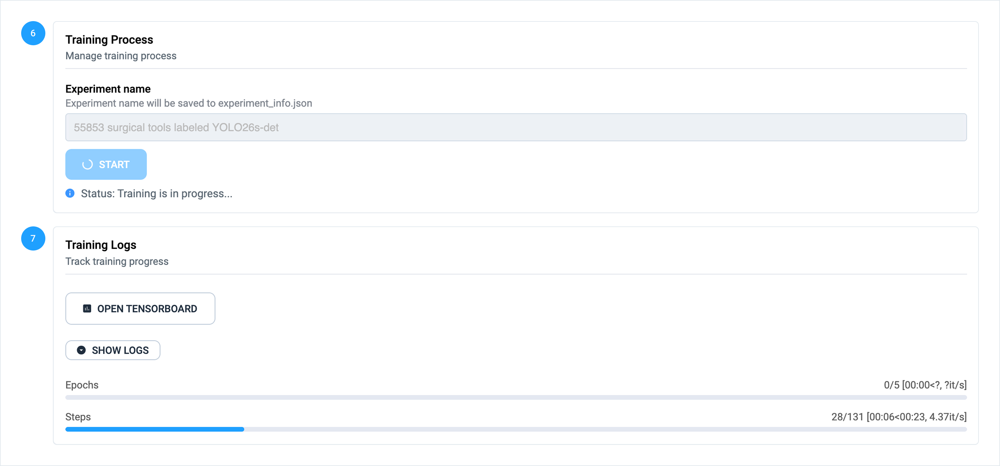<figcaption></figcaption></figure>

Click **Open Tensorboard** to monitor key performance metrics and loss function values.

<figure>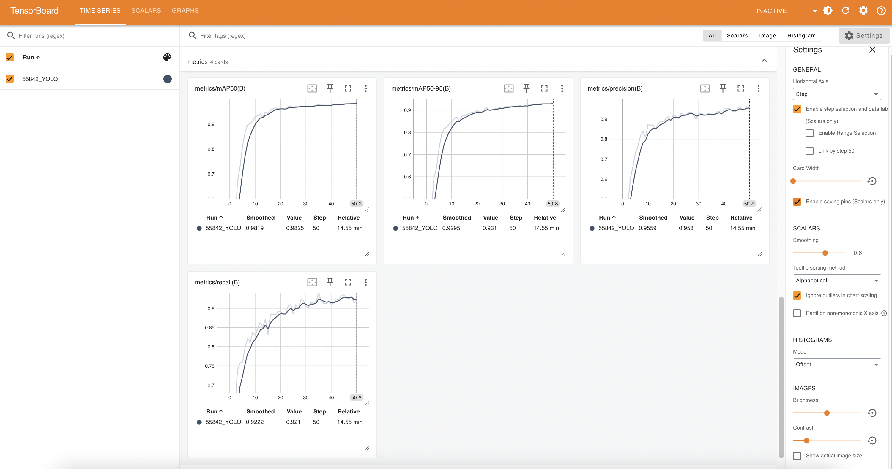<figcaption></figcaption></figure>

Once training finishes, links to checkpoints and logs will appear in app UI - they are stored under **Team Files → experiments → <your_experiment_name>**.

<figure>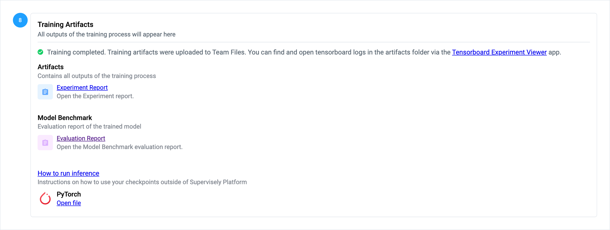<figcaption></figcaption></figure>

If user has enabled model benchmark option in training settings, then model performance evaluation report will be generated in the end of the training session.

Model benchmark will generate comprehensive report on model performance from different angles: general metrics, per class metrics, optimal confidence threshold estimation and much more.

<figure>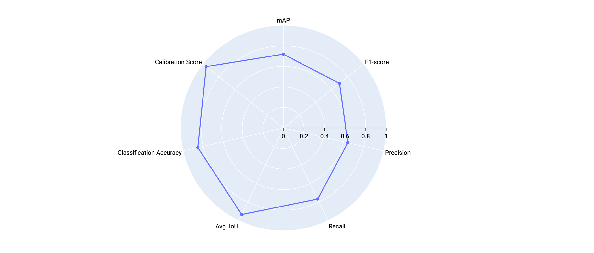<figcaption></figcaption></figure>

**Recall vs. Precision**

This section compares Precision and Recall in one graph, identifying imbalance between these two.

Bars in the chart are sorted by F1-score to keep a unified order of classes between different charts.

<figure>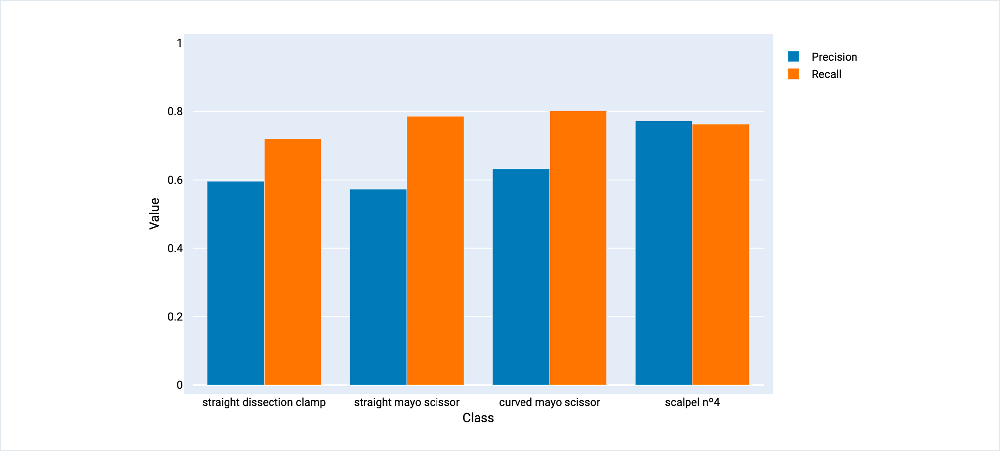<figcaption></figcaption></figure>

**Frequently Confused Classes**

This chart displays the most frequently confused pairs of classes. In general, it finds out which classes visually seem very similar to the model.

The chart calculates the probability of confusion between different pairs of classes. For instance, if the probability of confusion for the pair "straight mayo scissor - curved mayo scissor" is 0.17, this means that when the model predicts either "straight mayo scissor" or "curved mayo scissor", there is a 17.0% chance that the model might mistakenly predict one instead of the other.

The measure is class-symmetric, meaning that the probability of confusing a straight mayo scissor with a curved mayo scissor is equal to the probability of confusing a curved mayo scissor with a straight mayo scissor.
<figure>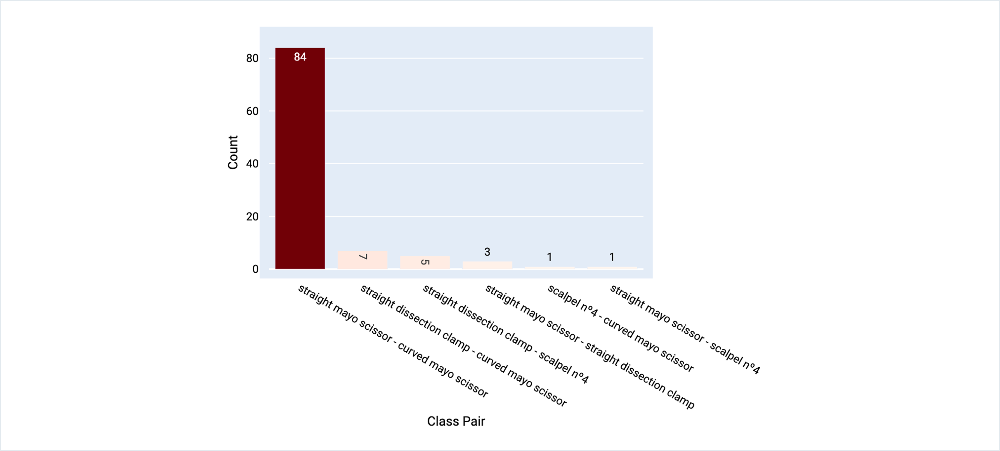<figcaption></figcaption></figure>

**Confidence Score Profile**

This section is going deeper in analyzing confidence scores. It gives you an intuition about how these scores are distributed and helps to find the best confidence threshold suitable for your task or application.


F1-optimal confidence threshold = 0.2737


<figure><figcaption></figcaption></figure>

You can find more information about Supervisely model benchmark [here](https://docs.supervisely.com/neural-networks/model-evaluation-benchmark).

## Deploying YOLO26 as a REST API Service

Now, when we got custom YOLO26 checkpoint, we can use the **Serve YOLO v8–26** app to deploy YOLO26 models as a REST API service.

### Step 1: Launch the Serve App

Run **Serve YOLO v8 – 26** from the Ecosystem choosing the target agent (GPU or CPU) that will host the model service.

<figure>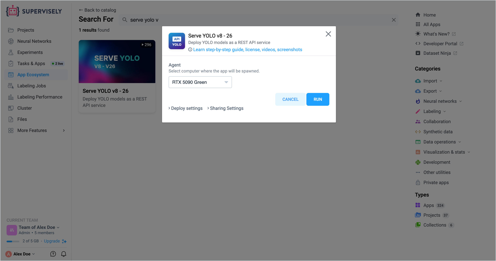<figcaption></figcaption></figure>

### Step 2: Select Model and Runtime

Choose one either model pretrained on COCO dataset 

<figure>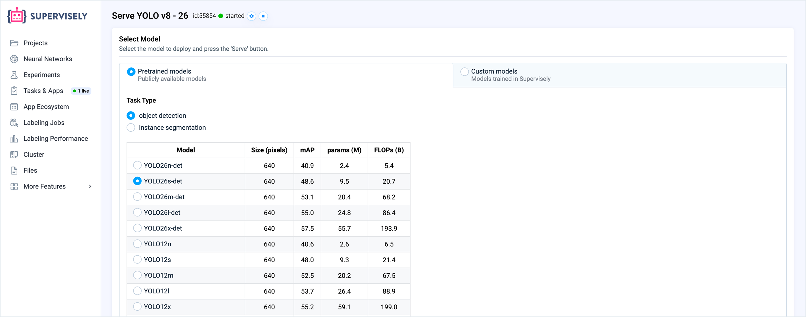<figcaption></figcaption></figure>

Or custom checkpoint fine-tuned on one of your own dataset.

<figure>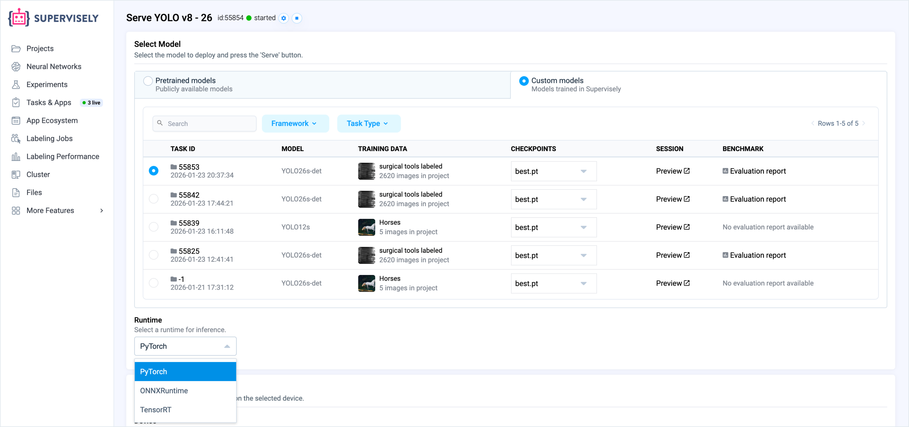<figcaption></figcaption></figure>

Pick the runtime engine:
- **Pytorch** - classic runtime for ML models 
- **ONNXRuntime**  - acts like a universal translator for ML models, useful if you want framework-agnostic deployment
- **TensorRT** - high-performance inference runtime which optimizes models specifically for NVIDIA GPUs

### Step 3: Deploy Selected Model

Click **Serve** and wait for the service status to become **running** in the app UI.  

<figure>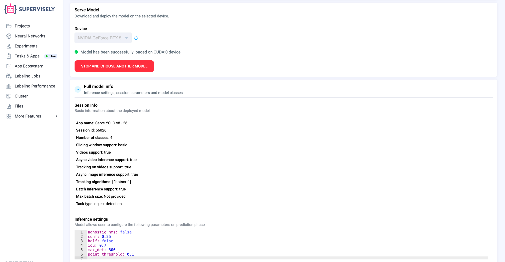<figcaption></figcaption></figure>


## Using Trained YOLO26 Model Inside Supervisely

Supervisely Ecosystem provides convenient apps for labeling data with trained neural networks. You can use [Predict App](https://ecosystem.supervisely.com/apps/apply-nn) to label your data with both pretrained and custom neural networks.

### Step 1: Launch Predict App

Run Predict app from the Ecosystem

<figure>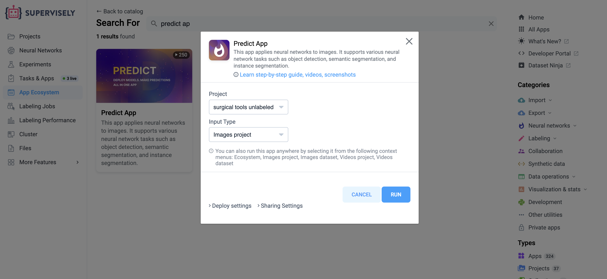<figcaption></figcaption></figure>

### Step 2: Select Input Data

Select datasets from images project to which model will be applied

<figure>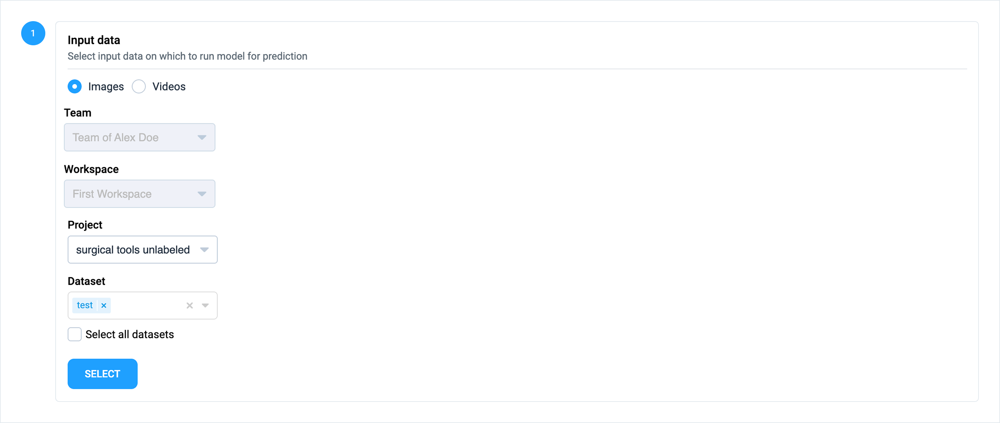<figcaption></figcaption></figure>

### Step 3: Connect to Served Model

Select app session with custom YOLO26 model:

<figure>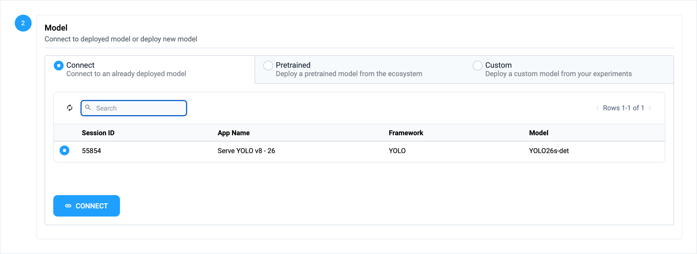<figcaption></figcaption></figure>

### Step 4: Select Classes

Select classes which will be used for prediction, other classes will be ignored:

<figure>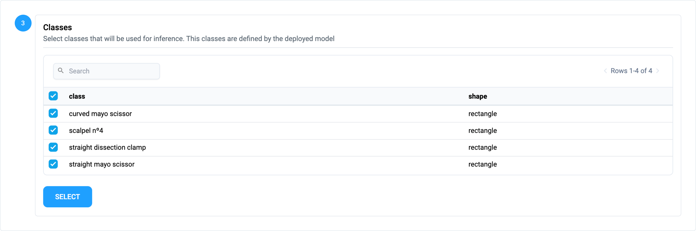<figcaption></figcaption></figure>

### Step 5: Set Inference Settings

Select inference settings (like confidence threshold) and run Preview:

<figure>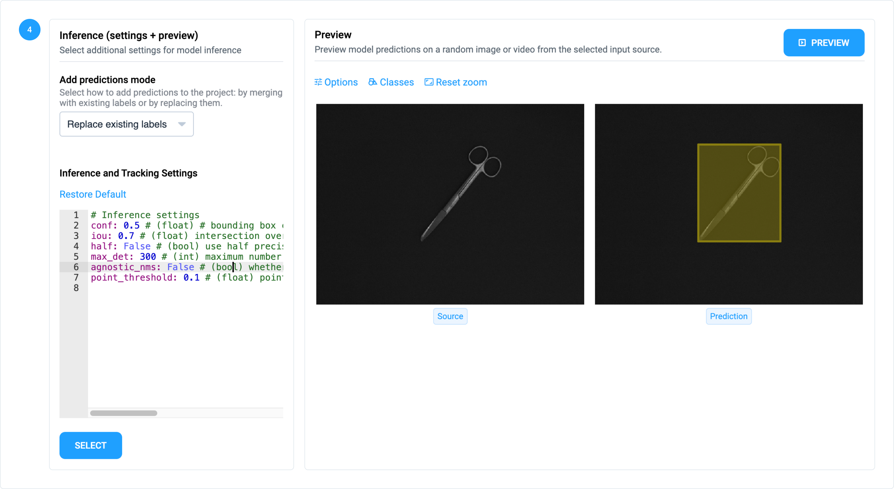<figcaption></figcaption></figure>


### Step 6: Enter Output Project Name

Write output project name and press **Run**. After inference will be finished, link to labeled project will appear in app UI.

<figure>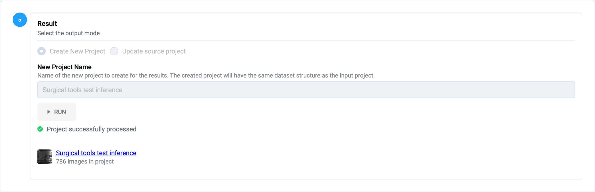<figcaption></figcaption></figure>

Now you can open labeled project with images and check how your trained model performed:

<figure>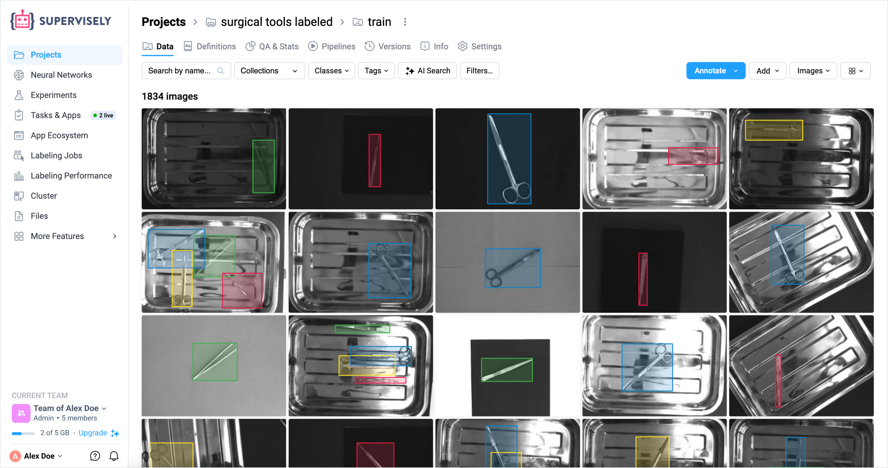<figcaption></figcaption></figure>

## Using Trained YOLO26 Model Outside Supervisely

After you've trained a model in Supervisely, you can download the checkpoint from Team Files and use it as a simple PyTorch model without Supervisely Platform.

**Quick start:**

1. **Set up environment**. 
   - Install [requirements](https://github.com/supervisely-ecosystem/yolo/blob/master/dev_requirements.txt) manually, or use our pre-built docker image from [DockerHub](https://hub.docker.com/r/supervisely/yolo/tags).
   - Clone [YOLO](https://github.com/supervisely-ecosystem/yolo) repository with model implementation.
2. **Download** your checkpoint from Supervisely Platform.
3. **Run inference**. Refer to our demo scripts:
   - [demo_pytorch.py](https://github.com/supervisely-ecosystem/yolo/blob/master/supervisely_integration/demo/demo_pytorch.py)
   - [demo_onnx.py](https://github.com/supervisely-ecosystem/yolo/blob/master/supervisely_integration/demo/demo_onnx.py)
   - [demo_tensorrt.py](https://github.com/supervisely-ecosystem/yolo/blob/master/supervisely_integration/demo/demo_tensorrt.py)


### Step 1: Set Up Environment

#### Manual Installation

```bash
git clone https://github.com/supervisely-ecosystem/yolo
cd yolo
pip install -r requirements.txt
```

#### Using Docker Image (advanced)

We provide a pre-built docker image with all dependencies installed [DockerHub](https://hub.docker.com/r/supervisely/yolo/tags). The image includes installed packages for ONNXRuntime and TensorRT inference.

```bash
docker pull supervisely/yolo:1.0.28-deploy
```

See our [Dockerfile](https://github.com/supervisely-ecosystem/yolo/blob/master/docker/Dockerfile) for more details.

Docker image already includes the source code.

### Step 2: Prepare Checkpoint and Model Files

Go to Team Files in Supervisely Platform and download the files.

<figure>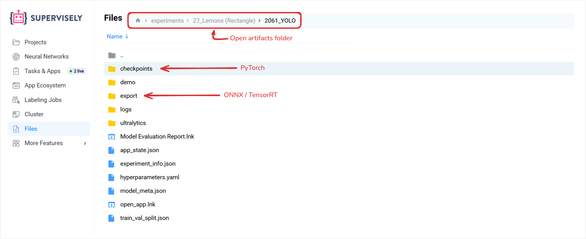<figcaption></figcaption></figure>


For YOLO, you need to download only the checkpoint file.


- **For PyTorch inference:** models can be found in the `checkpoints` folder in Team Files after training.
- **For ONNXRuntime and TensorRT inference:** models can be found in the `export` folder in Team Files after training. If you don't see the `export` folder, please ensure that the model was exported to `ONNX` or `TensorRT` format during training.


### Step 3: Run Inference

Here are demo scripts to run inference with your checkpoints in PyTorch, ONNX or TensorRT runtimes:




```python
from os.path import join
import torch
from ultralytics import YOLO
from supervisely.io.fs import get_file_ext, get_file_name


# Predict settings
device = "cuda" if torch.cuda.is_available() else "cpu"
task = "detect"

# Put your files here
demo_dir = join("supervisely_integration", "demo")
checkpoint_name = "best.pt"
checkpoint_path = join(demo_dir, "model", checkpoint_name)
image_path = join(demo_dir, "img", "coco_sample.jpg")
result_path = join(demo_dir, "img", f"result_{get_file_name(image_path)}{get_file_ext(image_path)}")

# Load model and predict
model = YOLO(checkpoint_path, task)
results = model.predict(source=image_path, device=device)
for result in results:
   result.save(filename=result_path)
```


```python
from os.path import join
import torch
from ultralytics import YOLO
from supervisely.io.fs import get_file_ext, get_file_name


# Predict settings
device = "cuda" if torch.cuda.is_available() else "cpu"
task = "detect"

# Put your files here
demo_dir = join("supervisely_integration", "demo")
checkpoint_name = "best.onnx"
checkpoint_path = join(demo_dir, "model", checkpoint_name)
image_path = join(demo_dir, "img", "coco_sample.jpg")
result_path = join(demo_dir, "img", f"result_{get_file_name(image_path)}{get_file_ext(image_path)}")

# Load model and predict
model = YOLO(checkpoint_path, task)
results = model.predict(source=image_path, device=device)
for result in results:
   result.save(filename=result_path)
```


```python
from os.path import join
import torch
from ultralytics import YOLO
from supervisely.io.fs import get_file_ext, get_file_name


# Predict settings
device = "cuda" if torch.cuda.is_available() else "cpu"
task = "detect"

# Put your files here
demo_dir = join("supervisely_integration", "demo")
checkpoint_name = "best.engine"
checkpoint_path = join(demo_dir, "model", checkpoint_name)
image_path = join(demo_dir, "img", "coco_sample.jpg")
result_path = join(demo_dir, "img", f"result_{get_file_name(image_path)}{get_file_ext(image_path)}")

# Load model and predict
model = YOLO(checkpoint_path, task)
results = model.predict(source=image_path, device=device)
for result in results:
   result.save(filename=result_path)
```

