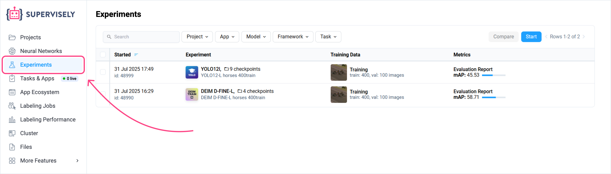
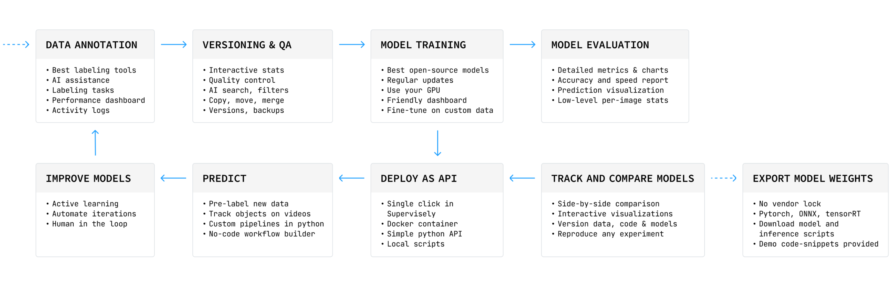
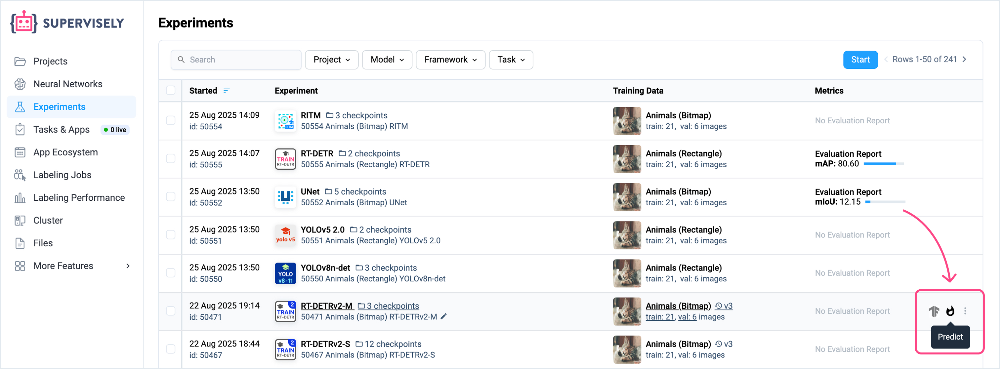
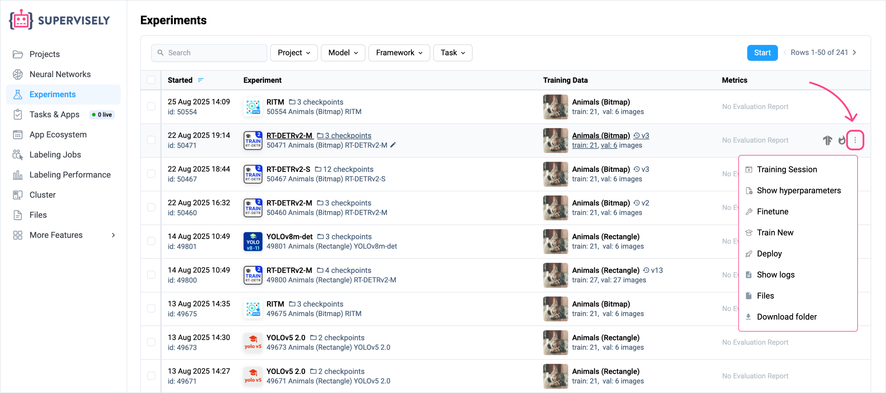
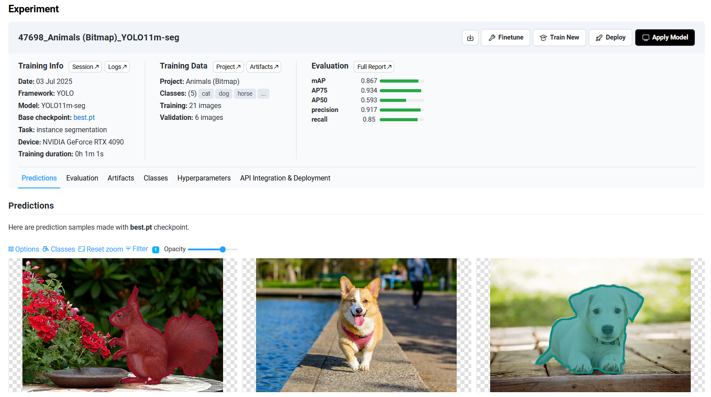
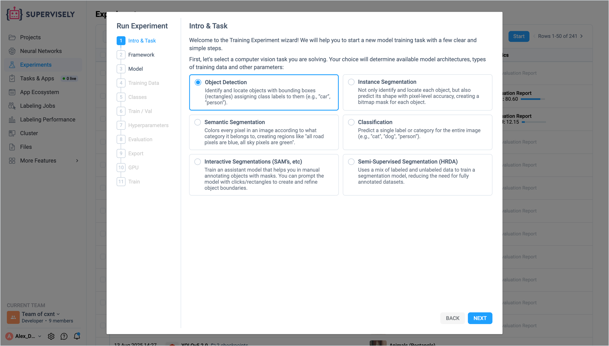
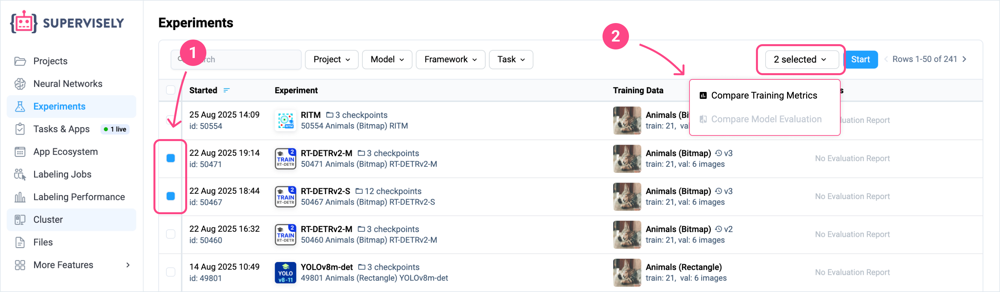
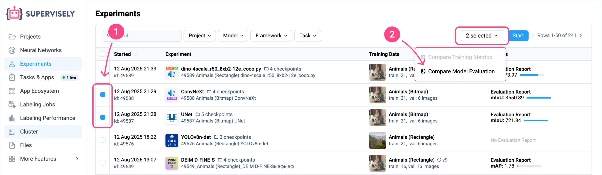
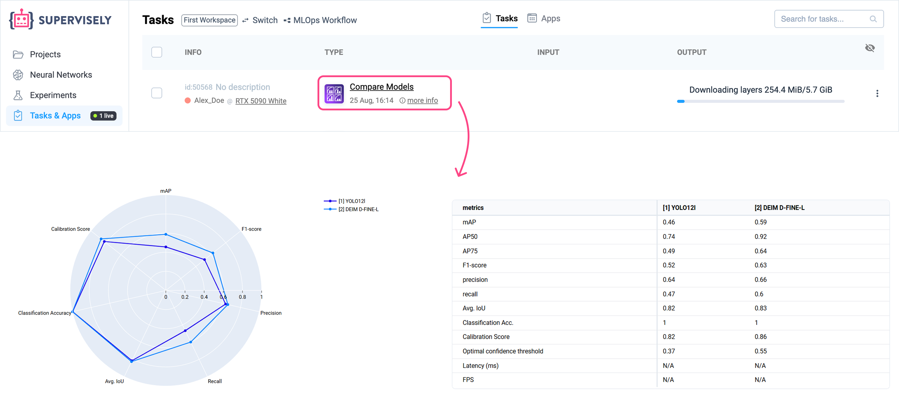

# Training Experiments

Supervisely records all your training experiments and provides an organized way to manage them, which makes working with your trained models easier and more efficient. You can find your experiments in the **Experiments** section of the right sidebar in the Supervisely platform. Here, you can see a table with your experiments and their details, such as model and framework, training data, evaluation metrics with the full evaluation report, tensorboard logs, and other information.

<figure><figcaption></figcaption></figure>

The Experiments table serves as a complete historical record of your team's ML journey, capturing:

- Exact model configurations and hyperparameters
- Training dataset versions and preprocessing steps
- Evaluation metrics with detailed visualizations in the full report
- Tensorboard logs with training charts, losses, and other metrics
- Environment details and framework versions

<figure><figcaption></figcaption></figure>

<!-- *You can also filter and sort the experiments by various criteria. You can also compare the evaluation results of different models and visually understand their behavior in different scenarios. You can deploy your final models directly from the experiments table, which allows you to quickly apply the models to your data. Finally, you can start a new experiment by clicking the **New Experiment** button in the top right corner of the page. This will open a form where you can set up the experiment configuration, and run the training process.* -->

#### Apply Model

You can apply your model directly from the experiments table by clicking on the button with "fire" icon. This will launch the **Predict App** where you can select a project or dataset and configure inference settings.

<figure><figcaption></figcaption></figure>

#### More Options

Find more options in the **3 dots** menu of an experiment:

- **Training Session**: This opens the training session where the training process was run.
- **Show hyperparameters**: This shows the hyperparameters used in the experiment.
- **Finetune**: Allows you to finetune your model on new data.
- **Train New**: Start a new training experiment with the same model and hyperparameters. This allows you to quickly reproduce experiments without manually configuring everything again.
- **Deploy**: Launches a serving app where the model will be deployed for inference.
- **Show logs**: Opens the app's logs of the training session.
- **Files**: Opens the result files of the training in Team Files, including model weights, evaluation reports, configuration files, and other artifacts.
- **Download folder**: Downloads ZIP archive with all the result files of the experiment.

<figure><figcaption></figcaption></figure>

<!-- ## Motivation

Data scientists usually run dozens of training experiments, tweaking hyperparameters, trying different models, and testing various datasets to achieve optimal results. However, without proper organization, this process quickly becomes chaotic - teams waste a lot of time in searching for the best-performing models, they manually write hundreds of code scripts to compare and organize results properly, struggle to reproduce training runs, and lose track of valuable insights gained during training, unless they have an organized view of their work.

Training neural networks is a complex process that involves many steps, such as data preparation, model selection, hyperparameter tuning, evaluation, etc. It is essential to keep track of all the configurations you use in experiments, as well as the results. Supervisely Experiments provides a strategic way in addressing this complexity, representing all your training runs in an organized table. It allows you to analyze experiments in detail, compare their evaluation results, deploy the best-performing models and apply them to your data in a few clicks.

This ensures that all your team's effort isn't lost, your experiments can be reproduced months later.

[Placeholder: Diagram showing experiment details and metadata capture] -->
<!-- 
### Features

- **Experiment Tracking**: Supervisely automatically tracks all your training experiments, including the model, framework, training data, hyperparameters, the full evaluation report, and tensorboard logs.
- **Experiment Management**: You can manage your experiments, such as filtering, sorting, and searching for specific experiments.
- **Model Comparison**: You can compare the evaluation benchmark results of different models to analyze their performance and visually understand their behavior in different scenarios.
- **View Tensorboard logs**: You can view the tensorboard logs of the training process.
- **Model Deployment & Inference**: You can deploy your final models directly from the experiments table. This allows you to quickly apply the models to your data.
- **Start New Experiment**: You can start a new experiment by clicking the **New Experiment** button in the top right corner of the page. This will open a form where you can set up the experiment configuration and run the training process.
- **Continue Training**: You can continue training your trained model with new data or hyperparameters. -->

## Experiment Details

You can click on any experiment in the table to open its details and view all the information about the experiment.

<figure><figcaption></figcaption></figure>

It includes the following sections:

- **Training Information**: The experiment name, model, framework, computer vision task, device, training duration, base checkpoint in case of transfer learning.
- **Training Data**: The dataset and project used for training, as well as the number of images in the training and validation sets.
- **Evaluation Metrics**: The evaluation metrics of the model, such as accuracy, precision, recall, F1 score, and other metrics specific to the computer vision task. You can also open the full evaluation report with detailed metrics and visualizations.
- **Hyperparameters**: The hyperparameters used for training, such as learning rate, batch size, number of epochs, and other parameters specific to the training framework.
- **Predictions**: Allows you to view the predictions made by the model on the validation dataset.
- **Training Logs**: You can analyze the training charts with losses and metrics, or open Tensorboard dashboard from here.
- **Checkpoints**: You can view and manage the checkpoints created during the training process, as well as the best checkpoint based on the evaluation.
- **Code examples & API usage**: You can find all the code examples and usage instructions for the model in the experiment details page. This allows you to quickly understand how to use the model inside and outside Supervisely platform.

You can also do quick actions with the model:

- **Apply Model**: Launches the **Predict App** where you can select a project/dataset and configure inference settings.
- **Deploy**: Launches a serving app where the model will be deployed for inference.
- **Train New**: Start a new training experiment with the same model and hyperparameters, but with different data or settings. This allows you to quickly reproduce experiments without manually configuring everything again.
- **Finetune**: You can finetune your model on new data to improve its performance or to have it applied for another downstream task. This allows you to continue training your model without starting from scratch.
- **Download Model**: Click on the "arrow down" button to download the model files, including the model weights and configuration. This allows you to use the model outside of Supervisely platform or in other applications.

## Start New Experiment

You can start a new experiment by clicking the **Start** button. This will open a wizard where you can set up the experiment configuration, such as the model, training data, hyperparameters, and other settings. Once you have configured the experiment, the training app will be launched, and you can start the training process.

<figure><figcaption></figcaption></figure>

The configuration wizard includes the following steps:

1. **Choose Computer Vision Task**: Select the type of computer vision task you solve, such as classification, object detection, segmentation, etc. This will narrow down the list of available models and frameworks to choose from.
2. **Framework**: Select the framework you want to use for training. A framework is a codebase that implements specific model architectures and training algorithms. Each framework typically offers multiple model variants (like different sizes or configurations) built on the same core design and training methodology.
3. **Model**: Choose a model architecture you want to train. The available models are shown in a table with their details, such as the number of parameters, metrics on some benchmark datasets (such as COCO).
4. **Training Data**: Select a project for training. All projects in your team will be shown in the table.
5. **Classes**: Select the classes you want to train the model on. Some classes can be automatically converted to the needed format. For example, bitmap masks can be converted to bounding boxes for training an object detection model.
6. **Train/Validation Split**: Configure how the training and validation datasets are split. You can choose to split either by datasets, by collections, or randomly.
7. **Hyperparameters**: Set the hyperparameters for training, such as learning rate, batch size, etc. Parameters are specific to the framework you selected.
8. **Evaluation & Speed test**: You can enable or disable the final evaluation of the best checkpoint on the validation dataset after training. This will generate a full evaluation report with detailed metrics and visualizations. Additionally, you can enable the speed test to measure the inference speed of the model. This will provide you with metrics like FPS and latency on your hardware.
9. **Model Export**: Choose which formats you want to export the trained model to. ONNX is a widely supported format that can be used in various frameworks and platforms, while TensorRT is optimized for NVIDIA GPUs and provides high performance for real-time applications.
10. **GPU**: Select a connected machine with a GPU to run the training on. You need to connect your machine to Supervisely platform first. See [how to connect an agent](https://docs.supervisely.com/getting-started/connect-your-computer).
11. **Finalization**: You can optionally set the name of the experiment and start the training process. The training app will be launched, and you can monitor the training progress in the application.

## Compare Experiments

You can compare the evaluation results of different experiments by **(1) selecting** them in the experiments table, then go in the **(2) selected -> Compare Model Evaluation**. This will open a comparison page where you can see the full evaluation reports of the selected experiments side-by-side.

<figure><figcaption></figcaption></figure>

You can also view the tensorboard logs of the selected experiments by clicking **(2) selected -> Compare Training Metrics**.

<figure><figcaption></figcaption></figure>

<figure><figcaption></figcaption></figure>

## Deploy & Inference

You can deploy your trained models for inference directly from the experiments table. This allows you to quickly apply your models to new data and start making predictions. To apply your model, hover on the experiment in the table and click on the button with "fire" icon. To deploy your model, click on the "3 dots" menu of an experiment and select "Deploy". This will launch a serving app where the model will be deployed.

<figure><figcaption></figcaption></figure>

## Finetune

You can finetune your trained model on new data by clicking the **Finetune** button in "3 dots" menu of an experiment. This will launch a training app with the same model and hyperparameters, but with different data. This allows you to continue training your model without starting from scratch.

<figure><figcaption></figcaption></figure>