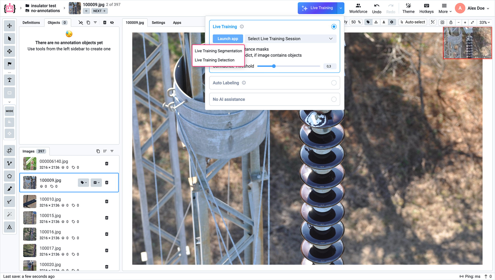
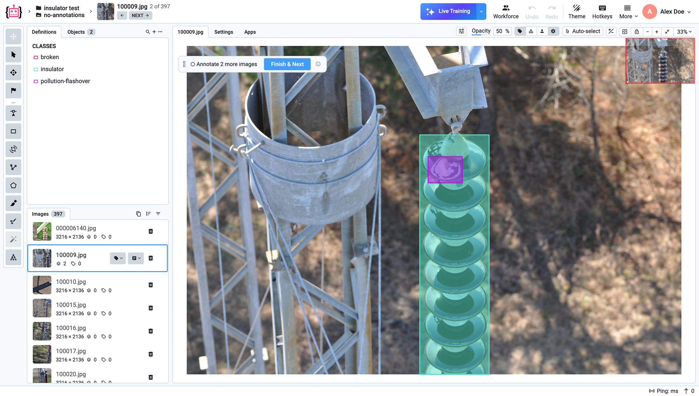

# Live Training

### Introduction

Live Training is a novel framework built by Supervisely where AI models train in parallel with human annotation. As annotators label images, the model quickly adapts to the domain-specific data and annotation patterns. After just 5-10 labeled images, it begins generating useful predictions (pre-labels) that accelerate labeling. The quality of these predictions continuously improves with every new image labeled.

By project completion, you get both a fully annotated dataset and a trained model ready for deployment, with accuracy equivalent to a model trained through conventional offline training.
Live Training transforms annotation projects from a multi-week, multi-team coordination challenge into a streamlined single-phase workflow where AI assistance grows naturally from the first annotation onward.

### Live Training solves two critical limitations in AI-assisted annotation:

Zero-shot foundation models (SAM, GroundingDINO) are helpful in annotating common objects (human, animals, vehicles), but they fail on specialized domains with almost zero assistance.
Conventional workflows such as Human-in-the-loop and Active Learning involve manual coordination that always create coordination overhead and idle time, resulting in high costs and timelines of annotation projects.

### How to use

**1. Launch the Application**

To start Live Training, click the **Launch App** button in your project workspace. This opens the configuration interface where you can initialize the training session.

**2. Choose a Model Type**

You will be prompted to select the type of model that fits your annotation task. There are two main options:

- Live Training Segmentation
- Live Training Detection

<figure><figcaption></figcaption></figure>

#### Live Training Segmentation

Segmentation is used when you need pixel-level precision. The model learns to generate detailed masks that outline the exact shape of objects in an image.

*Typical use cases:*

*Medical imaging (organs, tumors)* 
*Industrial inspection (defects, surface anomalies)* 
*Agriculture (plants, crops, diseases)*

As you annotate, the model begins producing pre-labeled masks that closely follow object boundaries, significantly reducing manual effort.

#### Live Trainig Detection

Detection is used when you need to identify and localize objects using bounding boxes. The model predicts rectangular regions around objects of interest.

*Typical use cases:*

*Autonomous driving (vehicles, pedestrians, signs)* 
*Retail analytics (products, shelves)* 
*Security and surveillance (people, events)*

With each labeled image, the model improves its ability to generate accurate pre-labeled bounding boxes, speeding up the annotation process.

While the app is launching, you can view the logs here.

<figure><figcaption></figcaption></figure>

**3. Start Live Training**

<figure><figcaption></figcaption></figure>

**4. Start training the model**

The AI needs a few labeled images before it can generate predictions.
Annotate each image completely and click Finish & Next to add it to the training data.
The more you annotate, the better the AI gets. Once quality is sufficient, it will start suggesting predictions automatically.

<figure><figcaption></figcaption></figure>