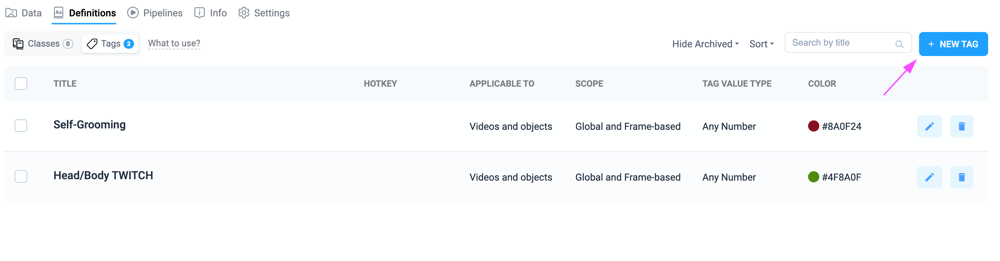
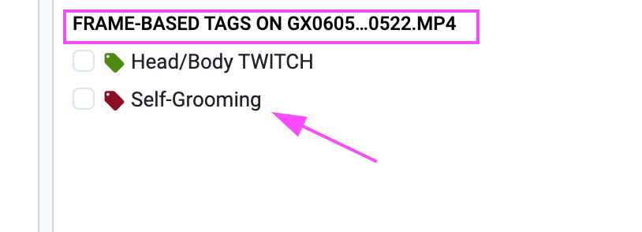
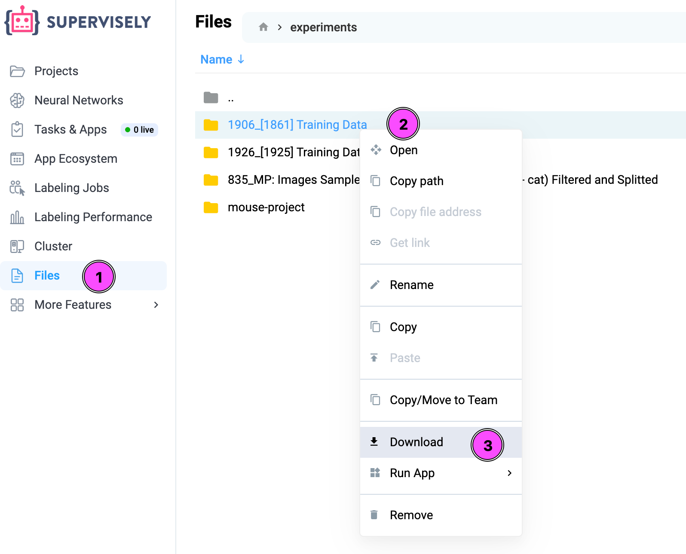

# Temporal Action Localization with MVD

The Supervisely Team is pleased to share one more successful solution for solving the task of Temporal Action Localization using the [Masked Video Distillation](https://github.com/ruiwang2021/mvd) model.

## Description

This project aims to provide an effective automated solution for monitoring behavioral changes in laboratory mice before and after experimental treatments. The system focuses on identifying two key behavioral actions: "Head/Body Twitch" and "Self-Grooming" within video recordings.

The core computer vision task involves Temporal Action Localization - precisely identifying the start and end timestamps of these specific mouse actions in the videos. Once these temporal boundaries are established, researchers can then calculate the duration and frequency of each action type. By comparing the behavioral analysis results from pre-treatment and post-treatment videos, researchers can objectively determine whether the experimental treatment has produced positive, negative, or neutral effects on mouse behavior.

**Data type:** Video\
**Task types:** Temporal Action Localization, Object Detection\
**Used models:** [MVD](https://github.com/ruiwang2021/mvd), [RT-DETRv2](https://github.com/lyuwenyu/RT-DETR)\
**Pre-processing:** Video frames extraction and sampling, object detection and cropping the frames, trimming the video into segments

## Solution Approach

The Supervisely Team focused on finding the optimal solution that can be used to solve this case in the most effective way. The solution is based on the following steps:

1. **Import video files** to the Supervisely platform. For already annotated videos, the initial annotations were made outside of Supervisely in a specific custom format, so the Supervisely Team developed a [custom script](https://github.com/supervisely-ecosystem/mouse_project_upload_videos_with_xlsx) that can be used to convert and import these annotations.
2. **Train Object Detection model** to detect mice using [RT-DETRv2](https://ecosystem.supervisely.com/apps/rt-detrv2/supervisely_integration/train) model. We've generated a dataset using pretrained models before training the mouse detector. The model was evaluated with our [Evaluation Benchmark](https://docs.supervisely.com/neural-networks/model-evaluation-benchmark/object-detection).
3. **Preprocess video before training** the Action Recognition model using the [Preprocess Data for Mouse Action Recognition](https://ecosystem.supervisely.com/apps/preprocess-data-for-mouse-project) app. The preprocessing includes mouse detection, video frames extraction, trimming videos into segments, and class balancing.
4. **Train the Action Recognition model (MVD)** using the [Train Mouse Action Recognition Model](https://ecosystem.supervisely.com/apps/mouse-action-recognition/supervisely_integration/train) app. We've chosen the **MVD** architecture as the best choice for our specific use case. It has achieved SOTA performance on common benchmarks and was presented at the CVPR 2023 conference.
5. **Evaluation Benchmark** is performed on the test dataset to assess the model's performance. The evaluation includes metrics such as precision, recall, and F1-score.
6. **Inference** is performed on new videos using the trained MVD model and the mouse detector. The inference is done using the [Mouse Action Recognition](https://ecosystem.supervisely.com/apps/mouse-action-recognition/src/app) app, which processes the videos and predicts the mouse actions.


## Solution Overview

The complete worfkflow of the solution contains the several steps, each of them is described in the corresponding section below. The solution is implemented using the Supervisely platform and its features, such as video frames extraction, object detection, training models, and analyzing the results.

Table of Contents:

1. [Import Data](temporal_action_localization_with_mvd.md#1-import-data)
2. [Annotation](temporal_action_localization_with_mvd.md#2-annotation)
3. [Preprocessing](temporal_action_localization_with_mvd.md#3-preprocessing)
4. [Train & Evaluation](temporal_action_localization_with_mvd.md#4-train--evaluation)
5. [Inference](temporal_action_localization_with_mvd.md#5-inference)

### 1. Import data

The first step of the solving the task is to import the video files into the Supervisely platform. There are plenty of ways to do that, and all of them described in the [Import](https://docs.supervisely.com/import-and-export/import) section of the Supervisely documentation. In this bcase we'll briefly describe one of the options - manual upload of the data from the local machine.

1. Create a new project in Supervisely, name it **Input Project**. If your workspace is empty, you can just click the Import Data button.
2. Choose the **Videos** option in the Type of project section, and click **Create**.
3. Next, you can drag and drop your video files into the project.

If you need to import files from a remote server or from a Cloud Storage, you can use apps like [Import Videos from Cloud Storage](https://ecosystem.supervisely.com/apps/import-videos-from-cloud-storage) or [Remote Import](https://ecosystem.supervisely.com/apps/remote-import).

For this case, the annotations were made in a specific custom format outside of Supervisely platform, so the Supervisely Team developed a [custom script](https://github.com/supervisely-ecosystem/mouse_project_upload_videos_with_xlsx) that can be used to convert and import those annotations into Supervisely platform. The script is written using Supervisely Python SDK and it's possible to implement any custom logic for various custom formats and even wrap this script into a [Supervisely App](https://developer.supervisely.com/app-development/basics/from-script-to-supervisely-app) for more convenient usage.

### 2. Annotation

Before training a NN model, you need to annotate your Input Project. We recommend to annotate your videos in Supervisely, because this way you can annotate precise frames where an action starts and ends, which will help the model learn much better. Also, the labeling tool is very convenient and has a lot of features that will help you annotate your data faster.

Annotation format: The annotations should contain the mouse actions (Head/Body Twitch, Self-Grooming) represented as **Tags**. Each tag has a start time and end time, where the action is happening. You don't need to manually annotate bounding boxes around the mouse, because our mouse detector will do it at the preprocessing stage.

The Supervisely Video Labeling Toolbox provides extensive possibilities for any type of labeling, you can learn more about it in the [Video Labeling Toolbox](https://docs.supervisely.com/labeling/labeling-toolbox/videos-3.0) documentation. In this case, you only need to work with **Frame-based Tags**, which means that you will label segments of frames in the video for specific actions.

### Defining the Tags

First of all, you need to add the Tags that we will use for annotating the mouse actions. To do it, open the Input Project in Supervisely, then switch to the **Definitions** tab, select the **Tags** section, and click the **New Tag** button.



Add the following tags:

* **Self-Grooming** - this tag will be used to annotate the segments in a video where the mouse is grooming itself.
* **Head/Body TWITCH** - this tag will be used to annotate the segments in a video where the mouse is twitching its head or body.

Make sure that the **Scope** of the tags is set to **Frame-based** or **Global and Frame-based** to allow annotating segments of frames in the video. You can use the **Number** type of the tag value, if you need to specify, for instance, the number of repeated actions in that segment.


### Annotating the Videos

Now, when the Tags are defined, you can start annotating the videos. Open any video from the project in Supervisely Video Labeling Toolbox, and find the needed segment of the video using the scalable timeline.

When you found the segment corresponding to the mouse action, you can add a new Tag by clicking on the corresponding Tag name in the **Definitions** panel. By default, this panel is located on the right side of the screen, but it can be moved to any place you like.



Make sure, you've selected the **Frame-based** tags, not the **Global** tags, because in this example we're working with the sequences of frames in the video.\
If you're using the **Number** type of the tag value, you can also specify the number of repeated actions in the segment.


1 - The beginning of the segment (where the action starts).\
2 - Current position of the playhead in the video.\
3 - The **Flag** icon on the timeline, which is used to finish the Tag.

Navigate to the end of the segment (where the action ends) and click on the **Flag** icon on the timeline. This will finish the Tag and create a segment of frames with the specified action.

### 3. Preprocessing

When you have your data and annotations ready, you can start preprocessing your data for training. The preprocessing is done by the [**Preprocess Data for Mouse Action Recognition**](https://ecosystem.supervisely.com/apps/preprocess-data-for-mouse-project) app in Supervisely and includes the following procedures:

1. **Mouse detection**. We use a separate mouse detector that predicts bounding boxes around the mouse in each frame. We then crop videos to the bounding box of the mouse. This is done to reduce the amount of background noise and focus on the mouse itself, which helps the model learn better and more efficiently.
2. **Trim videos into segments**. Videos are trimmed into short clips (\~2-3 seconds each), which are manageable for the model. Each clip represents a particular mouse action. This is necessary because the MVD model has a context window limitation, it can't process large videos with a length of several minutes.
3. **Class balancing**. Since for most of the video frames the mouse performs no actions, there will be too many video clips with inactivity in the training set (we calle this "idle" action). To avoid this, we will balance the number of frames between the "idle" and "Self-Grooming" actions. This will create a more useful and informative sample for training the model.
4. **Train/test split**. The preprocessing app will create a test dataset with full-length original videos for evaluation purposes. This is important to evaluate the model performance on unseen data after training.

#### How to Preprocess Data

1. Deploy a mouse detector. Run the app [**Serve RT-DETRv2**](https://ecosystem.supervisely.com/apps/rt-detrv2/supervisely_integration/serve) in Supervisely and deploy our custom model trained for mouse detection task.
2. Run [**Preprocess Data for Mouse Action Recognition**](https://ecosystem.supervisely.com/apps/preprocess-data-for-mouse-project) app in Supervisely, selecting the input project with your original videos and annotations. The input project may have a free structure with nested datasets, or without it.
3. Follow the instructions in the app. You will need to select the mouse detector you deployed in the first step, and specify the amount of video to train/test split. About 10 full-length videos should be enough for the test dataset.
4. Run the preprocessing.

After processing completes, a new project will be created with name **Training Data**. It will contain short video clips with detected bounding boxes of mice. It will consists of three datasets, one dataset per class: **"Self-Grooming"**, **"Head-Body\_TWITCH"**, and **"idle"**. Additionally, the project will has a **test** dataset with full-length original videos for evaluation purposes.

**Note**: The app will remember which videos it has already processed, so you can run it multiple times without reprocessing the same videos. This is useful if you add new videos to the input project - the app will only process the new videos and add them to the **Training Data** project that it has already created.

### 4. Train & Evaluation

After preprocessing, you can start training the model. The app [**Train Mouse Action Recognition Model**](https://ecosystem.supervisely.com/apps/mouse-action-recognition/supervisely_integration/train) in Supervisely will help you with this. It will train the [MVD](https://github.com/ruiwang2021/mvd) model for mouse action recognition.

**Why MVD:** After analyzing the latest research papers on action recognition and localization models, we've chosen the **MVD** architecture as the best choice for our specific use case. It has achieved SOTA performance on common benchmarks, such as **Kinetics-400** and **AVA v2.2**, and offers a good trade-off between the hardware requirements and the model accuracy. Additionally, this work was presented at the CVPR'2023 conference.

**DeepSpeed**: MVD training can be configured with DeepSpeed acceleration to optimize GPU memory usage and computational efficiency. This optimization enables training the model on mid-range hardware, such as a single NVIDIA RTX 4090, rather than requiring high-end server GPUs.

#### How to Train

To start training, run the app [**Train Mouse Action Recognition Model**](https://ecosystem.supervisely.com/apps/mouse-action-recognition/supervisely_integration/train) in Supervisely and select the **Training Data** project that had been created after preprocessing. You don't need the mouse detector for training, so you can stop the app **Serve RT-DETRv2** that you used for preprocessing to save GPU resources. Follow the instructions in the training app, specify the training parameters, and run the training. The training may take several hours or even days, depending on the amount of data and hyperparameters you choose. You can monitor the training process in the app.

**Notes on hyperparameters:**

* The MVD's archeticture is able to process only short video segments. The default input length is 16 frames. You can increase it by modifying `num_frames` parameter in the app's settings, but it will require more GPU memory.
* The `sampling_rate` is the second parameter that affects the context window length. It defines the step size between frames in the input video. For example, if `sampling_rate=2`, the model will process every second frame. This parameter affects the resulting model's performance, especially on the **Head/Body TWITCH** action, which is fast and may be missed if the sampling rate is too high. For better results, we recommend set `sampling_rate=1` and `num_frames=32`, but it may require high-end GPU, or multi-GPU setup.
* The resulting context window length is `num_frames * sampling_rate`. With default settings it is equal to 32 frames _(16 \* 2 = 32)_, which is about 1 second of video.
* The `batch_size` parameter is also important. It should be at least 6-8 in case of single GPU setup.

#### Evaluation

After training, the app will automatically evaluate the best checkpoint on the **test** dataset and provide you with Evaluation Report. The report will include the metrics such as precision, recall, and F1-score and will help you understand how well the model performs on unseen data.

### 5. Inference

Now, you can use the trained model for inference. As long as MVD is limited to short video segments, the model processes long videos in a sliding window manner. The model predicts an action for each short segment (window), and the app will aggregate the results to provide a final prediction for the entire video. The mouse detector is required for inference, it will be used to crop the video segments to the bounding box of the mouse.

#### How to Run Inference

Launch the app [**Mouse Action Recognition**](https://ecosystem.supervisely.com/apps/mouse-action-recognition/src/app) providing the paths to your trained MVD model and the mouse detector in Team Files. The app will load the models and run inference on the input project or dataset. After the inference is done, it will create a new project with the same structure as the input project, but with predictions for each video. The annotations will include predicted bounding boxes of a mouse and action intervals. The predicted action classes are represented as tags on the timeline in the labeling tool. The inference may take several hours for long-video datasets.

#### Inference in Docker

You can run inference in a Docker container on your local machine. We have built Docker images for the MVD model and the mouse detector, and prepared a docker-compose file. This way you can run the inference without manully installing any dependencies.

1. Clone our github repository and navigate to the `inference_script` directory:

```bash
git clone https://github.com/supervisely-ecosystem/mouse-action-recognition
cd mouse-action-recognition/inference_script
```

2. Download both of your models: the trained MVD model and the mouse detector. Place the models in the `inference_script/models` directory.
3. Open `inference_script/.env` file and define your paths to an input directory with videos and a directory to the trained MVD model (the last contains all files needed to load the model, such as config.txt and a folder with best checkpoint). Here is an example of the `.env` file:

```bash
# Note: all paths are relative to this .env file (you can use absolute paths as well)
# Directory where the MVD model is stored
MODEL_DIR=./models/MP_TRAIN_3_maximal_crop_2025-03-11_15-09-26
# Path to an input directory with videos
INPUT=./videos
# Path where to save predictions
OUTPUT=./output
```

4. Run the following command to start the inference in Docker (make sure you are in the `inference_script` directory):

```bash
docker compose up
```

This will automatically pull our pre-built images `supervisely/mvd:inference-1.0.0` and `supervisely/mvd:rtdetrv2-1.0.0` and load your MVD model and the mouse detector in separate containers. After this, the inference will start. This process may take some time. The final predictions will be saved in `inference_script/output` (in case you didn't change the default output path).

### Exporting the data

At any time you can export your assets from the Supervisely platform. It's applied both to the data (video files with annotations) and to the models. There are several ways to download and export the data, that are described in the [Export](https://docs.supervisely.com/import-and-export/export) section of the Supervisely documentation. In this case, we'll briefly describe one of the options - exporting the data from the platform's UI.

#### Exporting the data

To export the video project you can click on the **Three dots** (1) icon on the project, select the **Download** (2) option and choose the needed format (3). We recommend to use the **Supervisely JSON Annotation** format, which will export the project with all annotations and metadata.


#### Exporting the models

All of the artifacts that were created during the training process are stored in the Team Files.\
Note: there's no vendor lock in Supervisely, so you can download the models and use them completely outside of the Supervisely platform, for example, in your own Python scripts or in Docker containers.\
To download the data, go to the **Files** (1) section in the left sidebar, find the needed file or folder (2), right-click on it, and select the **Download** (3) option.


