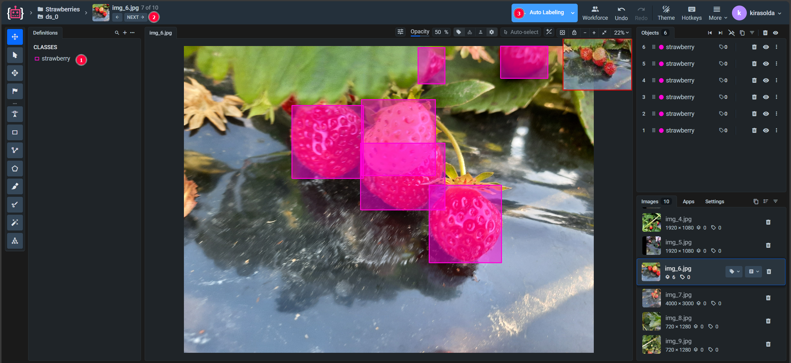
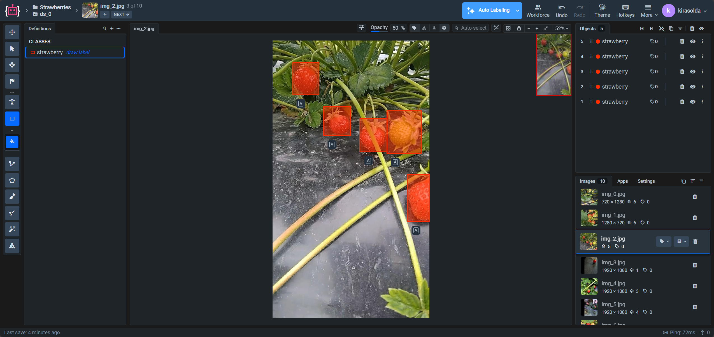
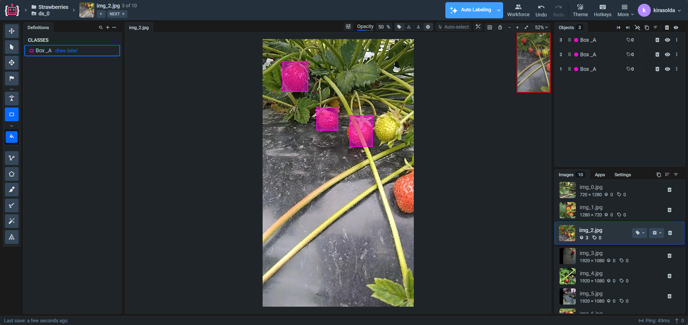
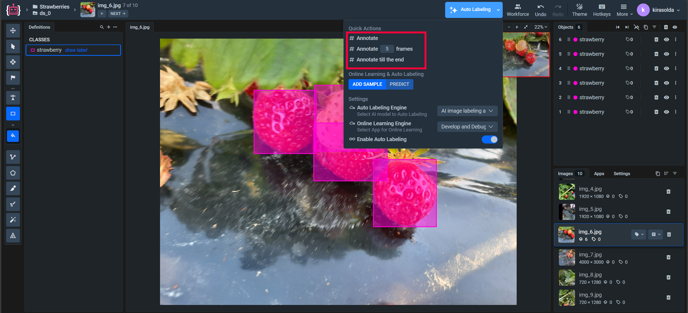

# Automatic Strawberry Image Labeling with AI Image Labeling Assistant 2.0

This document describes the process of creating a labeled strawberry dataset for computer vision tasks. It examines a practical example of using AI Image Labeling Assistant 2.0 to automate the image annotation process.

The purpose of this guide is to demonstrate the tool's capabilities through a specific example and show the typical workflow for creating training data for machine learning models.

## Work Results

- Labeled strawberry image dataset with annotations
- Automatic strawberry detection and labeling
- Data export in standard formats (COCO, YOLO, Pascal VOC)
- Automatic analytics and statistics

## Real Case Study: From Garden Photos to Ready Dataset

### Task Description

To demonstrate the tool's capabilities, we examine a scenario of creating a dataset for an automatic strawberry detection system.

The source data consists of a set of photos of strawberry beds containing berries. The task is to create an annotated dataset that can be used for training a computer vision model to detect strawberries.

The process of manual labeling of such images requires significant time investment and can be optimized using AI Image Labeling Assistant 2.0.

### How We Solved the Problem: Step-by-Step Process

#### Step 1: Launch Application and Open Dataset

We launch AI Image Labeling Assistant 2.0 and open our strawberry image dataset for labeling. The application automatically loads the first image from the dataset.

#### Step 2: Manual Labeling of the First Frame

**Critically important stage!** On the first image, it's necessary to manually label all berries, precisely defining the class name. This manually labeled image will serve as an input prompt for the app to understand which annotations are necessary to generate for the given dataset, forming the foundation for correct automatic labeling of all subsequent images.

When creating annotations, it's important to:

- Set correct class name (for example: "strawberry")
- Carefully outline all visible berries using bounding boxes
- Not miss any objects, as this will affect the quality of automatic labeling

Example of good input prompt:

Example of bad input prompt:

#### Step 3: Move to Next Image

After completing the labeling of the first image, we move to the next frame in the dataset.

#### Step 4: Launch Automatic Labeling

On the second (and subsequent) images, we launch the automatic labeling function. The application also offers other flexible processing options:

- **Batch processing**: select a specific number of images for automatic labeling
- **Full processing**: process all remaining images in the dataset

#### Step 5: Quality Control and Correction

After automatic processing, we review the results and make corrections if necessary:

- Add bounding boxes for the missed objects
- Refine bounding box boundaries
- Verify correct strawberry classification

#### Step 6: Obtain Ready Dataset

We export final annotations in the required format — COCO JSON for popular ML frameworks, YOLO for specialized detection tasks, or Pascal VOC for classical approaches.

## Results Analysis

**Time Cost Comparison:**

- **Manual labeling:** ~1 hour (10 images × ~6 minutes per image)
- **Using AI Image Labeling Assistant 2.0:** ~10 minutes (first frame labeling + automatic processing + verification)
- **Ratio:** approximately 6 times faster

**Quality Characteristics:**

- Percentage of correctly detected objects: 95%+
- Object boundary accuracy is ensured by the pre-trained model
- Annotation consistency is maintained automatically

## Possible Development Directions

The created dataset can be used for:

1. **Training detection models** for automatic strawberry recognition
2. **Integration into monitoring systems** for agricultural crops
3. **Methodology adaptation** for working with other types of fruits

## Conclusions

This example demonstrates the application of AI Image Labeling Assistant 2.0 on the Supervisely platform for solving a typical task of creating training data in the field of computer vision. The tool shows effectiveness in automating the image labeling process, especially at the stage of initial processing of large volumes of data.

The main advantage of the approach is the reduction of time required for preparing annotated datasets. This makes the process of creating training data more accessible for research projects and practical applications in various fields.
