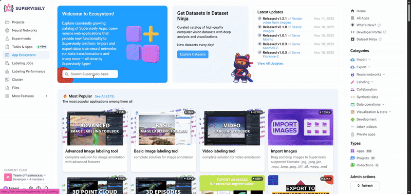
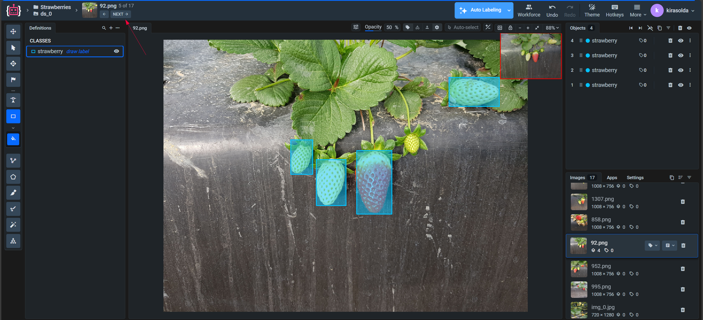
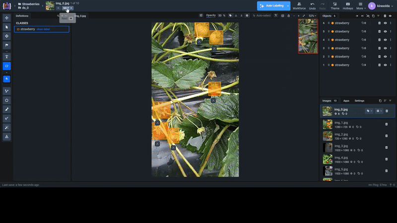

# Automatic Strawberry Image Labeling with AI Image Labeling Assistant 2.0

Imagine a vast strawberry field stretching across several hectares, with thousands of plants bearing ripe berries that need to be harvested quickly and efficiently while maintaining the highest quality standards. Traditional manual harvesting requires dozens of workers and takes several days, with the constant risk of missing the optimal harvest window.

## The Robotic Solution

Recent [research in agricultural robotics](https://www.sciencedirect.com/science/article/pii/S2405896322027422) has demonstrated the viability of automated strawberry harvesting systems. Studies such as the work by Lemsalu et al. (2022) on "Real-Time CNN-based Computer Vision System for Open-Field Strawberry Harvesting Robot" show that modern computer vision approaches using neural networks can achieve 91.5% average precision in strawberry detection tasks.

Commercial strawberry farms deploy autonomous harvesting robots that move between crop rows on wheeled platforms. Each robot carries a robotic arm with a gripper and multiple cameras mounted at different angles. As the robot moves through the field, its cameras continuously capture images of strawberry plants.

The robot's workflow follows this sequence:

1. **Image capture**: Cameras photograph strawberry plants from multiple angles
2. **Detection**: Computer vision algorithms identify ripe strawberries in real-time
3. **Harvesting**: The robotic arm extends to the detected berry and gently picks it using specialized grippers
4. **Collection**: Picked strawberries are placed in onboard containers

## The Training Data Challenge

For this process to work reliably, the detection algorithms must be trained on thousands of labeled strawberry images showing berries in different lighting conditions, growth stages, and orientations. Creating such training datasets manually is extremely time-consuming - a single image with multiple strawberries can take about 5 minutes to annotate properly. AI Image Labeling Assistant 2.0 solves this challenge by dramatically accelerating dataset creation, enabling farms to deploy robotic harvesting solutions faster and more cost-effectively.

## The Business Impact

AI Image Labeling Assistant 2.0 delivered measurable results for strawberry farms:

- **6x faster dataset creation**: From 60 minutes to 10 minutes for 10 images
- **91%+ detection accuracy**: Reliable strawberry identification in field conditions
- **Scalable robot deployment**: Training datasets ready in days instead of months
- **Cost reduction**: Dramatically lower data preparation expenses

### The Solution with AI Image Labeling Assistant 2.0

When using AI Image Labeling Assistant 2.0, farmers get a streamlined process that transforms months of manual work into weeks of efficient production. The tool enables teams to label just one representative image manually, then automatically processes thousands of similar field images with consistent accuracy. This approach handles varying lighting conditions, different berry orientations, and complex plant backgrounds while maintaining production-ready quality standards.

The result is robot-ready training data exported in multiple formats (COCO, YOLO, Pascal VOC) optimized for immediate integration with harvesting systems, enabling rapid deployment across large agricultural operations.

### How We Solved the Problem: Step-by-Step Process

#### Step 1: Launch Application and Open Dataset

First, we upload our strawberry image dataset to the Supervisely platform. Once the dataset is successfully uploaded to the platform, we launch AI Image Labeling Assistant 2.0 and open the uploaded strawberry image dataset for labeling. The application automatically loads the first image from the dataset.

#### Step 2: Manual Labeling of the First Frame

**Critically important stage!** On the first image, it's necessary to manually label all berries, precisely defining the class name. This manually labeled image will serve as an input prompt for the app to understand which annotations are necessary to generate for the given dataset, forming the foundation for correct automatic labeling of all subsequent images.

When creating annotations, it's important to:

- Set correct class name (for example: "strawberry")
- Carefully outline all visible berries using bounding boxes
- Not miss any objects, as this will affect the quality of automatic labeling

Here are examples of good and bad class names:

#### Step 3: Move to Next Image

After completing the labeling of the first image, we move to the next frame in the dataset.

#### Step 4: Launch Automatic Labeling

On the second (and subsequent) images, we launch the automatic labeling function. The application also offers other flexible processing options:

- **Batch processing**: select a specific number of images for automatic labeling
- **Full processing**: process all remaining images in the dataset

#### Step 5: Quality Control and Correction

After automatic processing, we review the results and make corrections if necessary:

- Add bounding boxes for the missed objects
- Refine bounding box boundaries
- Verify correct strawberry classification

#### Step 6: Obtain Ready Dataset

We export final annotations in the required format — COCO JSON for popular ML frameworks, YOLO for specialized detection tasks, or Pascal VOC for classical approaches.

## Results Analysis

**Time Cost Comparison:**

- **Manual labeling:** ~1 hour (10 images × ~6 minutes per image)
- **Using AI Image Labeling Assistant 2.0:** ~10 minutes (first frame labeling + automatic processing + verification)
- **Ratio:** approximately 6 times faster

## Conclusions

This example demonstrates the application of AI Image Labeling Assistant 2.0 on the Supervisely platform for solving a typical task of creating training data in the field of computer vision. The tool shows effectiveness in automating the image labeling process, especially at the stage of initial processing of large volumes of data.

The main advantage of the approach is the reduction of time required for preparing annotated datasets. This makes the process of creating training data more accessible for research projects and practical applications in various fields.

## Try It Yourself

To test AI Image Labeling Assistant 2.0 with strawberry detection, you can use [ready dataset with strawberry](https://datasetninja.com/strawberry-dataset-for-object-detection) available at [DatasetNinja.com](https://datasetninja.com/). The platform provides access to various pre-labeled strawberry datasets that you can import into Supervisely and use to evaluate the performance and accuracy of the AI Image Labeling Assistant 2.0 tool in real-world scenarios.
