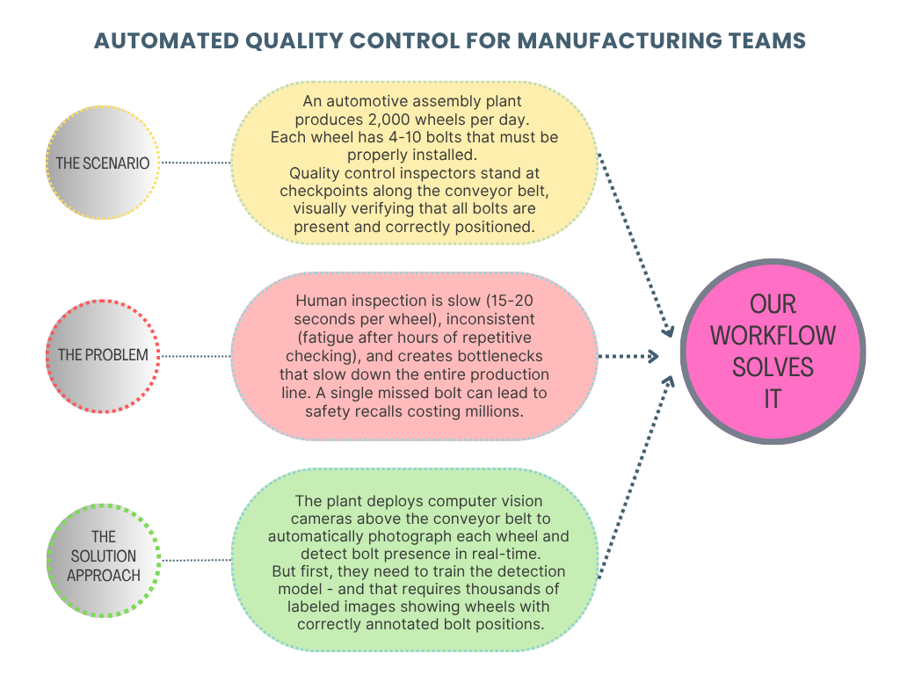
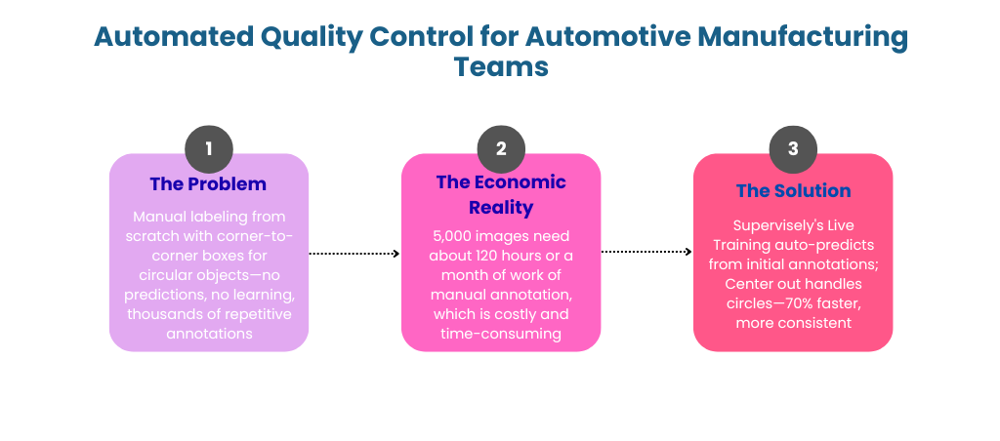
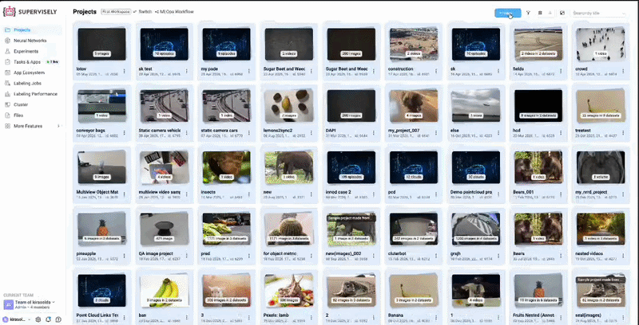
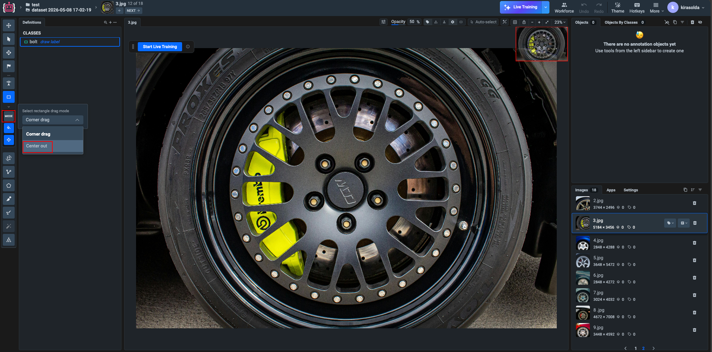

# Bounding Box Annotation of Wheel Bolts for Automotive QA: Live Training in Supervisely

## The Dataset Creation Challenge

ML engineers, QA specialists, and data scientists in automotive manufacturing face a critical challenge when building object detection systems for assembly line inspection. Computer vision can automate this and this guide demonstrates how Supervisely's Live Training and "Center Out" tool (designed for circular objects) reduce annotation time by 70% while improving consistency, getting your automated inspection system into production faster.

<figure><figcaption></figcaption></figure>

## Computer Vision in Automotive Manufacturing: Research Evidence

Recent research demonstrates the effectiveness of computer vision systems in automotive manufacturing quality control:

- [A Deep Learning-Based Computer Vision System for Automated Screw Detection in Vehicle Wheel Boxes](https://link.springer.com/chapter/10.1007/978-3-031-96997-3_1) (Sakuma et al., Springer 2025) presents a computer vision system specifically designed to replace manual visual inspection of screws in automotive wheel assemblies, demonstrating the critical role of automated inspection.

These studies collectively demonstrate that computer vision systems significantly reduce inspection time, improve consistency, and enable real-time quality control—but all require substantial annotated training datasets to achieve production-ready performance.

## Demonstration Dataset: Automotive Wheel Bolts

To solve the automated quality control challenge described above—deploying computer vision for real-time bolt detection on the assembly line—we first need to create a training dataset. We use 18 front-view images of automotive wheels with 3-10 bolts per wheel to demonstrate how Live Training dramatically accelerates this dataset creation process. All bolts are labeled with a single class "bolt" using the "Center out" bounding box mode, which is specifically designed for annotating circular objects like bolt heads.

<figure><figcaption></figcaption></figure>

## How to Annotate Bolts Using Live Training and Center Out Tool: Step-by-Step Guide

### Step 1: Upload Dataset and Launch Annotation Tool

First, we upload our wheel inspection image dataset to the Supervisely platform. The dataset contains front-view images of automotive wheels. Once uploaded, we open the images in Supervisely's annotation interface to begin the labeling process.

<figure><figcaption></figcaption></figure>

<!-- Image placeholder: Upload process
Recommended alt text: "Uploading automotive wheel bolt dataset to Supervisely annotation platform for quality control" -->

### Step 2: Create Initial Bounding Box Annotations

**Critical foundation stage!** We start by manually labeling the first 3-5 images in the dataset. This establishes the annotation pattern that Live Training will learn from.

When creating annotations for bolts, we use the **Rectangle tool with "Center out" option**, which is specifically designed for round objects:

<figure><figcaption></figcaption></figure>

- **Why "Center out" matters**: Traditional bounding boxes are drawn from corner to corner, which is natural for rectangular objects but awkward for circular bolt heads. The "Center out" option allows you to click in the center of the bolt and drag to the edge, automatically creating a properly sized bounding box for round objects.

**Important labeling guidelines:**

- Use consistent class name (e.g., "bolt" or "wheel_bolt")
- Label all visible bolts on each wheel, including partially visible ones
- Use the "Center out" drawing mode for precise bounding boxes around circular bolt heads
- Maintain consistent bounding box sizes relative to the bolt heads

### Step 3: Activate Live Training for Automatic Predictions
