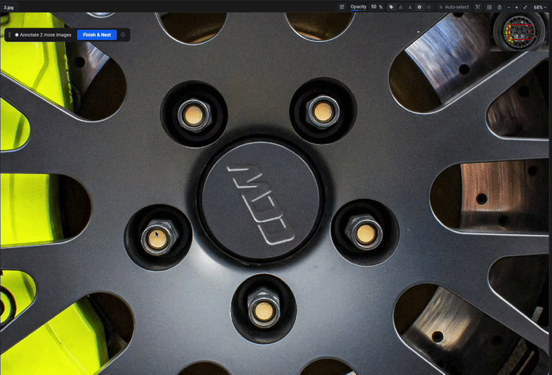
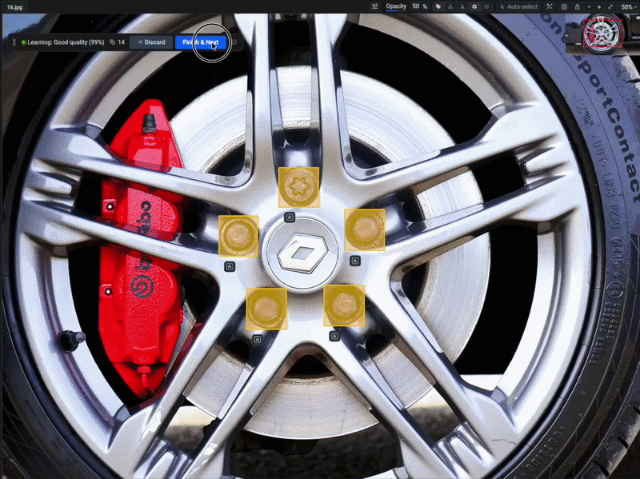
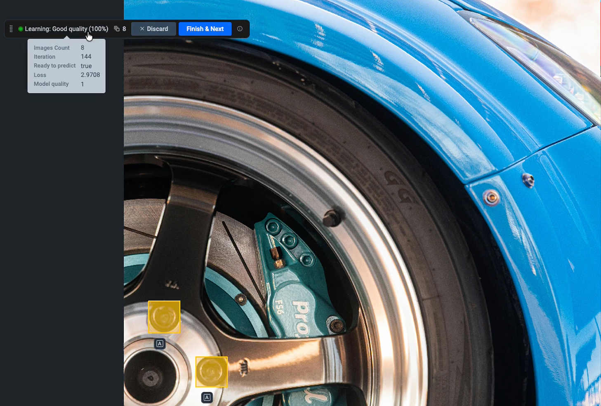
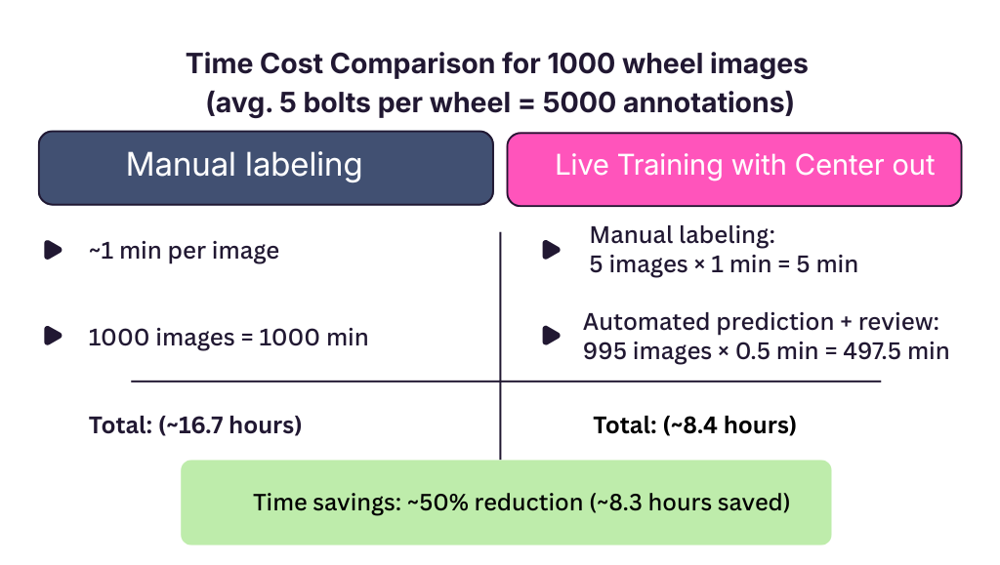
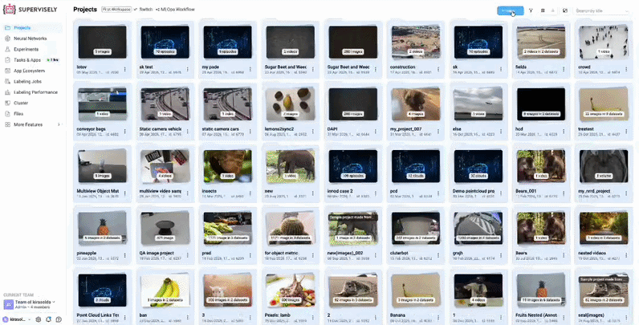
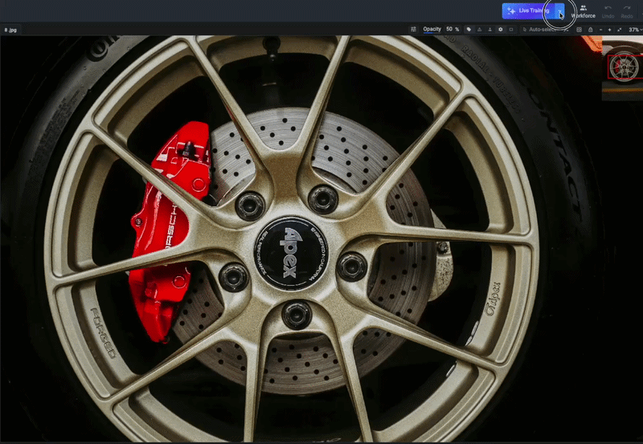

# Bounding Box Annotation of Wheel Bolts for Automotive QA: Live Training in Supervisely

## The Dataset Creation Challenge

ML engineers, QA specialists, and data scientists in automotive manufacturing face a critical challenge when building object detection systems for assembly line inspection. Computer vision can automate this and this guide demonstrates how Supervisely's Live Training and "Center Out" tool (designed for circular objects) reduce annotation time by 70% while improving consistency, getting your automated inspection system into production faster.

### Automated Quality Control for Manufacturing Teams

**The Scenario**

An automotive assembly plant produces 2,000 wheels per day. Each wheel has 4–10 bolts that must be properly installed. Quality control inspectors stand at checkpoints along the conveyor belt, visually verifying that all bolts are present and correctly positioned.

**The Problem**

Human inspection is slow (15–20 seconds per wheel), inconsistent (fatigue after hours of repetitive checking), and creates bottlenecks that slow down the entire production line. A single missed bolt can lead to safety recalls costing millions.

**The Solution Approach**

The plant deploys computer vision cameras above the conveyor belt to automatically photograph each wheel and detect bolt presence in real-time. But first, they need to train the detection model – and that requires thousands of labeled images showing wheels with correctly annotated bolt positions.

## Computer Vision in Automotive Manufacturing: Research Evidence

Recent research demonstrates the effectiveness of computer vision systems in automotive manufacturing quality control:

- [A Deep Learning-Based Computer Vision System for Automated Screw Detection in Vehicle Wheel Boxes](https://link.springer.com/chapter/10.1007/978-3-031-96997-3_1) (Sakuma et al., Springer 2025) presents a computer vision system specifically designed to replace manual visual inspection of screws in automotive wheel assemblies, demonstrating the critical role of automated inspection.

These studies collectively demonstrate that computer vision systems significantly reduce inspection time, improve consistency, and enable real-time quality control—but all require substantial annotated training datasets to achieve production-ready performance.

## Demonstration Dataset: Automotive Wheel Bolts

To solve the automated quality control challenge described above—deploying computer vision for real-time bolt detection on the assembly line — we first need to create a training dataset. We use 17 front-view images of automotive wheels with 3-10 bolts per wheel to demonstrate how Live Training dramatically accelerates this dataset creation process. All bolts are labeled with a single class "bolt" using the "Center out" bounding box mode, which is specifically designed for annotating circular objects like bolt heads.

**The Problem**

Manual labeling from scratch with corner-to-corner boxes for circular objects, no predictions, no learning, thousands of repetitive annotations.

**The Economic Reality**

5,000 images need about 100 hours or a month of work of manual annotation, which is costly and time-consuming.

**The Solution**

Supervisely's Live Training auto-predicts from initial annotations and "Center out" tool handles circles—50-70% faster, more consistent.

## Two Essential Tools for Fast Annotation

### "Center Out" Bounding Box Mode

This specialized drawing mode solves the problem of annotating circular objects: instead of awkward corner-to-corner dragging, you click the center of a bolt and drag to its edge, creating accurate bounding boxes in less time. Ideal for bolts, screws, rivets, washers, bearings, and any round fasteners.

<figure><figcaption></figcaption></figure>

Learn more about this tool in the [Rectangle Tool Documentation](https://docs.supervisely.com/labeling/labeling-tools/bounding-box-rectangle-tool).

### Live Training

This is Supervisely's active learning system that learns from your annotations in real-time. After labeling just a few images, Live Training generates predictions for subsequent images, which you can quickly review and correct. This iterative process significantly reduces the time spent on manual annotation while improving consistency across the dataset.

The Live Training system provides several advantages:

- **Pattern recognition**: Learns from your annotation style and object characteristics
- **Adaptive predictions**: Improves with each labeled image
- **Context awareness**: Considers spatial relationships between objects

<figure><figcaption></figcaption></figure>

#### Monitoring Training Progress

When Live Training is active, you can hover over the learning panel to see real-time training metrics for each iteration:

<figure><figcaption></figcaption></figure>

- **Images count**: Number of labeled images used for training
- **Iteration**: Current training cycle number
- **Ready to predict**: Status indicator showing when the model is ready to generate predictions
- **Loss**: Training loss value showing how well the model is learning (lower is better)
- **Model quality**: Overall quality metric of the current model

These metrics help you understand when the model has learned enough to start making reliable predictions. Typically, after 3-5 manually labeled images, the model quality improves enough to provide useful predictions that you can quickly review and correct.

You can learn more about Live Training in our [Live Training Documentation](https://docs.supervisely.com/labeling/overview/live-training) and [technical report](https://docs.supervisely.com/labeling/overview/live-training/technical-report), which provides a comprehensive guide to setup, workflow, and model quality metrics.

## Performance Metrics and Time Savings

<figure><figcaption></figcaption></figure>

As you can see from the time cost comparison, the combination of the "Center out" tool and Live Training results in a dramatic reduction in annotation time. The initial manual labeling of 3-5 images takes about 1 minute per image, but once Live Training is activated, the time per image drops to around 30 seconds for review and correction. This represents a 50% reduction in annotation time, allowing you to create production-ready datasets much faster.

## How These Supervisely Tools Impact Your Business

Live Training with advanced labeling tools delivers measurable results for manufacturing quality control:

- **50% faster dataset annotation**: Cut labeling time in half for production-scale datasets (1000 images: 16.7 hours of manual labeling against 8.4 hours of labeling with live training)
- **Reduced annotation errors**: "Center out" bounding box option ensures consistent labeling of round objects
- **Scalable system deployment**: Training datasets ready in days instead of weeks
- **Lower quality control costs**: Dramatically reduced data preparation time and expenses
- **Improved inspection accuracy**: Better-quality training data leads to more reliable detection models

## How to Annotate Bolts Using Live Training and Center Out Tool: Step-by-Step Guide

### Step 1: Upload Dataset and Launch Annotation Tool

First, we upload our wheel inspection image dataset to the Supervisely platform. The dataset contains front-view images of automotive wheels. Once uploaded, we open the images in Supervisely's [annotation interface](https://docs.supervisely.com/labeling/labeling-toolbox) to begin the labeling process.

<figure><figcaption></figcaption></figure>

### Step 2: Create Object Class and Start Live Training

Before beginning annotation:

1. Create a new class with a consistent name (e.g., "bolt" or "wheel_bolt")
2. Click the **"Live Training"** button in the interface
3. Press **"Launch app"** and then **"Start Live Training"** to activate the system
4. The Live Training session is now ready to learn from your annotations

<figure><figcaption></figcaption></figure>

### Step 3: Create Initial Manual Annotations

With Live Training activated, manually label the first 3-5 images to establish the annotation pattern that the system will learn from.

When creating annotations for bolts, use the **Rectangle tool with "Center out" option**, which is specifically designed for round objects:

**Important labeling guidelines:**

- Use the "Center out" drawing mode: click the center of each bolt and drag to its edge
- Label all visible bolts on each wheel, including partially visible ones
- Maintain consistent bounding box sizes relative to the bolt heads
- Click **"Finish & Next"** after completing each image to submit it to the training system

### Step 4: Review and Correct AI Predictions

After labeling 3-5 images manually, Live Training starts generating automatic predictions for subsequent images. When you open a new image, predicted bounding boxes appear automatically around detected bolt heads.

**Quick review workflow:**

- **If predictions are good**: Click **"Finish & Next"** to accept and move to the next image
- **If predictions need adjustment**:
  - Adjust boxes that are slightly misaligned (drag corners or edges)
  - Add boxes for any missed bolts
  - Click **"Finish & Next"** when satisfied
- **If predictions are unusable**: Click **"Discard"** to remove all predictions, then click **"Predict"** to generate new predictions, or annotate manually.

**This step takes ~30 seconds per image** compared to 1-2 minutes for full manual labeling.

### Step 5: Iterate and Improve

As you continue labeling with **"Finish & Next"**:

- Live Training predictions become progressively more accurate
- The model learns your specific annotation style
- Review time decreases with each image
- You can process entire batches with minimal adjustments

The system continuously learns from every confirmed annotation, improving prediction quality in real-time.

### Step 6: Export Production-Ready Dataset

Once labeling is complete, export your dataset in the required format (Supervisely, COCO, YOLO, Pascal VOC) for model training and deployment. The exported dataset is immediately ready for model training and deployment in production quality control systems.

Also, you can see step-by-step instructions how to annotate with [Live Training in Supervisely](https://docs.supervisely.com/labeling/overview/live-training).

## Ready to Get Started? Use Our Demo Dataset

Want to test this workflow immediately without collecting your own images? We've prepared a ready-to-use demo dataset with automotive wheel images specifically for practicing Live Training with circular object annotation.

**Download the demo dataset:**

- [Automotive Wheel Bolts Dataset](https://app.supervisely.com/ecosystem/projects/automotive-bolt-annotation-sample-project?id=532) - 17 front-view wheel images with 3-10 bolts per image, perfect for testing Live Training

**How to use it:**

1. Import the dataset directly from Supervisely Ecosystem to your workspace
2. Follow Steps 2-6 from the guide above
3. Experience the 50% annotation time reduction firsthand

**Want to create your own dataset?** For best results:

1. **Capture 50-100 images** with consistent lighting and angles
2. **Ensure clear visibility** of bolt heads in each image
3. **Upload to Supervisely** and follow this guide
4. **Start small**: Create your object class, launch Live Training, then label 3-5 images manually
5. **Review carefully**: Always verify automated predictions using "Finish & Next" or "Discard" → "Predict"
