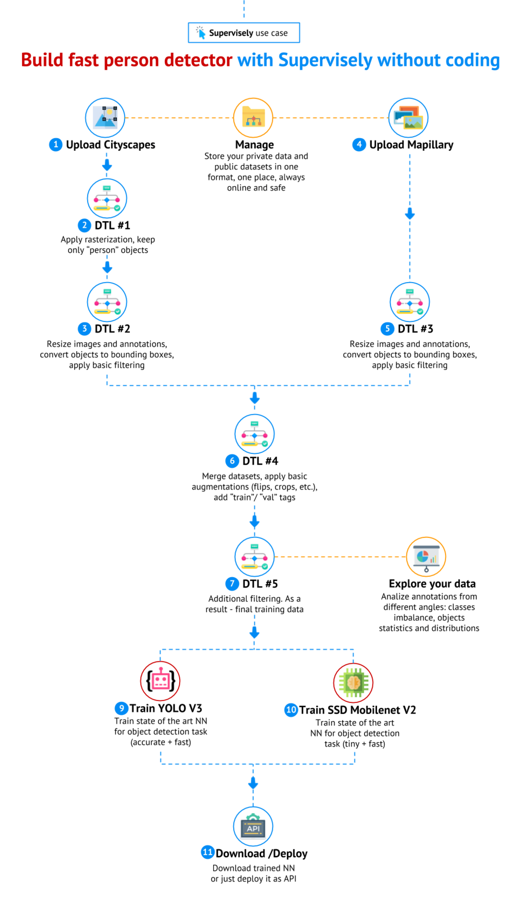
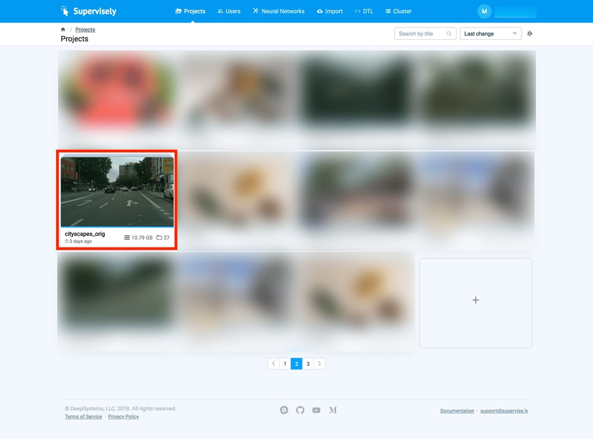
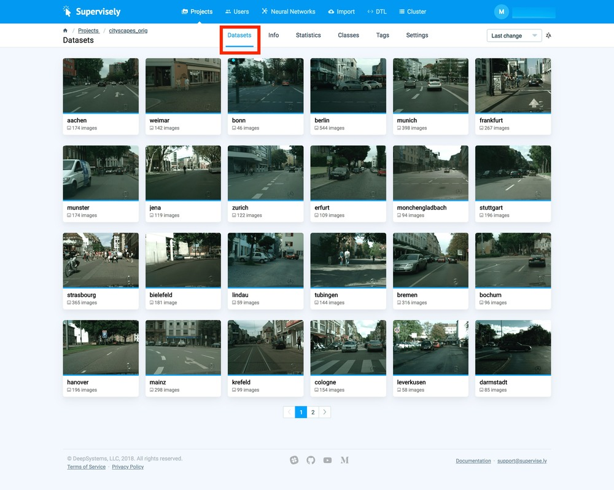
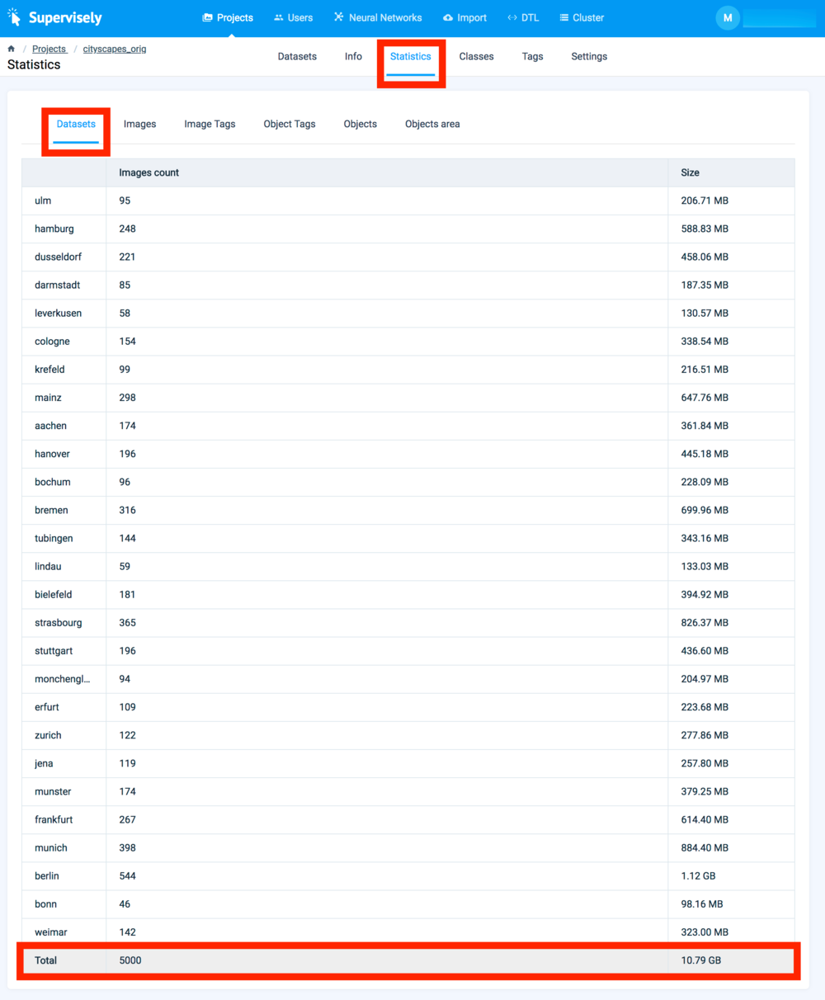
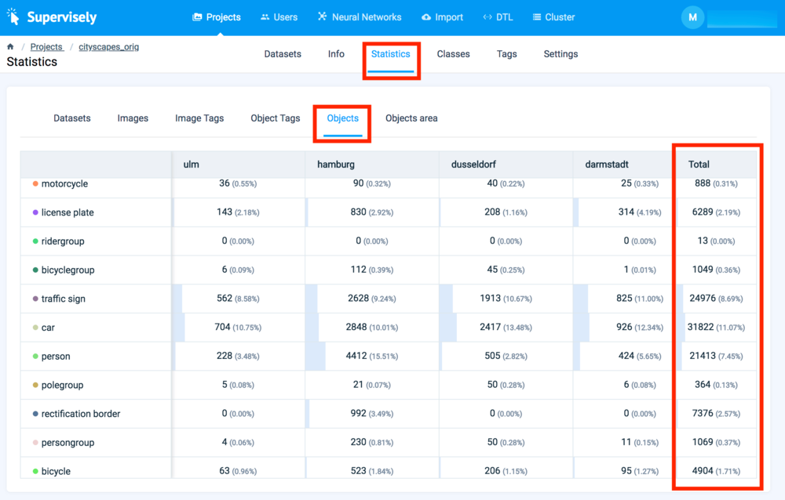
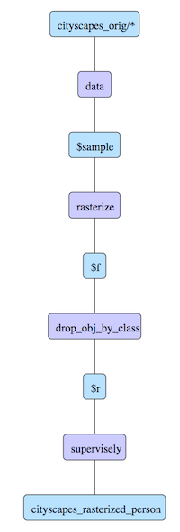
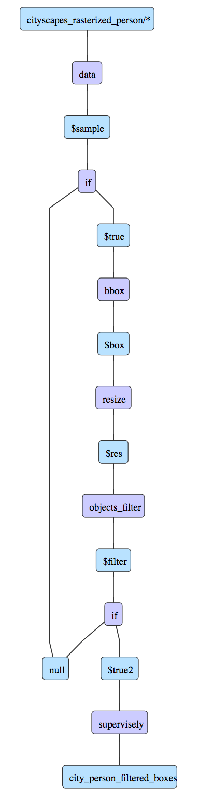
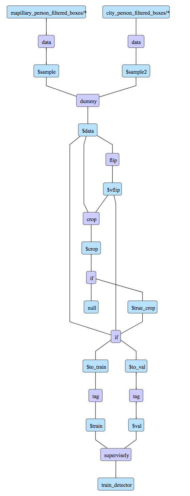
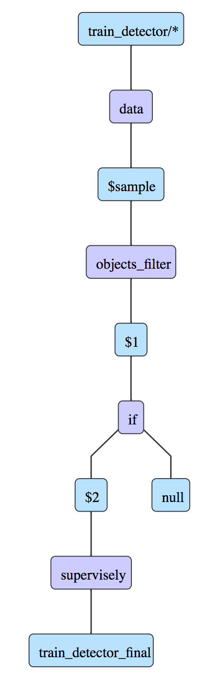
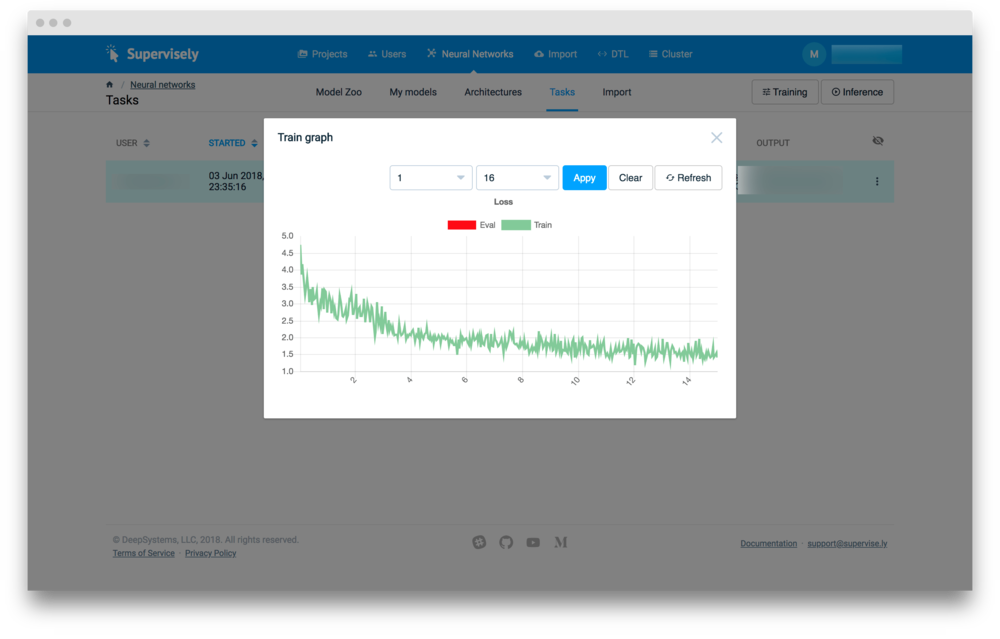

## Intro 

In this tutorial we will demonstrate how easy it is to build a production level model for person detection inside Supervisely without coding. At the end of this tutorial we will get both: 

* A huge training dataset for "person" detection task

* Two custom state of the art models that are very fast and pretty accurate ("YOLO V3" and "SSD MobileNet V2")

Then we can download resulting models, get the source codes and embed them to our production environment (i.e. self-driving car, drone, robot etc.)


So, let's start.

## Big Picture

First of all, we would like to display the entire pipeline from the high level perspective. It is good to see the big picture and understand the entire pipeline we are going to create.



**Disclaimer**: as you can see, we sequentially apply a few DTL queries. Of course, we can apply all the necessary transformations and augmentaions at the same time. We avoid doing that intentionally. It allows us to anylize the intermediate results visually and in terms of statistics.

## Step 1. Upload Cityscapes

In our documentation you will find how to [upload](../../data-organization/import/upload/README.md) a public dataset (in [Cityscapes format](../../data-organization/import/formats/cityscapes.md)) to Supervisely. We will name this project as `cityscapes_orig`.

Uploaded project: 


All datasets inside the project:


Supervisely automatically counts very useful statistics regarding images, objects, tags, and objects areas. Here are a few examples.  

Statistics - project `cityscapes_orig` contains 5000 images in total:


Statistics - objects number distribution in every project and in total:


## Step 2. DTL #1

This DTL takes original Cityscapes dataset and does the following: 

1. Layer #1 (`"action": "data"`) merges two classes (`rider` and `person`) to the single one (`person_poly`) and all other classes to the single class `unnec`. We do not drop unnecessary classes because they are needed to make the correct rasterization.

2. Layer #2 (`"action": "rasterize"`) performs the correct rasterization and converts the class types to bitmap. Read more [here](../../data-manipulation/dtl/examples/drop-classes-complex/drop-classes-complex.md). 

3. Layer #3 (`"action": "drop_obj_by_class"`) drops class `unnec_b` with all its objects. As a result after this operation we will have objects of only the class `person`. Read more here ([link1](../../data-manipulation/dtl/examples/drop-classes-simple/drop-classes-simple.md) and [link2](../../data-manipulation/dtl/examples/drop-classes-complex/drop-classes-complex.md)). 

4. Layer #4 (`"action": "supervisely"`) saves results to the new project with the name `cityscapes_rasterized_person`.


```json
[
  {
    "dst": "$sample",
    "src": [
      "cityscapes_orig/*"
    ],
    "action": "data",
    "settings": {
      "classes_mapping": {
        "rider": "person_poly",
        "person": "person_poly",
        "__other__": "unnec"
      }
    }
  },
  {
    "dst": "$f",
    "src": [
      "$sample"
    ],
    "action": "rasterize",
    "settings": {
      "classes_mapping": {
        "unnec": "unnec_b",
        "person_poly": "person"
      }
    }
  },
  {
    "dst": "$r",
    "src": [
      "$f"
    ],
    "action": "drop_obj_by_class",
    "settings": {
      "classes": [
        "unnec_b"
      ]
    }
  },
  {
    "dst": "cityscapes_rasterized_person",
    "src": [
      "$r"
    ],
    "action": "supervisely",
    "settings": {}
  }
]
```

Here is the visualization of the current DTL query:



## Step 3. DTL #2

In this DTL query we transform previous results. 

1. Layer #1 (`"action": "data"`) merges the entire `cityscapes_rasterized_person` project and map `person` into `person_b`.

2. Layer #2 (`"action": "if"`) drops all images that have no objects.

3. Layer #3 (`"action": "bbox"`) converts objects of the class `person_b` from bitmaps to bounding boxes and renames this class as `person`.

4. Layer #4 (`"action": "resize"`) resizes image to the `"height": 600`.

5. Layer #5 (`"action": "objects_filter"`) drops objects of the class `person` that are less then 10px * 10px.

6. Layer #6 (`"action": "if"`) drops all images without any objects again.

7. Layer #7 (`"action": "supervisely"`) saves the results to the new project with the name `city_person_filtered_boxes`.


```json
[
  {
    "dst": "$sample",
    "src": [
      "cityscapes_rasterized_person/*"
    ],
    "action": "data",
    "settings": {
      "classes_mapping": {
        "person": "person_b"
      }
    }
  },
  {
    "dst": [
      "$true",
      "null"
    ],
    "src": [
      "$sample"
    ],
    "action": "if",
    "settings": {
      "condition": {
        "min_objects_count": 1
      }
    }
  },
  {
    "dst": "$box",
    "src": [
      "$true"
    ],
    "action": "bbox",
    "settings": {
      "classes_mapping": {
        "person_b": "person"
      }
    }
  },
  {
    "dst": "$res",
    "src": [
      "$box"
    ],
    "action": "resize",
    "settings": {
      "width": -1,
      "height": 600,
      "aspect_ratio": {
        "keep": true
      }
    }
  },
  {
    "dst": "$filter",
    "src": [
      "$res"
    ],
    "action": "objects_filter",
    "settings": {
      "filter_by": {
        "polygon_sizes": {
          "action": "delete",
          "area_size": {
            "width": 10,
            "height": 10
          },
          "comparator": "less",
          "filtering_classes": [
            "person"
          ]
        }
      }
    }
  },
  {
    "dst": [
      "$true2",
      "null"
    ],
    "src": [
      "$filter"
    ],
    "action": "if",
    "settings": {
      "condition": {
        "min_objects_count": 1
      }
    }
  },
  {
    "dst": "city_person_filtered_boxes",
    "src": [
      "$true2"
    ],
    "action": "supervisely",
    "settings": {}
  }
]
```

Here is the visualization of the current DTL query:



## Step 4. Upload Mapillary

In our documentaion you will find how to [upload](../../data-organization/import/upload/README.md) a public dataset (in [Mapillary format](../../data-organization/import/formats/mapillary.md)) to Supervisely. We will name this project as `mapillary`.

You can analize statisctics as we showed in Step 1.

## Step 5. DTL #3

In this DTL query we apply transformations that are very similar to Step 3.

1. Layer #1 (`"action": "data"`) merges classes (`Person`, `Bicyclist`, `Other Rider` and `Motorcyclist`) into a single class (`person_b`) and drops all other classes.

2. Layer #2 (`"action": "if"`) drops all images that have no objects.

3. Layer #3 (`"action": "bbox"`) convert objects of class `person_b` from bitmaps to bounding boxes and renames this class as `person`.

4. Layer #4 (`"action": "resize"`) resizes image to the `"height": 600`.

5. Layer #5 (`"action": "objects_filter"`) drops objects of class `person` that are less then 10px * 10px.

6. Layer #6 (`"action": "if"`) drops all images without any objects again.

7. Layer #7 (`"action": "supervisely"`) saves the results to the new project with name `mapillary_filtered_boxes`.


```json
[
  {
    "dst": "$sample",
    "src": [
      "mapillary/*"
    ],
    "action": "data",
    "settings": {
      "classes_mapping": {
        "Person": "person_b",
        "Bicyclist": "person_b",
        "__other__": "__ignore__",
        "Other Rider": "person_b",
        "Motorcyclist": "person_b"
      }
    }
  },
  {
    "dst": [
      "$true",
      "null"
    ],
    "src": [
      "$sample"
    ],
    "action": "if",
    "settings": {
      "condition": {
        "min_objects_count": 1
      }
    }
  },
  {
    "dst": "$box",
    "src": [
      "$true"
    ],
    "action": "bbox",
    "settings": {
      "classes_mapping": {
        "person_b": "person"
      }
    }
  },
  {
    "dst": "$res",
    "src": [
      "$box"
    ],
    "action": "resize",
    "settings": {
      "width": -1,
      "height": 600,
      "aspect_ratio": {
        "keep": true
      }
    }
  },
  {
    "dst": "$filter",
    "src": [
      "$res"
    ],
    "action": "objects_filter",
    "settings": {
      "filter_by": {
        "polygon_sizes": {
          "action": "delete",
          "area_size": {
            "width": 10,
            "height": 10
          },
          "comparator": "less",
          "filtering_classes": [
            "person"
          ]
        }
      }
    }
  },
  {
    "dst": [
      "$true2",
      "null"
    ],
    "src": [
      "$filter"
    ],
    "action": "if",
    "settings": {
      "condition": {
        "min_objects_count": 1
      }
    }
  },
  {
    "dst": "mapillary_person_filtered_boxes",
    "src": [
      "$true2"
    ],
    "action": "supervisely",
    "settings": {}
  }
]
```

Here is the visualization of current DTL query:


## Step 6. DTL #4

This DTL query merges transformed Cityscapes project (`city_person_filtered_boxes`) and transformed Mapillary project (`mapillary_person_filtered_boxes`), 

1. Layer #1 (`"action": "data"`) gets everything from the project `mapillary_person_filtered_boxes` and keeps the classes as they are.

2. Layer #2 (`"action": "data"`) gets everything from the project `city_person_filtered_boxes` and keeps classes as they are.

3. Layer #3 (`"action": "dummy"`) combines data from Layer #1 and Layer #2 into a single variable.

4. Layer #4 (`"action": "flip"`) applies a vertical flip to the images and their annotations.

5. Layer #5 (`"action": "crop"`) performs relatively big random crops (from 60% to 90% in width and height with respect to the image size)

6. Layer #6 (`"action": "if"`) drops all images without any objects of class `person`.

7. Layer #7 (`"action": "if"`) randomly split the data into two branches: first branch - 98% (will be tagged as `train`) and second branch - 2% (will be tagged as `val`)

8. Layer #8 (`"action": "tag"`) adds the tag `train` to all input images.

9. Layer #9 (`"action": "tag"`) add the tag `val` to all input images.

10. Layer #10 (`"action": "supervisely"`) saves results to the new project with name `train_detector`.

```json
[
  {
    "dst": "$sample",
    "src": [
      "mapillary_person_filtered_boxes/*"
    ],
    "action": "data",
    "settings": {
      "classes_mapping": "default"
    }
  },
  {
    "dst": "$sample2",
    "src": [
      "city_person_filtered_boxes/*"
    ],
    "action": "data",
    "settings": {
      "classes_mapping": "default"
    }
  },
  {
    "dst": "$data",
    "src": [
      "$sample",
      "$sample2"
    ],
    "action": "dummy",
    "settings": {}
  },
  {
    "dst": "$vflip",
    "src": [
      "$data"
    ],
    "action": "flip",
    "settings": {
      "axis": "vertical"
    }
  },
  {
    "dst": "$crop",
    "src": [
      "$data",
      "$vflip"
    ],
    "action": "crop",
    "settings": {
      "random_part": {
        "width": {
          "max_percent": 90,
          "min_percent": 60
        },
        "height": {
          "max_percent": 90,
          "min_percent": 60
        }
      }
    }
  },
  {
    "dst": [
      "$true_crop",
      "null"
    ],
    "src": [
      "$crop"
    ],
    "action": "if",
    "settings": {
      "condition": {
        "include_classes": [
          "person"
        ]
      }
    }
  },
  {
    "dst": [
      "$to_train",
      "$to_val"
    ],
    "src": [
      "$data",
      "$vflip",
      "$true_crop"
    ],
    "action": "if",
    "settings": {
      "condition": {
        "probability": 0.98
      }
    }
  },
  {
    "dst": "$train",
    "src": [
      "$to_train"
    ],
    "action": "tag",
    "settings": {
      "tag": "train",
      "action": "add"
    }
  },
  {
    "dst": "$val",
    "src": [
      "$to_val"
    ],
    "action": "tag",
    "settings": {
      "tag": "val",
      "action": "add"
    }
  },
  {
    "dst": "train_detector",
    "src": [
      "$train",
      "$val"
    ],
    "action": "supervisely",
    "settings": {}
  }
]
```

Here is the visualization of the current DTL query:



## Step 7. DTL #5

This is the final DTL query. As a result we will get the project `train_detector_final` that will be used for training (41615 images with 175088 objects). 

1. Layer #1 (`"action": "data"`) gets everything from the project `train_detector` and keeps classes as they are.

2. Layer #2 (`"action": "objects_filter"`) drops objects of the class `person` that are less then 1px * 1px (drops "dummy" objects).

3. Layer #3 (`"action": "if"`) drops all images without any objects of class `person`.

4. Layer #4 (`"action": "supervisely"`) saves results to the new project with the name `train_detector_final`.


```json
[
  {
    "dst": "$sample",
    "src": [
      "train_detector/*"
    ],
    "action": "data",
    "settings": {
      "classes_mapping": "default"
    }
  },
  {
    "dst": "$1",
    "src": [
      "$sample"
    ],
    "action": "objects_filter",
    "settings": {
      "filter_by": {
        "polygon_sizes": {
          "action": "delete",
          "area_size": {
            "width": 1,
            "height": 1
          },
          "comparator": "less",
          "filtering_classes": [
            "person"
          ]
        }
      }
    }
  },
  {
    "dst": [
      "$2",
      "null"
    ],
    "src": [
      "$1"
    ],
    "action": "if",
    "settings": {
      "condition": {
        "min_objects_count": 1
      }
    }
  },
  {
    "dst": "train_detector_final",
    "src": [
      "$2"
    ],
    "action": "supervisely",
    "settings": {}
  }
]
```

Here is the visualization of the current DTL query:




## Step 8. YOLO V3 training.

Basic step by step training guide is [here](../../neural-networks/training/training.md). So it is the same for all models inside Supervisely.

Training for models YOLO V3 and SSD Mobilenet V2 will differ just in training configurations. Detailed information is [here](../../neural-networks/configs/train_config.md). 

YOLO V3 weihts were initialized from the corresponding model from the Models list (it was pretrained on COCO).

For YOLO V3 we used this configuration:

```json
{
  "lr": 0.0001,
  "epochs": 30,
  "batch_size": {
    "train": 64
  },
  "input_size": {
    "width": 448,
    "height": 448
  },
  "bn_momentum": 0.01,
  "gpu_devices": [
    0,
    1,
    2,
    3
  ],
  "data_workers": {
    "train": 3
  },
  "dataset_tags": {
    "train": "train"
  },
  "subdivisions": {
    "train": 16
  },
  "print_every_iter": 30,
  "weights_init_type": "transfer_learning",
  "enable_augmentations": true
}
```

Training takes 6 hours on four GPUs. Here is the loss chart during training:



## Step 9. SSD Mobilenet V2 training.

SSD Mobilenet V2 weihts were initialized from the orresponding model from the Models list (it was pretrained on COCO).

For SSD Mobilenet V2 we used this configuration:

```json
{
  "lr": 0.0001,
  "epochs": 15,
  "val_every": 1,
  "batch_size": {
    "val": 12,
    "train": 12
  },
  "input_size": {
    "width": 600,
    "height": 600
  },
  "gpu_devices": [
    0,
    1,
    2,
    3
  ],
  "data_workers": {
    "val": 0,
    "train": 0
  },
  "dataset_tags": {
    "val": "val",
    "train": "train"
  },
  "weights_init_type": "transfer_learning",
  "allow_corrupted_samples": {
    "val": 0,
    "train": 0
  }
}
```


## Step 10. Download resulting models

"How to download model" guide is [here](../../neural-networks/my-models/my-models.md).  