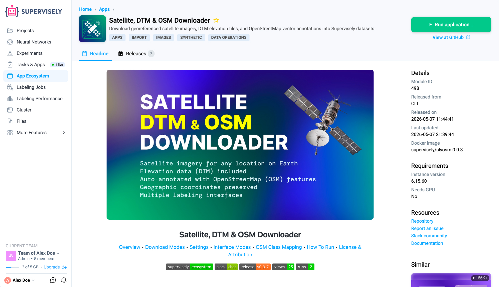
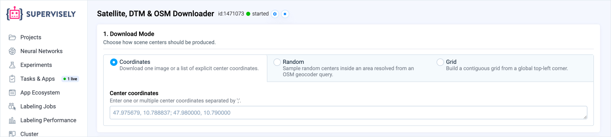
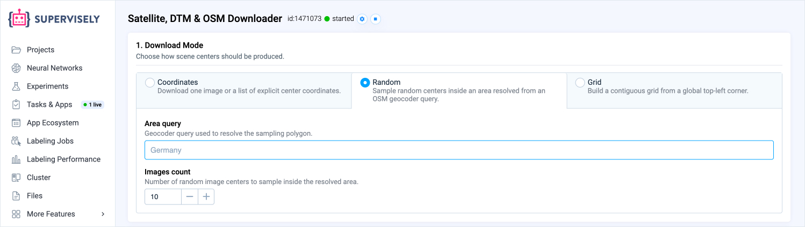
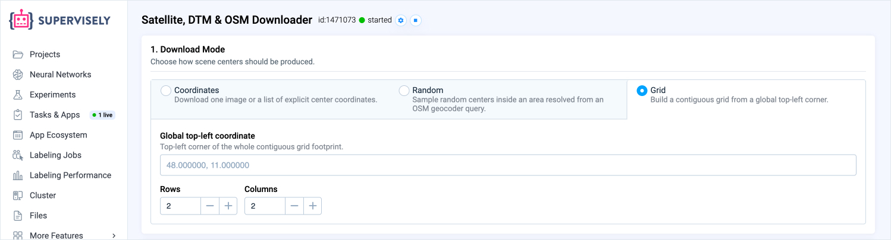
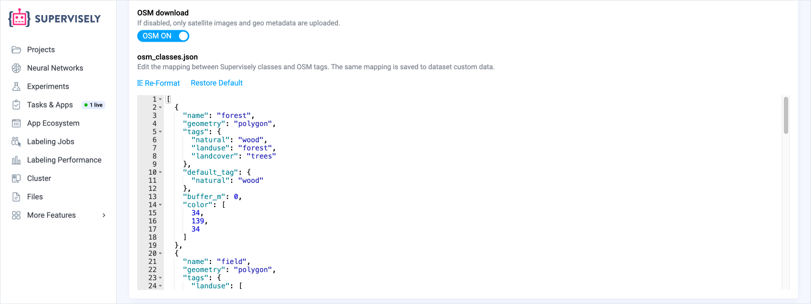
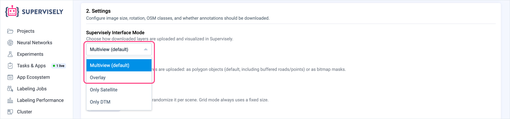
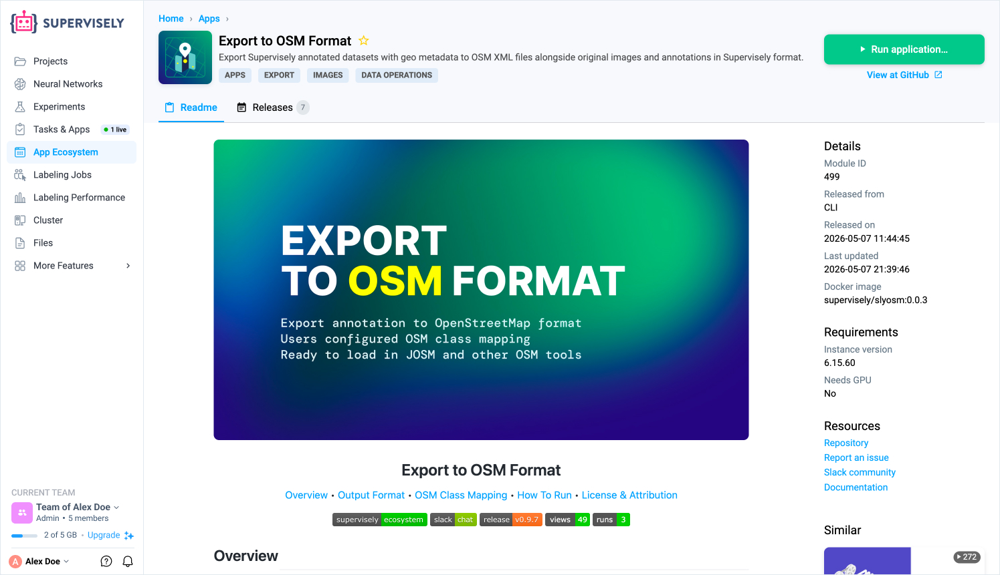
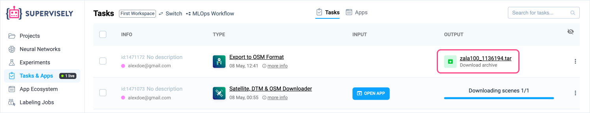

# Geospatial Data Annotation

Supervisely provides a fully integrated workflow for geospatial imagery — from data acquisition to annotation to export. Satellite images, elevation maps, and OpenStreetMap vector features are downloaded together, stored as georeferenced datasets, and remain ready for annotation with the full power of the Supervisely labeling platform. When the work is done, annotated data can be exported back to standard geodata formats without leaving the platform or writing any conversion scripts.

## End-to-End Workflow

The geospatial workflow in Supervisely covers every stage in one place:

1. **Collect** — download satellite imagery, DTM tiles, and OSM vector annotations for any location on Earth.
2. **Label** — work with multi-layer geospatial images using purpose-built interfaces, manual tools, and AI assistance.
3. **Collaborate** — manage labeling jobs, run quality control, and coordinate teams at scale using native Supervisely features.
4. **Export** — produce OSM-compatible geodata files from your annotations, preserving geographic coordinates.

No external preprocessing or format conversion is required at any step.

## Collecting Data

<figure><figcaption></figcaption></figure>

The [Satellite, DTM & OSM Downloader](https://ecosystem.supervisely.com/apps/slyosm/import_osm) app downloads three types of geospatial data simultaneously for any set of geographic locations:

- **Satellite imagery** — optical tiles from the provider of your choice.
- **DTM (Digital Terrain Model)** — elevation data for the same coverage area.
- **OpenStreetMap vector features** — roads, buildings, water bodies, forests, and other features fetched from the [OpenStreetMap](https://www.openstreetmap.org/) API and stored as Supervisely object annotations.

Every downloaded image carries embedded geo metadata — center coordinates, local coordinate reference system, and a homography matrix — so geographic context is never lost regardless of how the data is processed later.

### Download Modes

The app supports three strategies for selecting locations:

**Coordinates** — provide an explicit list of `lat, lon` pairs. Use this when you have a known set of locations from a survey, an external dataset, or a previous pipeline stage.

<figure><figcaption></figcaption></figure>

**Random sampling** — specify a place name and a tile count. The app geocodes the name to a boundary polygon and randomly samples tile centers inside it, with a configurable minimum distance between tiles to avoid redundant coverage. Sampling state is persisted between runs, so you can incrementally grow an existing dataset.

<figure><figcaption></figcaption></figure>

**Grid** — define a top-left corner, row and column counts, and tile size. Tiles are placed contiguously with no gaps, producing a seamless mosaic — useful for exhaustive coverage of a specific area or building spatially structured validation sets.

<figure><figcaption></figcaption></figure>

### OSM Class Mapping

The set of OpenStreetMap features to download — and how they map to Supervisely object classes — is configured as a JSON array in the app UI. The mapping is saved automatically to the dataset's custom metadata when images are uploaded. The companion export app reads it back from there, so annotations round-trip correctly without any manual reconfiguration.

<figure><figcaption></figcaption></figure>

## Labeling Interfaces

Geospatial images often contain information across multiple data layers. Supervisely provides two dedicated labeling interfaces that are particularly well suited to multi-layer imagery.

<figure><figcaption></figcaption></figure>

### Multiview

[Multiview labeling](https://docs.supervisely.com/labeling/labeling-toolbox/multi-view-images) displays the satellite image and the DTM elevation layer side by side in a single labeling session. Both views are synchronized — panning, zooming, and annotations are shared across the pair. This is useful when elevation context is needed for annotation decisions, for example distinguishing embankments from roads or identifying vegetation by canopy height.

### Overlay

[Overlay mode](https://docs.supervisely.com/labeling/labeling-toolbox/overlay) composites the DTM layer on top of the satellite image. The transparency of the overlay can be adjusted on the fly during labeling. This provides a single unified view with elevation information blended in, which can help identify terrain boundaries and surface anomalies that are not visible in the optical image alone.

Both modes are available as options in the downloader app. If only one data source is needed, the app also supports **Satellite only** and **DTM only** configurations that produce standard single-image datasets compatible with all other Supervisely labeling tools.

## AI-Assisted Annotation

Because geospatial datasets in Supervisely are standard image datasets with object annotations, every AI feature on the platform is available without any additional setup.

The **Smart Tool** provides interactive AI-assisted segmentation — click on an object and the model produces a mask or polygon boundary. This is particularly effective for consistently shaped features like buildings, water bodies, and agricultural fields that appear across many tiles.

**Neural network training and inference** can be run directly on geospatial datasets using any model from the Supervisely Ecosystem, enabling semi-automated annotation pipelines where a model pre-labels new tiles and annotators review and correct the output.

## Exporting Geodata

<figure><figcaption></figcaption></figure>

The [Export to OSM Format](https://ecosystem.supervisely.com/apps/slyosm/export_to_osm) app converts Supervisely annotations back to geographic coordinates and produces standard [OSM XML](https://wiki.openstreetmap.org/wiki/OSM_XML) files. It can be launched from a single dataset or from an entire project.

<figure><figcaption></figcaption></figure>

For each dataset the export produces:

- `img/` — original satellite images.
- `ann/` — Supervisely annotation JSON files.
- `osm/` — OSM XML files with annotations projected to longitude/latitude, ready to open in [JOSM](https://josm.openstreetmap.de/) or any other OSM-compatible tool.

The OSM class mapping stored in the dataset's metadata is read automatically, so every exported feature carries the correct OSM tags. The complete archive is delivered as a downloadable file directly from the task interface.

## Full Platform Access

Geospatial datasets in Supervisely are first-class image datasets. This means the entire platform feature set is available without compromise:

- **Team labeling and jobs** — distribute annotation work across teams, track progress, and enforce review workflows.
- **Quality control** — use consensus labeling, review queues, and inter-annotator agreement metrics.
- **Data versioning** — snapshot datasets at any point, compare annotation revisions, and roll back changes.
- **Model training** — train and fine-tune computer vision models directly on geospatial datasets within the platform.
- **Python SDK** — automate any part of the pipeline, from data ingestion to annotation export, using the [Supervisely Python SDK](https://developer.supervisely.com).

Geospatial data is no longer a specialized silo that requires dedicated tooling at each stage. With Supervisely, satellite imagery, elevation data, and OpenStreetMap annotations are part of the same unified environment as every other computer vision dataset on the platform.

## Developer Documentation

If you want to reproduce this workflow programmatically, see the corresponding Developer Portal tutorial: [Working with Geospatial Images in Python SDK](https://developer.supervisely.com/getting-started/python-sdk-tutorials/images/geospatial-images).
