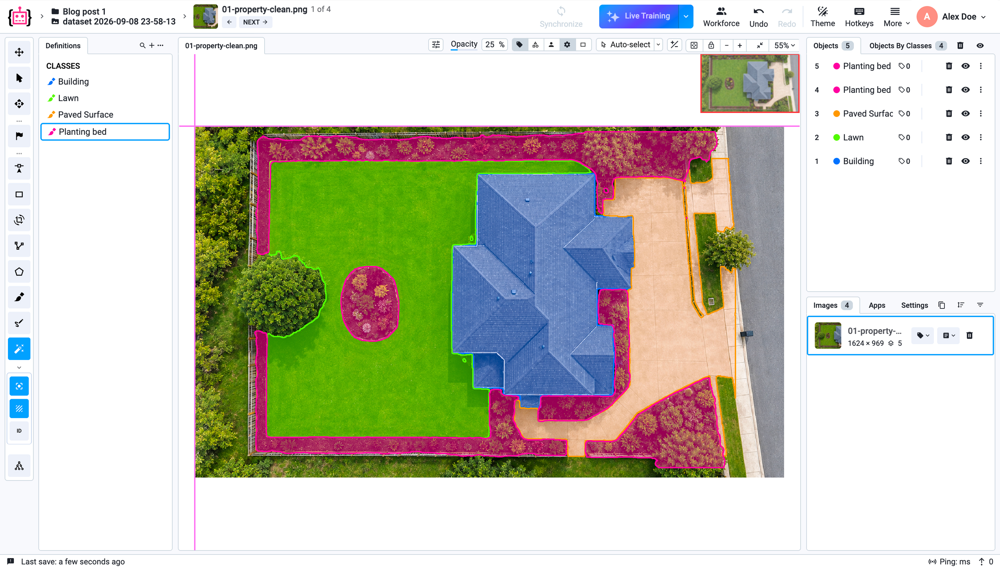
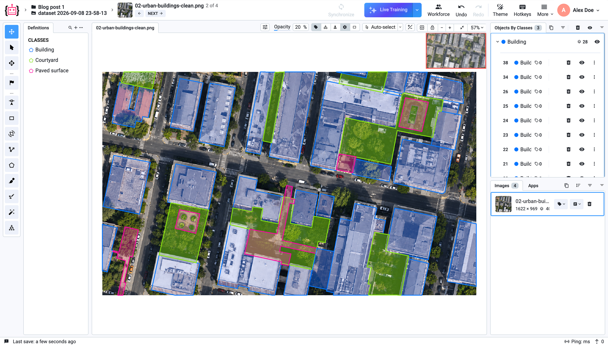
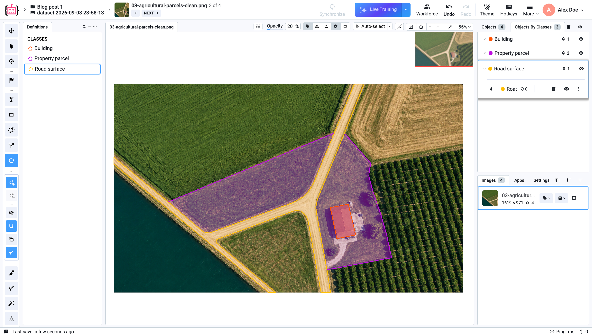

# Scalable Polygon Annotation in Supervisely

Many geospatial projects need more than an approximate object area. They need exact geometry: straight sides, corners, holes, and shared boundaries between neighboring regions. Consider a property where a house meets a lawn and a paved area. These are three separate map objects, but the lines between them must align without gaps, overlaps, or redrawing the same boundary twice.

*In this aerial image, Smart Tool with Segment Anything quickly identifies the building, lawn, paved surface, and planting beds, providing a useful first pass. This works well when the required boundary can follow visible image features. Here, however, the final site plan must also reflect the structure of the property: the lawn continues beneath the tree canopy, and the private paved area must be separated from the visually connected public sidewalk. Decisions like these require human review and, when boundaries must be straight and aligned, an appropriate final geometry.*

[Segment Anything in Smart Tool](../labeling/labeling-tools/smart-tool.md) and the [Brush Tool](../labeling/labeling-tools/brush-tool.md) are well suited to creating and refining masks quickly.

If positive and negative Smart Tool points are not enough, an annotator can refine the mask locally with the brush by adding a missing area or removing an unwanted one. The result remains a mask, so its boundary still follows the image's pixel grid.

If a mask is the required output, this workflow may be all the team needs.

If the final data must contain straight, editable boundaries that align precisely between neighboring objects, a polygon is the more appropriate final geometry.



*This video shows a mask created by Meta AI's pretrained Segment Anything model being refined with the Brush Tool in Supervisely. The brush lets an annotator add or remove individual regions when model-guidance points are not enough. This workflow is effective when the required output is a mask.*

When a project requires vector output, Supervisely can convert the mask into a polygon whose vertices can then be edited. This is useful for irregular objects or when the original mask is already close to the required boundary. For objects with straight sides, however, the conversion may create many unnecessary vertices.



*This video shows a Segment Anything mask being converted directly into a polygon in Supervisely. The resulting outline can be edited manually. For an object with straight sides, the converted polygon may contain more vertices than a clean outline drawn with only a few points.*

Across thousands of objects, repeatedly correcting uneven edges, extra vertices, and boundary junctions increases labeling and review time. For geospatial objects with an expected rectilinear shape, drawing a polygon manually is often a shorter path to approved geometry.

The right tool therefore depends on the required output. Smart Tool and the Brush Tool accelerate mask creation and refinement. When a task calls for straight edges, precise corners, editable outlines, and exact shared boundaries between neighboring objects, polygons are the better final representation.

For this combined workflow, Supervisely is the No. 1 choice: a team can generate an initial mask with AI, refine it with the brush, convert it into a polygon, or draw a polygon directly. The [Polygon Tool](../labeling/labeling-tools/polygon-tool.md) lets annotators quickly create a clean outline, correct a local section, continue a new polygon along an existing boundary, and create holes. Teams can then distribute tasks, review results, and measure performance in the same platform.



*This video shows polygon annotation of a property in Supervisely. The building and lawn are already stored as separate objects while the annotator adds planting beds, extending their outlines along neighboring objects to maintain straight, aligned boundaries.*

## Why geospatial projects use polygons

Geospatial annotation is not only about object area. It must also preserve the relationships between boundaries: whether objects overlap, touch along one shared line, contain excluded areas, or form a geometrically valid contour. These situations occur frequently when annotating buildings, property parcels, fields, lawns, and paved surfaces.

Spatial reference matters as much as shape in geospatial projects. Standard Supervisely annotations store polygon vertices in image coordinates. When imagery is prepared with the [Satellite, DTM & OSM Downloader](https://ecosystem.supervisely.com/apps/slyosm/import_osm), each image also retains geospatial metadata, including its coordinate reference system, geographic extent, and pixel-to-map transformation. [Export to OSM Format](https://ecosystem.supervisely.com/apps/slyosm/export_to_osm) uses that metadata to reproject annotations to longitude and latitude and produce OSM-compatible files.

### Intersections and overlaps: preserve the meaning of each object

Overlapping polygon areas are not always an error. A building occupies part of a property parcel, for example, but both objects must remain independent. Different thematic layers may likewise store the parcel area, surface types, and built structures separately.

When [overlap is part of the data model](https://supervisely.com/blog/complete-overview-and-comparison-of-manual-segmentation-approaches/), Supervisely can preserve each polygon as a separate object with its own class. But when two surfaces should only touch—such as a lawn and a paved area—an accidental overlap distorts both the area and the boundary. Annotation guidelines must therefore define the required relationship in each case: overlap, shared boundary, or hole.

### Snap to object: reuse one shared boundary

A building, lawn, and paved area meet along the same lines. If every polygon is drawn independently, gaps or overlaps may appear between objects, and the annotator has to place points twice along the same boundary.

[Automatic object linking](../labeling/labeling-tools/polygon-tool.md#automatic-object-linking) in the Polygon Tool provides snapping to an existing annotation contour. The annotator selects points on the existing boundary, and the new polygon follows that boundary between them. In the property example, the building outline can be reused when drawing the lawn and paved area instead of aligning every vertex manually.



*This video shows Automatic object linking in the Supervisely Polygon Tool. When drawing the lawn polygon, the annotator selects points on the existing building contour and reuses the boundary between them. The two objects share the same precise line without placing the same vertices twice or manually correcting gaps and overlaps.*

Once a shared boundary has been created, it can also be edited as linked geometry. If a vertex is shared by multiple neighboring polygons, the annotator moves it once and the Polygon Tool updates the contours of all linked objects. There is no need to correct one polygon and then drag the others back into alignment.



*In this video, the annotator first moves a vertex shared by the Lawn and Planting bed polygons, then moves the junction shared by Building, Lawn, and Planting bed. In both cases, the boundaries remain aligned while the shapes of two or three objects update together.*

### Self-intersection: a small mistake can invalidate a polygon

A self-intersection occurs when a polygon boundary crosses itself, for example because vertices were placed in the wrong order or a complex contour was corrected incorrectly. The inside of that polygon becomes ambiguous. This is more than a visual defect: the geometry may be considered invalid during validation and downstream GIS operations.

In the [Polygon Tool](../labeling/labeling-tools/polygon-tool.md#manual-annotation-guide), a reviewer can move, add, or remove vertices. If the problem affects only one part of the object, they can [replace the incorrect contour section](../labeling/labeling-tools/polygon-tool.md#correcting-and-refining-annotations) instead of redrawing the entire polygon. This is especially useful when reviewing polygons produced by a model or imported from an external source.

### Polygon holes: exclude an internal area

[Holes creation](../labeling/labeling-tools/polygon-tool.md#holes-creation) lets an annotator exclude an internal area from an existing polygon. A lawn can remain one object while a planting bed, pond, building, or landscaped island is cut out inside it. The outer lawn geometry stays intact, while the excluded region keeps its own precise shape.



*This video shows a hole being drawn for a planting bed inside an existing lawn polygon in Supervisely. The internal area is excluded from the lawn while the outer lawn remains a single object. The hole follows its own editable boundary, so the planting bed does not have to split the surrounding polygon into several annotations.*

### Why these actions matter at scale

Open geospatial datasets demonstrate the scale at which polygon geometry is used. [Microsoft Global ML Building Footprints](https://github.com/microsoft/GlobalMLBuildingFootprints) contains 1.4 billion building outlines extracted from imagery around the world, while [SpaceNet](https://spacenet.ai/datasets/) contains more than 11 million building footprints. [USDA Crop Sequence Boundaries](https://data.nass.usda.gov/Research_and_Science/Crop-Sequence-Boundaries/) publishes polygon boundaries for agricultural fields. At this scale, redrawing shared edges or recreating an entire object because of one local error becomes a significant operational cost.

The first outline can be produced by a person or a specialized model. [Frame Field Learning](https://openaccess.thecvf.com/content/CVPR2021/html/Girard_Polygonal_Building_Extraction_by_Frame_Field_Learning_CVPR_2021_paper.html), [PolyWorld](https://openaccess.thecvf.com/content/CVPR2022/html/Zorzi_PolyWorld_Polygonal_Building_Extraction_With_Graph_Neural_Networks_in_Satellite_CVPR_2022_paper.html), and [Pix2Poly](https://openaccess.thecvf.com/content/WACV2025/html/Adimoolam_Pix2Poly_A_Sequence_Prediction_Method_for_End-to-End_Polygonal_Building_Footprint_WACV_2025_paper.html) demonstrate different approaches to generating polygonal building footprints automatically. Supervisely supports [custom model integration](../neural-networks/custom-model-integration/integrate-custom-inference.md), while the Polygon Tool gives annotators and reviewers the controls required to turn predicted geometry into an approved result.

*In this high-resolution aerial image, buildings and neighboring urban areas are stored as separate polygons. Reviewers can inspect individual objects and correct local sections without redrawing an entire outline.*

Aerial imagery also helps digitize property parcels, but it cannot establish a legally authoritative cadastral boundary on its own. A specialist compares the imagery with cadastral records, survey plans, title documents, and field-survey results, then corrects the polygon when a visible fence, hedge, or road differs from the documented boundary. [HM Land Registry guidance](https://www.gov.uk/government/publications/how-to-read-a-title-register-and-title-plan/how-to-read-a-title-plan) similarly emphasizes that a title plan must be read together with the register and property deeds.

*The property parcel, road surface, and building remain separate editable objects. This structure allows a reviewer to check overlaps, shared boundaries, and consistency with source documents.*

For large projects, these editing operations are supported by platform-level workflow tools. [Labeling Jobs](../labeling/jobs/README.md) and [Labeling Queues](../labeling/jobs/Labeling-Queues.md) distribute data among annotators. [Labeling Quality Control](../labeling/jobs/Labeling-Quality-Control.md) supports review and rework, while [Labeling Performance](../labeling/labeling-performance.md) reports active labeling time, average time per object, annotation acceptance rate, and review time.

The [Supervisely Image Labeling Tool](../labeling/images/README.md) supports high-resolution imagery, TIFF files, and scenes containing large numbers of objects. Teams can therefore manage geospatial data, polygon annotation, and quality control in one workflow instead of assembling the process from separate tools.

## Precise geometry should remain practical at production scale

When the required output includes straight sides, exact corners, holes, and aligned boundaries between neighboring objects, polygons remain essential in 2026. Supervisely turns that geometry into a complete production workflow: the first polygon can be drawn manually or generated by a model, corrected locally, checked, and submitted for review in the same platform.

[Try Supervisely](https://app.supervisely.com/) or [request a demo](https://supervisely.com/contact-us/) to evaluate polygon annotation on your own geospatial data.
