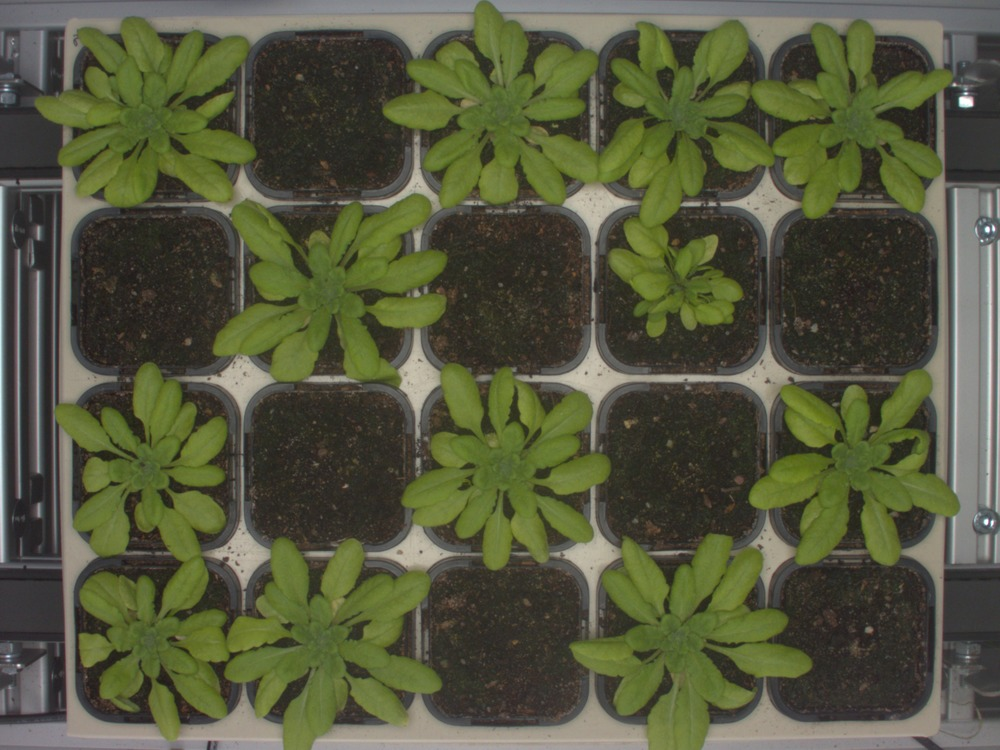
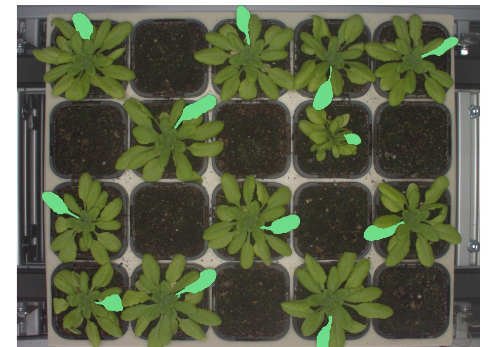
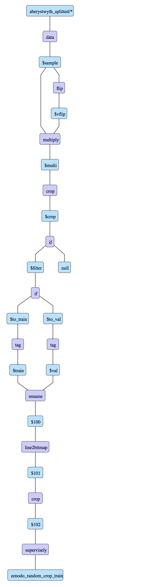
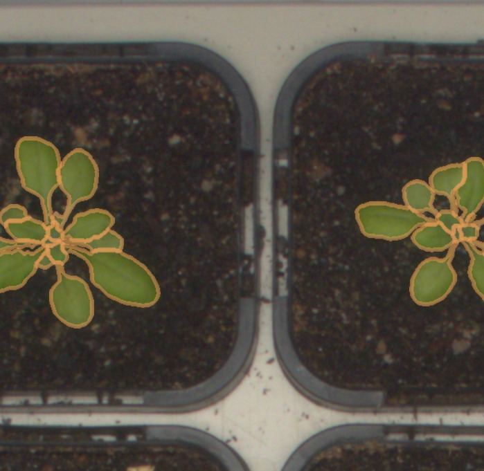
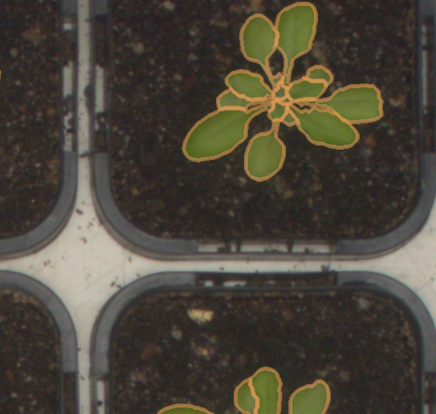
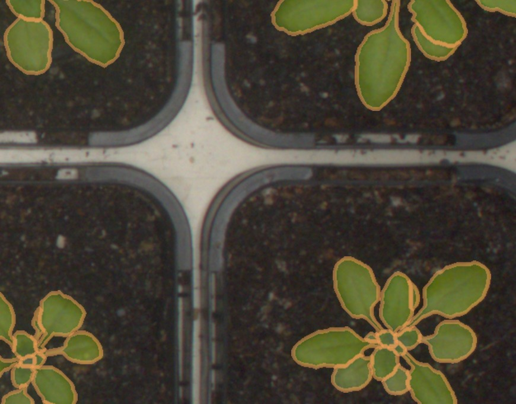
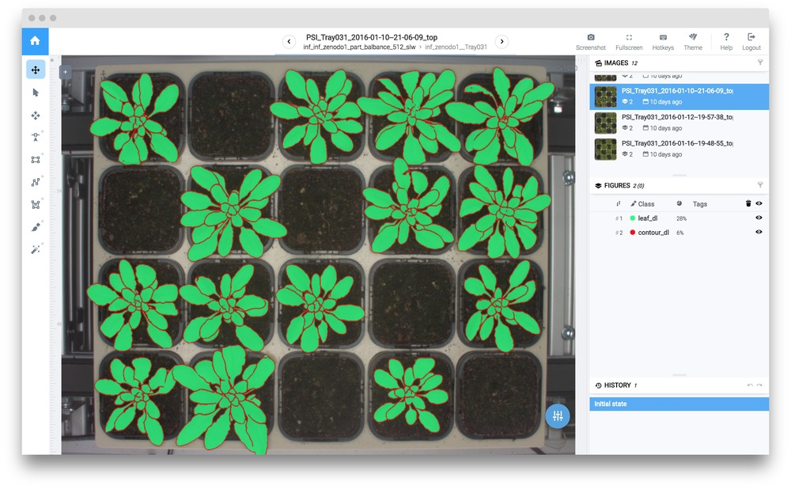
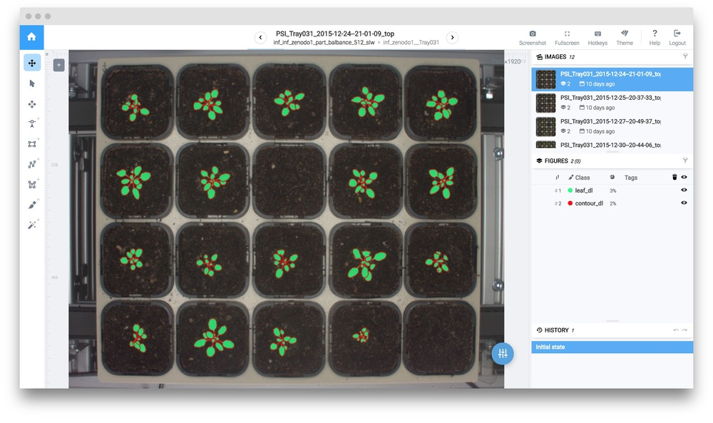

## Introduction

Today we are going to consider wery interesting, exotic and novel concept: how to adopt any segmentation neural network to find instances. While others use [Mask-RCNN](../../neural-networks/examples/mask_rcnn.md) (and of course it is good enought for many tasks), today we are going to propose another approach.    

The main idea is the following: we will add additional class (object boundary). It will allow us to train model to segment objects with their boundaries, and then we will be able to use these boundaries to split objects instances via DTL query.  

## Task description

Deep Learning has a lot of applications in agriculture. Today we will build system to perform instance segmentation of plant leafs. We will use [Aberystwyth Leaf Evaluation Dataset](https://zenodo.org/record/168158#.Wzt1BtgzbOQ).

Here is the example of image:




You can download the tutorial data and reproduce entire experiment yourself.



We recommend to combine these techniques with other tutorials to obtain better results.


To solve this task we should combine a few approaches: sliding window and adding the additional class (automatically using DTL) 


## Step 1. Upload Aberystwyth Leaf Evaluation Dataset

a) Download the original dataset [images_and_annotations.zip](https://zenodo.org/record/168158#.WzOr7-mWbCK)

b) Choose the `aberystwyth` import option

c) Drag `images_and_annotations` dir to the upload window

d) Name this project `aberystwyth`


As you can see, the annotations look unusual. Here is an example of a single object:



## Step 2. DTL #1 to split leafs to separate instances

1. Layer #1 (`"action": "data"`) takes all data from project `aberystwyth` and keeps classes as they are.

2. Layer #2 (`"action": "split_masks"`) splits masks of class `leaf` into connected components. As a result from one mask with a few leafs we will get separate masks for each leaf. 

3. Layer #3 (`"action": "supervisely"`) saves results to the new project `aberystwyth_splitted`.


```json
[
  {
    "dst": "$sample",
    "src": [
      "aberystwyth/*"
    ],
    "action": "data",
    "settings": {
      "classes_mapping": "default"
    }
  },
  {
    "dst": "$sample1",
    "src": [
      "$sample"
    ],
    "action": "split_masks",
    "settings": {
      "classes": [
        "leaf"
      ]
    }
  },
  {
    "dst": "aberystwyth_splitted",
    "src": [
      "$sample1"
    ],
    "action": "supervisely",
    "settings": {}
  }
]
```


## Step 3. Dtl #2 to apply augmentations and prepare training dataset

In this DTL query we apply transformations, filter images and split them into train and validation sets.

1. Layer #1 (`"action": "data"`) takes all data from the project `aberystwyth_splitted` and keeps classes as they are.

2. Layer #2 (`"action": "flip"`) flips the data horisontally. 

3. Layer #3 (`"action": "multiply"`) creates 10 copies for each image.

4. Layer #6 (`"action": "crop"`) performs random crops (from 20% to 25% in width and from 25% to 30% in height with respect to the image size)

5. Layer #7 (`"action": "if"`) filters the data (sends the data containing at least one object to the first branch, all other data will be sent to `null`).

6. Layer #8 (`"action": "if"`) randomly splits the data into two branches: first branch - 95% (will be tagged as `train`) and second branch - 5% (will be tagged as `val`).

7. Layer #9 (`"action": "tag"`) adds the tag `train` to all input images.

8. Layer #10 (`"action": "tag"`) adds the tag `val` to all input images.

9. Layer #11 (`"action": "rename"`) makes copies of objects of the class `leaf` and renames them as `tmp-contour` 

10. Layer #12 (`"action": "line2bitmap"`) transforms the objects into their contours.

11. Layer #13 (`"action": "crop"`) crops 3px stripes from each side to drop the boundary contours.

12. Layer #14 (`"action": "supervisely"`) saves results to the new project `aberystwyth_random_crop_train`.


```json
[
  {
    "dst": "$sample",
    "src": [
      "aberystwyth_splitted/*"
    ],
    "action": "data",
    "settings": {
      "classes_mapping": "default"
    }
  },
 
  {
    "dst": "$vflip",
    "src": [
      "$sample"
    ],
    "action": "flip",
    "settings": {
      "axis": "vertical"
    }
  },
  {
    "dst": "$multi",
    "src": [
      "$sample",
      "$vflip"
    ],
    "action": "multiply",
    "settings": {
      "multiply": 10
    }
  },
  {
    "dst": "$crop",
    "src": [
      "$multi"
    ],
    "action": "crop",
    "settings": {
      "random_part": {
        "width": {
          "max_percent": 25,
          "min_percent": 20
        },
        "height": {
          "max_percent": 30,
          "min_percent": 25
        }
      }
    }
  },
  {
    "dst": [
      "$filter",
      "null"
    ],
    "src": [
      "$crop"
    ],
    "action": "if",
    "settings": {
      "condition": {
        "min_objects_count": 1
      }
    }
  },
  {
    "dst": [
      "$to_train",
      "$to_val"
    ],
    "src": [
      "$filter"
    ],
    "action": "if",
    "settings": {
      "condition": {
        "probability": 0.95
      }
    }
  },
  {
    "dst": "$train",
    "src": [
      "$to_train"
    ],
    "action": "tag",
    "settings": {
      "tag": "train",
      "action": "add"
    }
  },
  {
    "dst": "$val",
    "src": [
      "$to_val"
    ],
    "action": "tag",
    "settings": {
      "tag": "val",
      "action": "add"
    }
  },
  {
    "dst": "$100",
    "src": [
      "$train",
      "$val"
    ],
    "action": "duplicate_objects",
    "settings": {
      "classes_mapping": {
        "leaf": "tmp-contour"
      }
    }
  },
  {
    "dst": "$101",
    "src": [
      "$100"
    ],
    "action": "line2bitmap",
    "settings": {
      "width": 3,
      "classes_mapping": {
        "tmp-contour": "contour"
      }
    }
  },
  {
    "dst": "$102",
    "src": [
      "$101"
    ],
    "action": "crop",
    "settings": {
      "sides": {
        "top": "3px",
        "left": "3px",
        "right": "3px",
        "bottom": "3px"
      }
    }
  },
  {
    "dst": "zenodo_random_crop_train",
    "src": [
      "$102"
    ],
    "action": "supervisely",
    "settings": {}
  }
]

```

Detailed description.




Here are a few examples of images after this DTL query.


    

    
    

    
    

    


## Step 4. Train neural network

Basic step by step training guide is [here](../../neural-networks/training/training.md). It is the same for all models inside Supervisely. Detailed information regarding training configs is [here](../../neural-networks/configs/train_config.md). 

UNetV2 weights were initialized from the corresponding model from the Models list (UNetV2 with VGG weigths that was pretrained on ImageNet).

Resulting model will be named `unet-leafs`. Project `zenodo_random_crop_train` is used for training.

```json
{
  "lr": 0.001,
  "epochs": 5,
  "val_every": 1,
  "batch_size": {
    "val": 3,
    "train": 3
  },
  "input_size": {
    "width": 512,
    "height": 512
  },
  "gpu_devices": [
    0,
    1,
    2
  ],
  "data_workers": {
    "val": 0,
    "train": 3
  },
  "dataset_tags": {
    "val": "val",
    "train": "train"
  },
  "special_classes": {
    "neutral": "neutral",
    "background": "bg"
  },
  "weights_init_type": "transfer_learning"
}
```

Training takes 15 minutes on three GPU devices.

After training the last model checkpoint is saved to "Neural Networks" list.

!!! hint "Monitor training charts and test various checkpoints"
	We recommend to carefully monitor the training charts to prevent overfitting or underfitting. Especially it is very important when we use a small training dataset. In this case restoring checkpoints is a key component to successful research.

## Step 5. Apply NN to test images.

Basic step by step inference guide is [here](../../neural-networks/inference/inference.md). It is the same for all models inside Supervisely. Detailed information regarding inference configs is [here](../../neural-networks/configs/inference_config.md).

We apply the model `unet-leafs` to the project with test images.

Config for sliding window inference:

```json
{
  "mode": {
    "save": false,
    "source": "sliding_window",
    "window": {
      "width": 512,
      "height": 512
    },
    "min_overlap": {
      "x": 0,
      "y": 0
    }
  },
  "gpu_devices": [
    0
  ],
  "model_classes": {
    "add_suffix": "_dl",
    "save_classes": [
      "contour",
      "leaf"
    ]
  },
  "existing_objects": {
    "add_suffix": "",
    "save_classes": []
  }
}
```





Afterwards leaf instances can be extracted from the segmentation mask using DTL query like in [this tutorial](../satellite-imagery/satellite-imagery.md). 

## Conclusion

As you can see the results are good enough.


You can use any segmentation model with the approach described above. 



