## Introducton

There are many real world applications where image size has an irregular shape: wide images from self-driving cars, huge resolutions in satellite imagery and so on. And in this context feeding the entire image a the neural network without loss of quality is almost impossible. Especially in cases where it is necessary to carefully segment very small objects.

This guide demonstrates how we can train a neural network on wide images and then apply it to similar images. 


This tutorial is a set of basic rules and procedures you can adapt and apply to your custom task. 


Here is an example of a wide image. If we want to segment persons, we cannot just simply resize image to 512px * 512px and feed it to NN because we will obtain low quality segmentations. 


Here is the example of a satellite image. If we want to segment cars, we cannot just simply resize the image and feed it to NN because they are too small.


## Task description

We want to build a cars segmentation model. For this purposes we take [KITTI semantic segmentation benchmark](http://www.cvlibs.net/datasets/kitti/eval_semseg.php?benchmark=semantics2015). There are a few reasons why we use this dataset: you can reproduce this experiment, data is already annotated, images are wide. Data consists of 200 semantically annotated training as well as 200 test images. Almost all images have the resolution 1242 px X 375 px. As you can see the images are wide. Also we will have only 200 training images and it allows us to demonstrate the power of DTL queries for image augmentation.  

Training image with annotations:
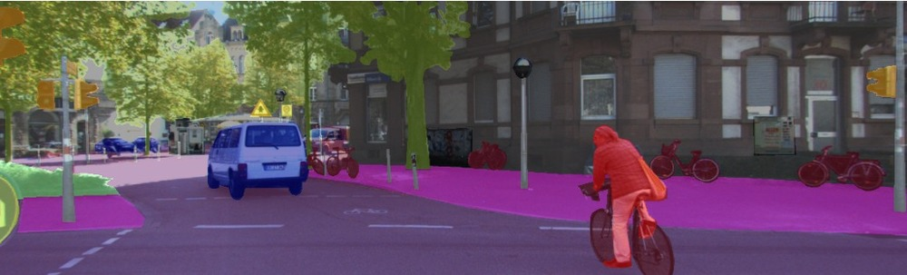

Test image without annotations:
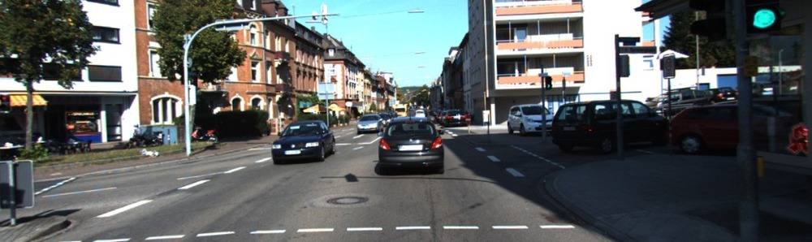


You can download the tutorial data and reproduce the entire experiment yourself.



We recommend to combine these techniques with other tutorials to obtain better results.


## Pipeline

1. Upload data. As a result we have the project `kitti-semseg-train` with annotated data and `kitti-semseg-test` with test images.

2. Apply the DTL query to build a new project `kitti-veh-tr`. We will merge a few classes (different vehicles) into a single one, drop objects of other classes and do special image augmentations to simulate image scaling we will use during inference. 

3. Train the UNetV2 network for cars segmentation task. As a result we will get the model `unet-kitti-veh`. 

4. Apply the `unet-kitti-veh` model to test images and analyse the results.


## Step 1. Prepare data for training and testing

Just download the archive from the official Kitty [site](http://www.cvlibs.net/datasets/kitti/eval_semseg.php?benchmark=semantics2015), unpack and import its content to the system. Supervisely supports Kitty format. Read more [here](../../data-organization/import/formats/kitti_semseg.md).

Let's go to `kitti-semseg-train` project -> Statistics -> Objects area. Supervisely automatically calculates all statistics in real time and it allows us to get valuable insigts from our data. Then we can use this information to create the "right" training set. This dataset contains 34 classes. Let's analyze the classes that have the largest area.

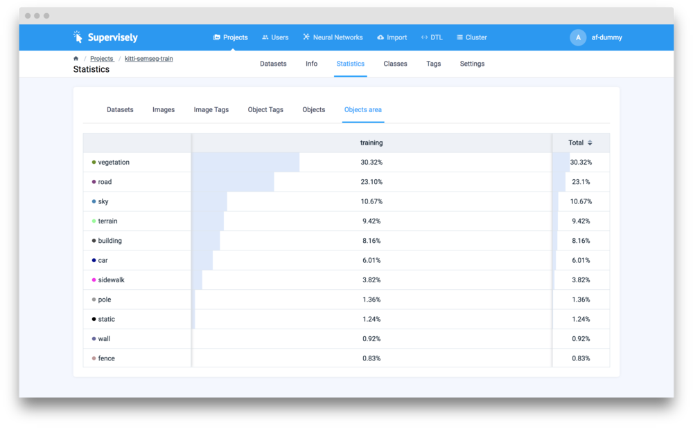

If we will be training a binary segmentation model (classes `car` and `background`) we will face the class imbalance problem. To deal with this we will use UNet V2 architecture with additional Dice loss function (it turns on automatically). 

## Step 2. Use DTL to prepare training data

We take the project `kitti-semseg-train` (200 images) and create a new one - `kitti-veh-tr` (2400 images). A few interesting comments:

1. The original dataset contains 34 classes.  If we want to train a car segmentation model we have to merge the corresponding classes into a single one and drop the other classes. We do it with Data layer  (first layer with `"action": "data"`). We map classes `bus`, `car`, `train`, `truck`, `caravan` and `trailer` to a single class `vehicle`. Other classes will be dropped (because of this field : `"__other__": "__ignore__"`). 

2. We multiply the images and their flipped versions and then perform crops with specific sizes. We are going to apply model in a [sliding window manner](../../neural-networks/configs/inference_config.md). That is why we have to construct a training set that will have similar images shapes. Example:

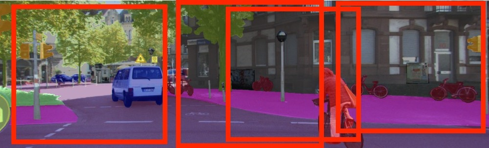

Here is the entire DTL query:

```json
[
  {
    "dst": "$sample",
    "src": [
      "kitti-semseg-train/*"
    ],
    "action": "data",
    "settings": {
      "classes_mapping": {
        "bus": "vehicle",
        "car": "vehicle",
        "train": "vehicle",
        "truck": "vehicle",
        "caravan": "vehicle",
        "trailer": "vehicle",
        "__other__": "__ignore__"
      }
    }
  },
  {
    "dst": "$sample1",
    "src": [
      "$sample"
    ],
    "action": "dataset",
    "settings": {
      "rule": "save_original"
    }
  },
  {
    "dst": [
      "$100-train",
      "$100-val"
    ],
    "src": [
      "$sample1"
    ],
    "action": "if",
    "settings": {
      "condition": {
        "probability": 0.95
      }
    }
  },
  {
    "dst": "$101-train",
    "src": [
      "$100-train"
    ],
    "action": "tag",
    "settings": {
      "tag": "train",
      "action": "add"
    }
  },
  {
    "dst": "$101-val",
    "src": [
      "$100-val"
    ],
    "action": "tag",
    "settings": {
      "tag": "val",
      "action": "add"
    }
  },
  {
    "dst": "$102",
    "src": [
      "$101-train",
      "$101-val"
    ],
    "action": "dummy",
    "settings": {}
  },
  {
    "dst": "$102-flipv",
    "src": [
      "$102"
    ],
    "action": "flip",
    "settings": {
      "axis": "vertical"
    }
  },
  {
    "dst": "$103",
    "src": [
      "$102",
      "$102-flipv"
    ],
    "action": "multiply",
    "settings": {
      "multiply": 6
    }
  },
  {
    "dst": "$104",
    "src": [
      "$103"
    ],
    "action": "crop",
    "settings": {
      "random_part": {
        "width": {
          "max_percent": 30,
          "min_percent": 27
        },
        "height": {
          "max_percent": 100,
          "min_percent": 90
        },
        "keep_aspect_ratio": false
      }
    }
  },
  {
    "dst": "kitti-veh-tr",
    "src": [
      "$104"
    ],
    "action": "supervisely",
    "settings": {}
  }
]
```

Detailed description:



In all previous tutorials at the end of DTL query we explicitly create an object of background class to cover all unlabeled pixels. Here we deliberately skip it just to show that all segmentation models will automatically create it before training if it is missed. 


	But we recomment to create it manually just to keep the experiments more clear for your teammates. 


## Step 3. Train the neural network

Basic step by step training guide is [here](../../neural-networks/training/training.md). It is the same for all models inside Supervisely. Detailed information regarding training configs is [here](../../neural-networks/configs/train_config.md). 

UNetV2 weights were initialized from the corresponding model from the Models list (UNetV2 with VGG weigths pretrained on ImageNet).

!!! hint "UnetV2 binary segmentation"
	For binary segmentation we prefer to use the UNetV2 architecture because it works well for the class imbalance problem like in this tutorial. This problem is partially solved with additional loss (Dice) we use during training.  Also it is fast to train and produces accurate predictions.


DeepLab v3 is a really deep, complex and "capricious" neural network. Sometimes when we have a small training dataset it is hard to train this architecture and achieve high accuracy. Usually this problem is solved by the means of long trainings and more complex augmentations. 


The esulting model will be named as `unet-kitti-veh`. The project `kitti-veh-tr` is used for training.

Training configuration:

```json
{
  "lr": 0.001,
  "epochs": 15,
  "val_every": 0.5,
  "batch_size": {
    "val": 6,
    "train": 14
  },
  "input_size": {
    "width": 256,
    "height": 256
  },
  "gpu_devices": [
    0,
    1,
    2
  ],
  "data_workers": {
    "val": 0,
    "train": 6
  },
  "dataset_tags": {
    "val": "val",
    "train": "train"
  },
  "special_classes": {
    "neutral": "neutral",
    "background": "bg"
  },
  "weights_init_type": "transfer_learning"
}
```

Training takes 17 minutes on three GPU devices. Here is the loss chart during training:
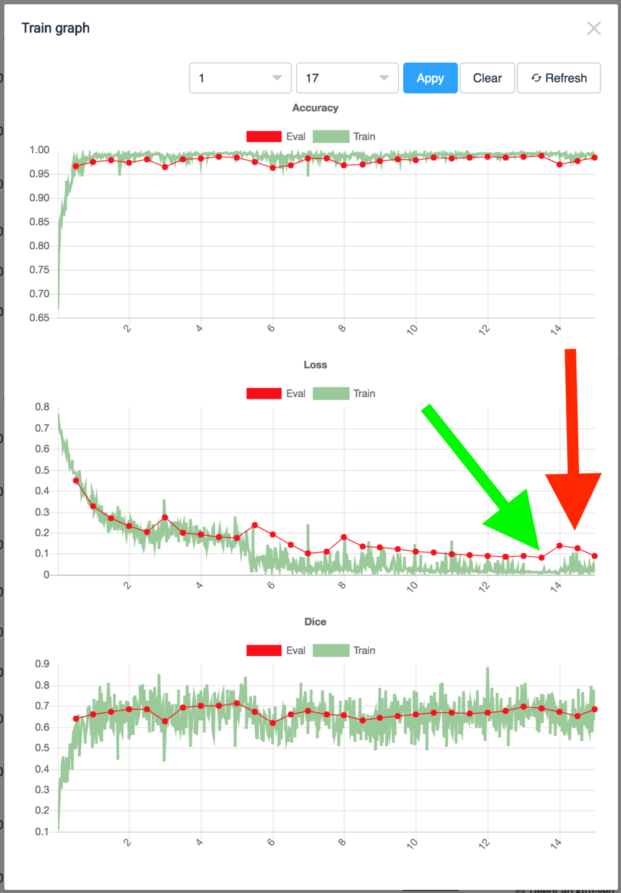

After training the last model checkpoint is saved to "My models" list. But we can see from the training chart that the last checkpoint is not the best in terms of loss and accuracy (red arrow). 

To make us safe from overfitting we took a checkpoint from epoch 13.5 (green arrow). For epoch 13.5 the checkpoint number is 27 because we automatically save checkpoint every 0.5 epoch (field `"val_every": 0.5` in the training config). You can find [here](../../neural-networks/checkpoints.md) how to do it. We assigned the `unet-kitti-veh (ckpt 27)` name to this restored model. 

!!! hint "Monitor training charts and test various checkpoints"
	We recommend to carefully monitor training charts to prevent overfitting or underfitting. Especially it is very important when we use a small training dataset. In this case restoring checkpoints is a key component of a successful research.

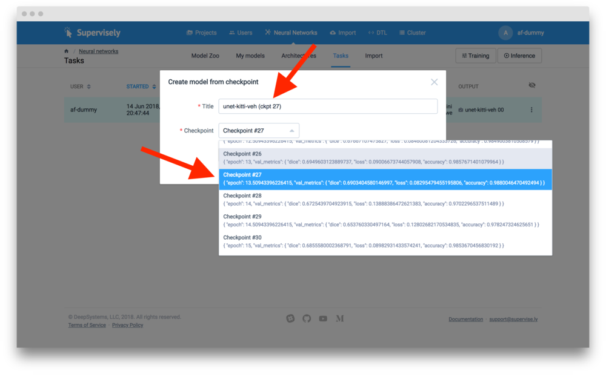

## Step 3. Apply NN to test images.

Basic step by step inference guide is [here](../../neural-networks/inference/inference.md). It is the same for all models inside Supervisely. The detailed information regarding inference configs is [here](../../neural-networks/configs/inference_config.md).

We apply the model `unet-kitti-veh (ckpt 27)` to the project `kitti-semseg-test`. The resulting project with neural network predictions will be saved as `kitti-test-vehunet-inf00`.

The inference configuration we used:

```json
{
  "mode": {
    "save": false,
    "source": "sliding_window",
    "window": {
      "width": 370,
      "height": 370
    },
    "min_overlap": {
      "x": 300,
      "y": 0
    }
  },
  "gpu_devices": [
    0
  ],
  "model_classes": {
    "add_suffix": "_dl",
    "save_classes": [
      "vehicle"
    ]
  },
  "existing_objects": {
    "add_suffix": "",
    "save_classes": []
  }
}
```

What dide we do? We applied inference in sliding window mode with a big overlap (300 px). Although most of the images have heights = 375, the height of the sliding window equals to 370 because there are some test images with height 370.

Also we defined `"save_classes": [ "vehicle" ]` just to automatically drop background object after inference. 

Here is the illustration of all sliding windows used: 


Here are a few examples of predictions. They look cool 😉

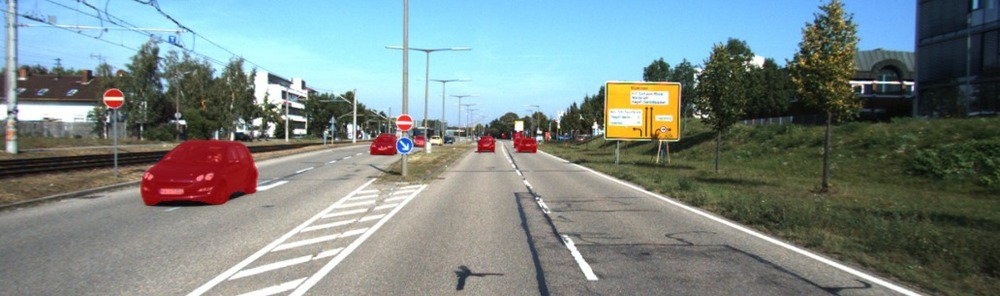

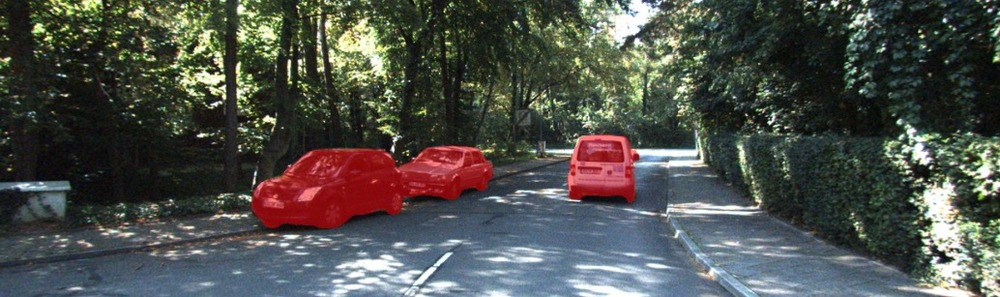

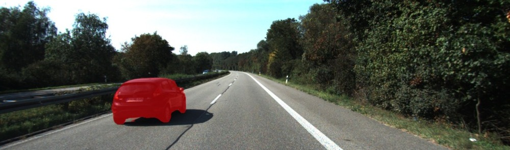

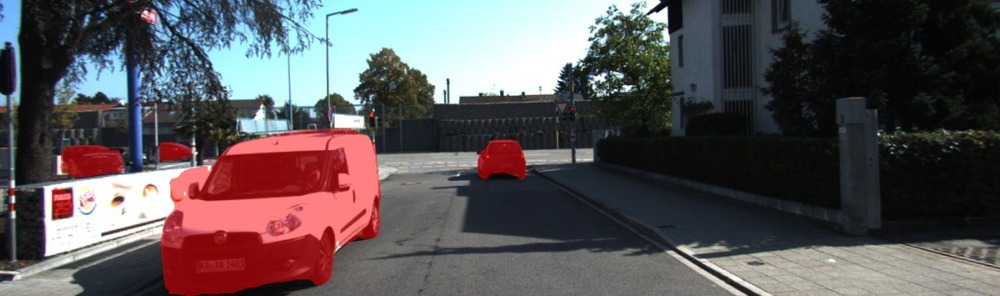

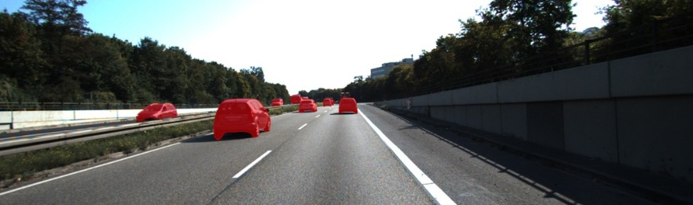

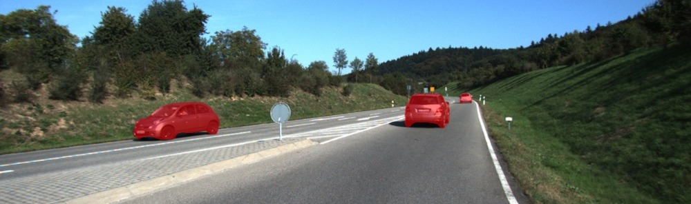

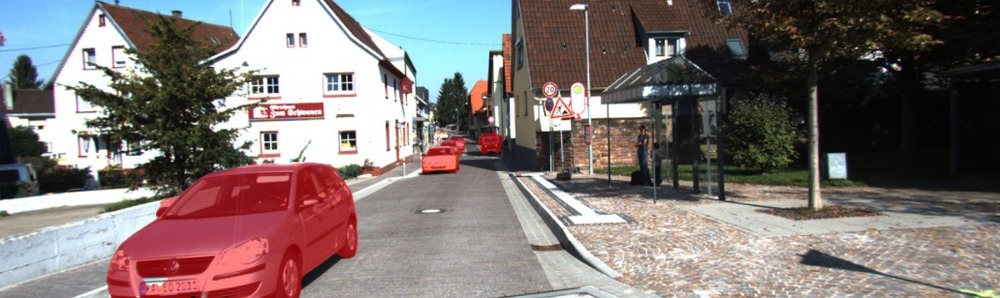


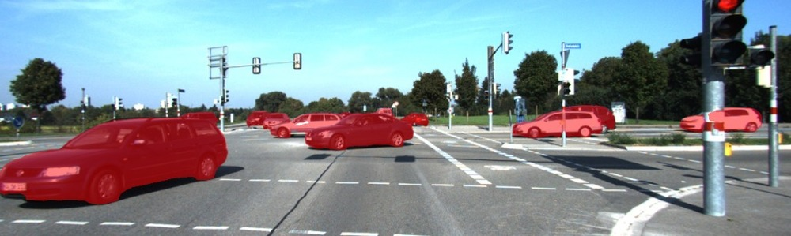

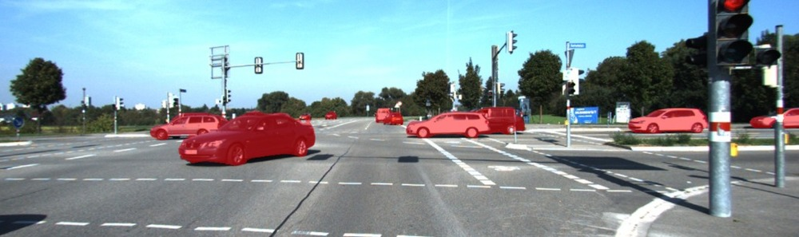

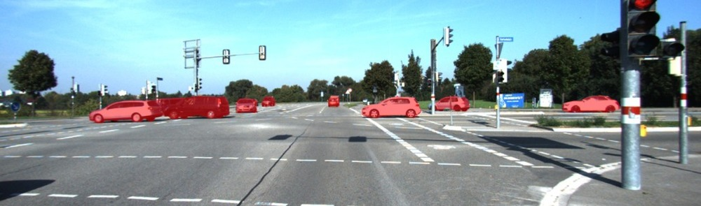

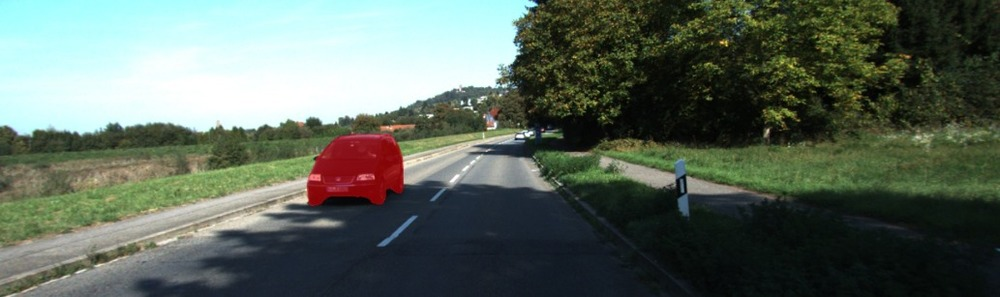

## Conclusion

For example, in combination with [human in the loop approach](../auto-roads-segm/auto-roads-segm.md) this allows to create complex pipelines inside Supervisely off the shelf without coding. Supervisely automates annotation work, routine tasks of data scientists and methodises/organises experiments with Neural Networks. Just download the resulting NN weights, get the sources from our repository and deploy the model to production whenever you want.

!!! sucess "Saves developers time"
	All neural networks inside Supervisely support all available inference modes thanks to our SDK. Sources are available so developers can customize them for their needs. 


