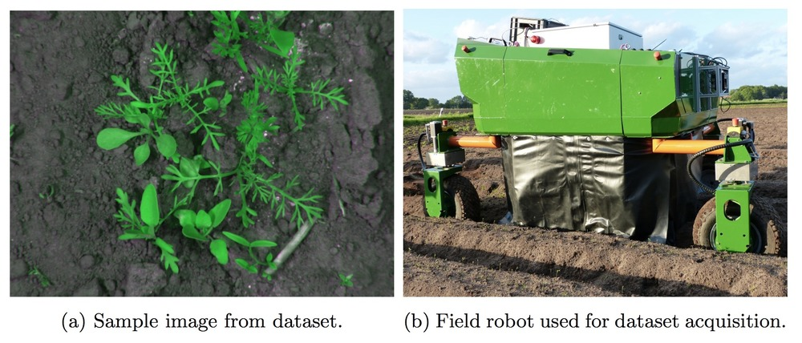
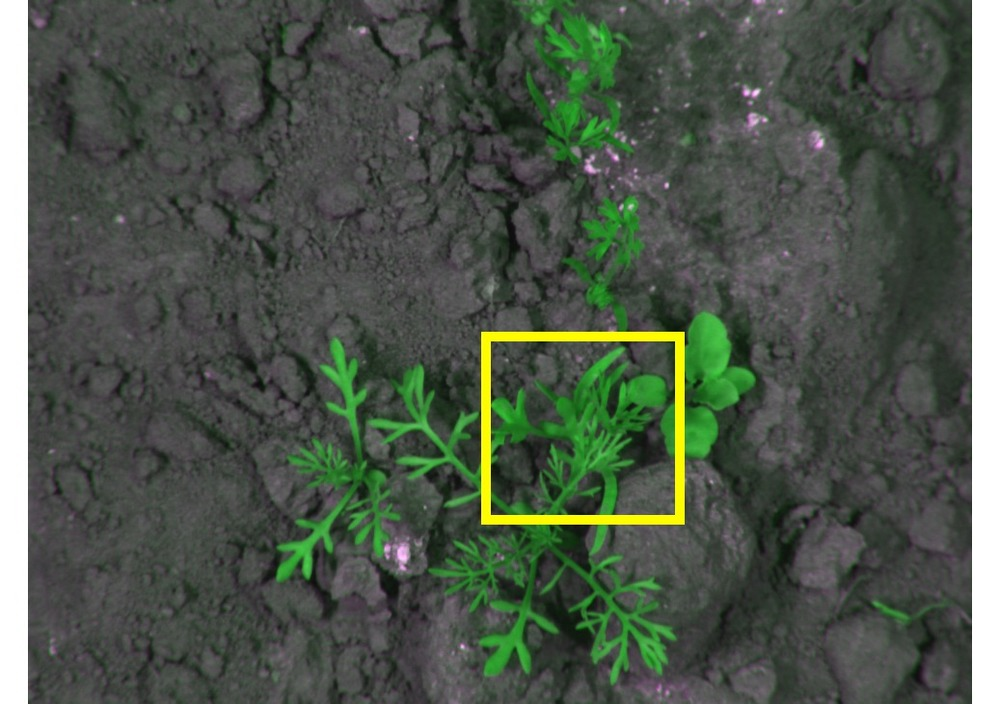
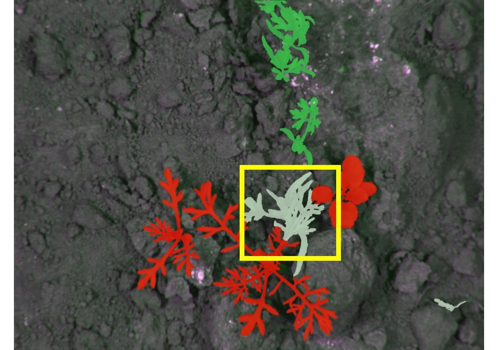
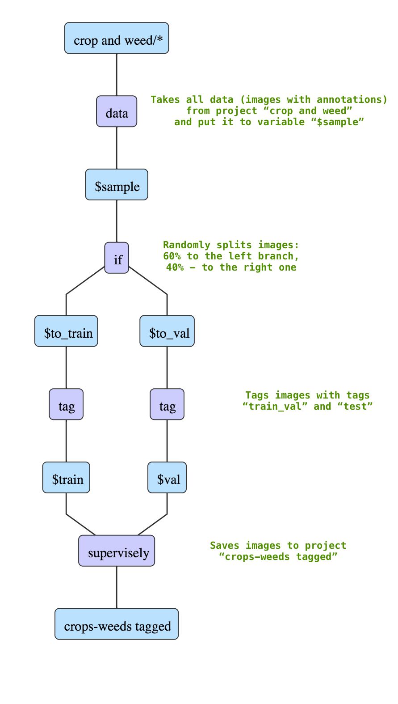
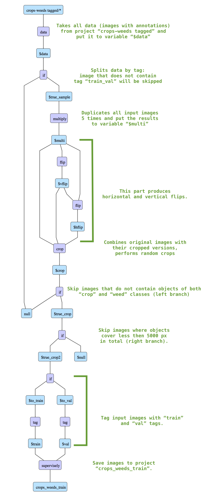
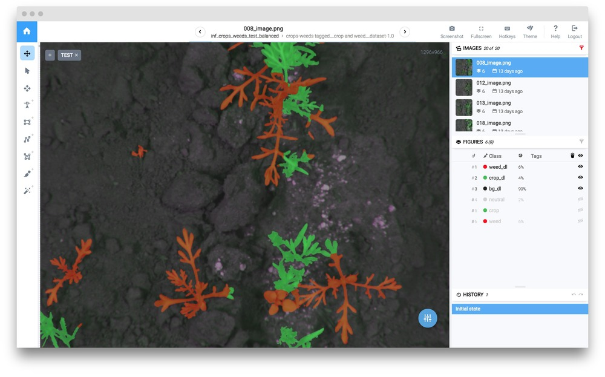
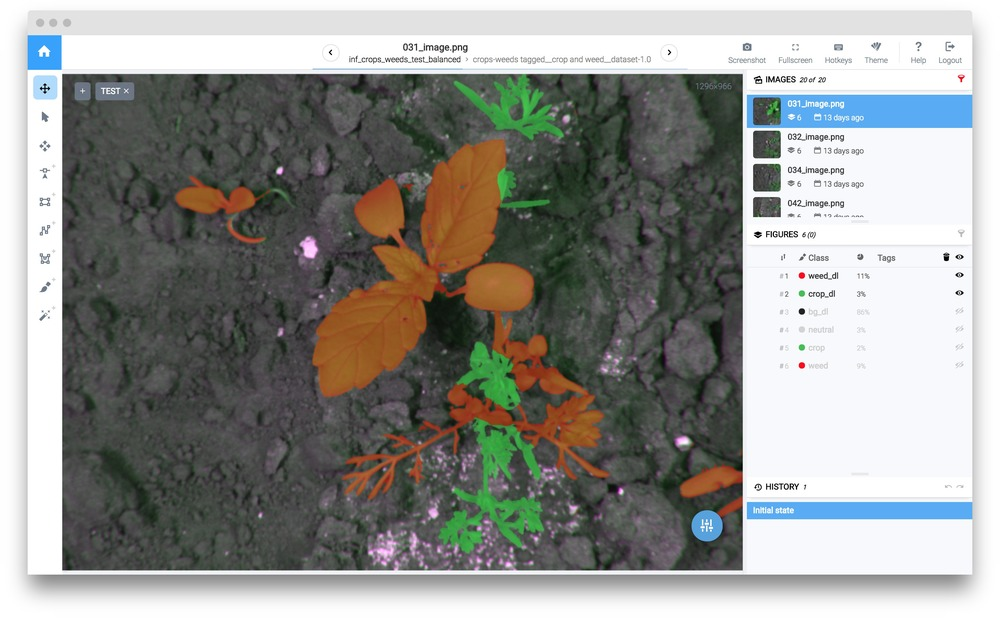

## Introducton

Automation in agriculture, intelligent farm management as well as robotic precision agriculture activities require detailed information about the environment, the field, the condition and the phenotype of individual plants. An increase in available data allows more automatic, precise, cost-effective and organic production of crops and vegetables.

This guide demonstrates how we can use neutral class to handle complex annotation scenarios (e.g. when it is hard to annotate manually some part of image). Then we will show how to train neural network with additional neutral class. 


This tutorial is a set of basic rules and procedures you can adapt and apply to your custom task. 


## Task description

In this tutorial we will use [Crop/Weed Field Image dataset](https://github.com/cwfid/dataset). The data was acquired with an autonomous field robot Bonirob.


You can download the data and reproduce the entire research yourself. The data may only be used for non-commercial purposes.




We have only 60 annotated images. We randomly chose 40 images for trainining and 20 images for testing. Here is an example of ground truth segmentation. There is an area on the image (yellow bouniding box) where it is really hard for human to decide whether it is a crop or a weed. Neutral area is segmentated with gray color. 


    

    
    

    



With neutral class user can annotate areas of images where it is not clear how to annotate or it is super time consuming. The image area that will be annotated as neutral class will be ignored during training (loss will not be computed for those pixels).  



## Step 1. Upload Crop/Weed Field Image Dataset

1) Download the original dataset from [github](https://github.com/cwfid/dataset).

2) Choose `crop_and_weed` import option

3) Drag `dataset-1.0` dir to the upload window

4) Name this project `crop and weed`. 

## Step 2. DTL #1: split annotated images to train/val/test

This dtl splits the original dataset into train-validation and test subsets using tags.

1) Layer #1 (`"action": "data"`) takes all data from project `crop and weed` and keeps classes as they are.

2) Layer #2 (`"action": "if"`) randomly splits data into two branches: first branch - 60% (will be tagged as `train_val`) and second branch - 40% (will be tagged as `test`).

3) Layer #3 (`"action": "tag"`) adds tag `train_val` to all input images.

4) Layer #4 (`"action": "tag"`) adds tag `test` to all input images.

5) Layer # 5 (`"action": "supervisely"`) saves results to the new project `crops-weeds tagged`.


```json
[
  {
    "dst": "$sample",
    "src": [
      "crop and weed/*"
    ],
    "action": "data",
    "settings": {
      "classes_mapping": "default"
    }
  },
  {
    "dst": [
      "$to_train",
      "$to_val"
    ],
    "src": [
      "$sample"
    ],
    "action": "if",
    "settings": {
      "condition": {
        "probability": 0.6
      }
    }
  },
  {
    "dst": "$train",
    "src": [
      "$to_train"
    ],
    "action": "tag",
    "settings": {
      "tag": "train_val",
      "action": "add"
    }
  },
  {
    "dst": "$val",
    "src": [
      "$to_val"
    ],
    "action": "tag",
    "settings": {
      "tag": "test",
      "action": "add"
    }
  },
  {
    "dst": "crops-weeds tagged",
    "src": [
      "$train",
      "$val"
    ],
    "action": "supervisely",
    "settings": {}
  }
]

```


A detailed description.




## Step 3. Dtl #2: create training project with augmentations

In this DTL query we apply transformations, filter images and split them into train and validation sets. Thus we get 677 images in training set from 40 images.

1) Layer #1 (`"action": "data"`) takes all data from the project `crops-weeds tagged` and keeps classes as they are.

2) Layer #2 (`"action": "if"`) splits the data into two branches based on tags. Further we will work only with the images that have tag `train_val`, other images will be sent to `null`.

3) Layer #3 (`"action": "multiply"`) creates 5 copies for each image.

4) Layer #4 (`"action": "flip"`) flips data horisontally. 

5) Layer #5 (`"action": "flip"`) flips data vertically. 

6) Layer #6 (`"action": "crop"`) performs random crops (from 37% to 55% in width and from 50% to 70% in height with respect to the image size)

7) Layer #7 (`"action": "if"`) filters the data (sends data containing objects of classes `crop` or `weed` to the first branch, other data will be sent to `null`).

8) Layer #8 (`"action": "if"`)  sends only the data where the area of objects of the class `crop` exceeds `5000` to the first branch, all other data will be sent to `null`. It allows us to balance the training dataset.

9) Layer #9 (`"action": "if"`) randomly splits the data into two branches: first branch - 90% (will be tagged as `train`) and second branch - 10% (will be tagged as `val`).

10) Layer #10 (`"action": "tag"`) adds the tag `train` to all input images.

11) Layer #11 (`"action": "tag"`) adds the tag `val` to all input images.

12) Layer #12 (`"action": "supervisely"`) saves results to the new project `crops_weeds_train`.

```json
[
  {
    "dst": "$data",
    "src": [
      "crops-weeds tagged/*"
    ],
    "action": "data",
    "settings": {
      "classes_mapping": "default"
    }
  },
  {
    "dst": [
      "$true_sample",
      "null"
    ],
    "src": [
      "$data"
    ],
    "action": "if",
    "settings": {
      "condition": {
        "tags": [
          "train_val"
        ]
      }
    }
  },
  {
    "dst": "$multi",
    "src": [
      "$true_sample"
    ],
    "action": "multiply",
    "settings": {
      "multiply": 5
    }
  },
  {
    "dst": "$vflip",
    "src": [
      "$multi"
    ],
    "action": "flip",
    "settings": {
      "axis": "vertical"
    }
  },
  {
    "dst": "$hflip",
    "src": [
      "$vflip",
      "$multi"
    ],
    "action": "flip",
    "settings": {
      "axis": "horizontal"
    }
  },
  {
    "dst": "$crop",
    "src": [
      "$multi",
      "$vflip",
      "$hflip"
    ],
    "action": "crop",
    "settings": {
      "random_part": {
        "width": {
          "max_percent": 55,
          "min_percent": 37
        },
        "height": {
          "max_percent": 70,
          "min_percent": 50
        }
      }
    }
  },
  {
    "dst": [
      "$true_crop",
      "null"
    ],
    "src": [
      "$crop"
    ],
    "action": "if",
    "settings": {
      "condition": {
        "include_classes": [
          "crop",
          "weed"
        ]
      }
    }
  },
  {
    "dst": [
      "$true_crop2",
      "$null"
    ],
    "src": [
      "$true_crop"
    ],
    "action": "if",
    "settings": {
      "condition": {
        "classes": [
          "crop"
        ],
        "sum_object_area": 5000
      }
    }
  },
  {
    "dst": [
      "$to_train",
      "$to_val"
    ],
    "src": [
      "$true_crop2"
    ],
    "action": "if",
    "settings": {
      "condition": {
        "probability": 0.9
      }
    }
  },
  {
    "dst": "$train",
    "src": [
      "$to_train"
    ],
    "action": "tag",
    "settings": {
      "tag": "train",
      "action": "add"
    }
  },
  {
    "dst": "$val",
    "src": [
      "$to_val"
    ],
    "action": "tag",
    "settings": {
      "tag": "val",
      "action": "add"
    }
  },
  {
    "dst": "crops_weeds_train",
    "src": [
      "$train",
      "$val"
    ],
    "action": "supervisely",
    "settings": {}
  }
]

```


Detailed description.




## Step 3. UNet training

Basic step by step training guide is [here](../../neural-networks/training/training.md). It is the same for all models inside Supervisely. The detailed information regarding training configs is [here](../../neural-networks/configs/train_config.md).

UNet encoder weights were initialized from the model that was trained on ImageNet.

For UNet training we used this configuration:

```json
{
    "lr": 0.001,
    "epochs": 5,
    "momentum": 0.9,
    "val_every": 1,
    "batch_size": {
      "val": 3,
      "train": 3
    },
    "input_size": {
      "width": 512,
      "height": 512
    },
    "gpu_devices": [
      0,
      1,
      2
    ],
    "data_workers": {
      "val": 0,
      "train": 3
    },
    "dataset_tags": {
      "val": "val",
      "train": "train"
    },
    "loss_weights": {
      "bce": 1,
      "dice": 1
    },
    "lr_decreasing": {
      "patience": 1000,
      "lr_divisor": 5
    },
    "special_classes": {
      "neutral": "neutral",
      "background": "bg"
    },
    "weights_init_type": "transfer_learning",
    "validate_with_model_eval": true
  }
```


Here we define special classes: `"neutral": "neutral"`. For example, if you have class `my_neutral_class` and you would like to set it as neutral class, you have to define: `"neutral": "my_neutral_class"`.

Training takes 4 minutes on three GPU devices.

## Step 4. Apply NN to test images. 

Basic step by step inference guide is [here](../../neural-networks/inference/inference.md). It is the same for all models inside Supervisely. Detailed information regarding inference configs is [here](../../neural-networks/configs/inference_config.md).

We apply the resulting model to the project `crops-weeds tagged` to analyse the predictions on both train and test images. 

We will apply the neural network to images in a sliding window manner. Inference configuration we used: 

```json
{
  "mode": {
    "save": false,
    "source": "sliding_window",
    "window": {
      "width": 512,
      "height": 512
    },
    "min_overlap": {
      "x": 128,
      "y": 128
    }
  },
  "gpu_devices": [
    0
  ],
  "model_classes": {
    "add_suffix": "_dl",
    "save_classes": "__all__"
  },
  "existing_objects": {
    "add_suffix": "",
    "save_classes": "__all__"
  }
}
```


Here are the examples of test images (these images were not included in the training set):






