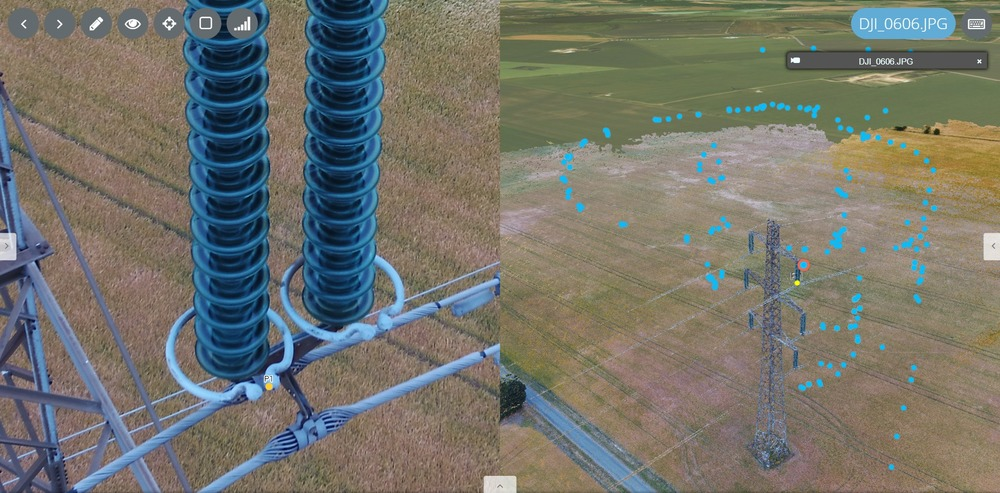
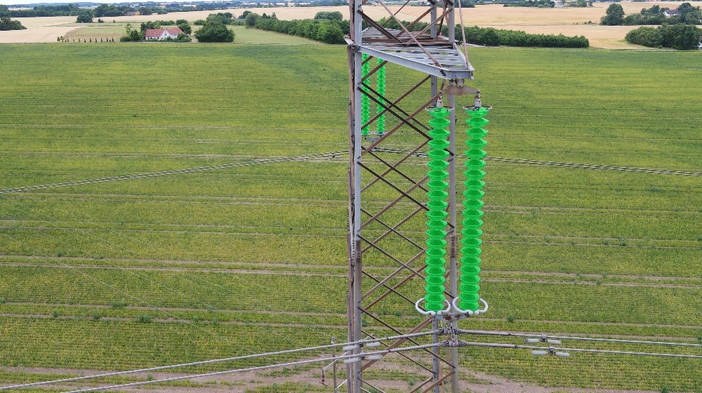
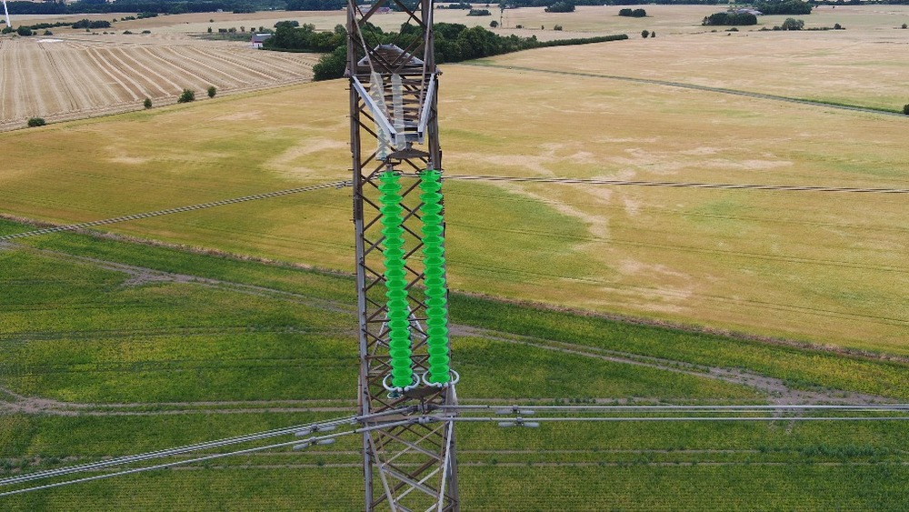
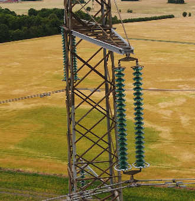
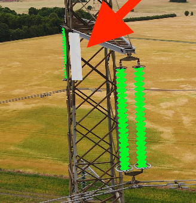
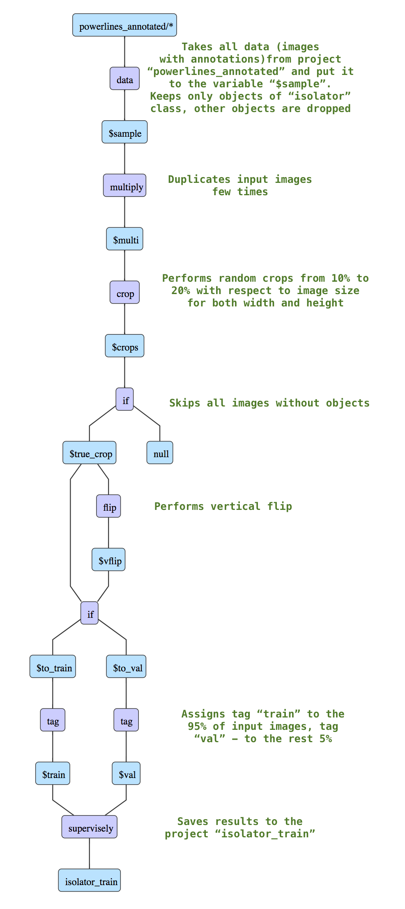
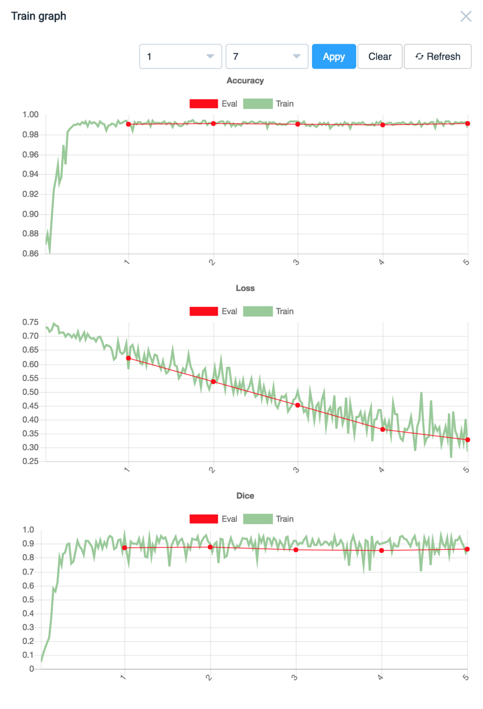
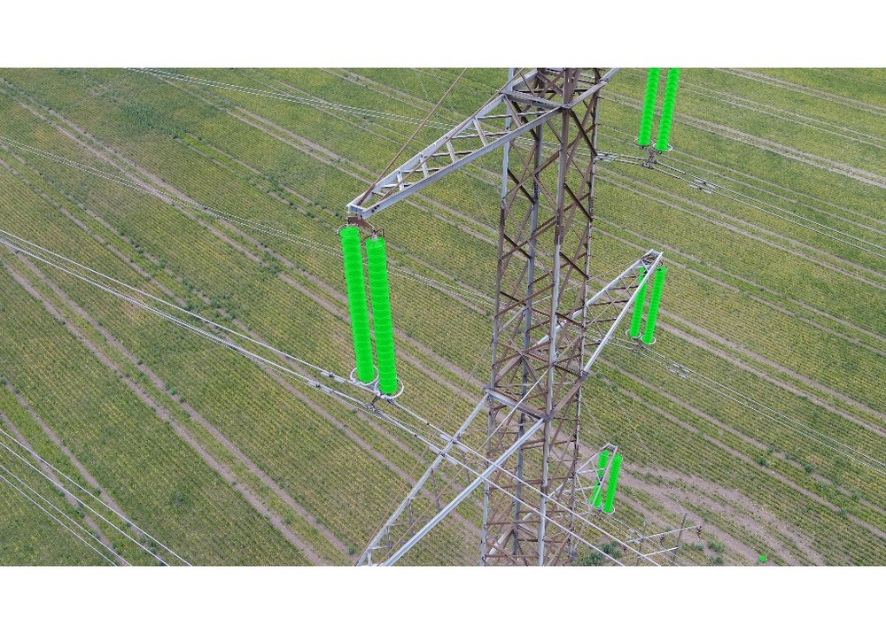
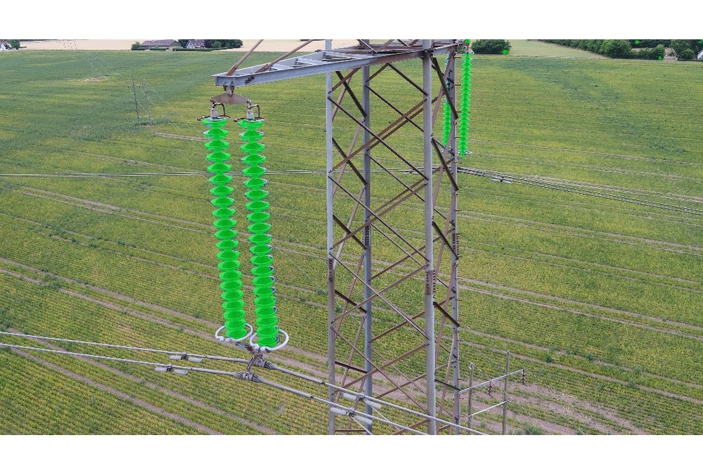

## Introduction

One of our clients [EasyInspect](https://www.easyinspect.io/) kindly agreed to showcase how they utilize innovative technologies to analyse powerlines with drones. This is what the inspection looks like in their platform:



## Task description

This guilde will demonstrate how Supervisely helps conduct research and build production level segmentation models. We are going to segment powerline isolators. We have only 22 annotated images. As you can see, the objects of interest are small compared to the size of image (~5000px x ~5000px).

Here are a few examples of the images:





To solve this task we will combine a few approaches: 

* basic augmentations with crops and flips to build a training dataset that models the data we will feed to the neural network during inference. Also we will try to slightly balance the dustribution of occupied classes area.

* sliding window inference because we cannot just resize input images. We are going to keep the input resolution to produce as accurate masks as possible.

* adding neutral class to deal with objects that are hard to annotate. Read more [here](../neutral-class/neutral-class.md).

## Some hints on data annotation

Here is an example of image with neutral class. You can see that it is really hard and time consuming to segment some isolators. So the fastest way is to segment only the simpler cases and mark the complex ones with neutral class.


    

    
    

    


## Step 1. DTL #1 to build training dataset

In this DTL query we apply crop and flip transformations, filter images and split them into train and validation sets. Thus we get 542 images from only 22 annotated images in the training set.

1. Layer #1 (`"action": "data"`) takes all data from the project `powerlines_annotated`, keeps objects of class "isolator", objects of other classes are dropped.

2. Layer #2 (`"action": "multiply"`) creates 50 copies for each image.

3. Layer #3 (`"action": "crop"`) performs random crops (from 10% to 20% in width and from 10% to 20% in height with respect to image size)

4. Layer #4 (`"action": "if"`) filters the data (sends data containing objects to the first branch, all other data will be sent to `null`).

5. Layer #5 (`"action": "flip"`) flips data horisontally.

6. Layer #6 (`"action": "if"`) randomly splits the data into two branches: first branch - 90% (will be tagged as `train`) and second branch - 10% (will be tagged as `val`).

7. Layer #7 (`"action": "tag"`) adds the tag `train` to all input images .

8. Layer #8 (`"action": "tag"`) adds the tag `val` to all input images.

9. Layer #9 (`"action": "supervisely"`) saves the results to the new project `isolator_train`.


``` json
[
  {
    "dst": "$sample",
    "src": [
      "powerlines_annotated/*"
    ],
    "action": "data",
    "settings": {
      "classes_mapping": {
        "Isolator": "Isolator",
        "neutral": "neutral",
        "__other__": "__ignore__"
      }
    }
  },
  {
    "dst": "$multi",
    "src": [
      "$sample"
    ],
    "action": "multiply",
    "settings": {
      "multiply": 50
    }
  },
  {
    "dst": "$crops",
    "src": [
      "$multi"
    ],
    "action": "crop",
    "settings": {
      "random_part": {
        "width": {
          "max_percent": 20,
          "min_percent": 10
        },
        "height": {
          "max_percent": 20,
          "min_percent": 10
        }
      }
    }
  },
  {
    "dst": [
      "$true_crop",
      "null"
    ],
    "src": [
      "$crops"
    ],
    "action": "if",
    "settings": {
      "condition": {
        "min_objects_count": 1
      }
    }
  },
  {
    "dst": "$vflip",
    "src": [
      "$true_crop"
    ],
    "action": "flip",
    "settings": {
      "axis": "vertical"
    }
  },
  {
    "dst": [
      "$to_train",
      "$to_val"
    ],
    "src": [
      "$true_crop",
      "$vflip"
    ],
    "action": "if",
    "settings": {
      "condition": {
        "probability": 0.95
      }
    }
  },
  {
    "dst": "$train",
    "src": [
      "$to_train"
    ],
    "action": "tag",
    "settings": {
      "tag": "train",
      "action": "add"
    }
  },
  {
    "dst": "$val",
    "src": [
      "$to_val"
    ],
    "action": "tag",
    "settings": {
      "tag": "val",
      "action": "add"
    }
  },
  {
    "dst": "isolator_train",
    "src": [
      "$train",
      "$val"
    ],
    "action": "supervisely",
    "settings": {}
  }
]
```

Graphical description of DTL query:




## Step 3. Train neural network

Basic step by step training guide is [here](../../neural-networks/training/training.md). It is the same for all models inside Supervisely. Detailed information regarding training configs is [here](../../neural-networks/configs/train_config.md). 

UNetV2 weights were initialized from the corresponding model from the Models list (UNetV2 with VGG weigths that was pretrained on ImageNet).

!!! hint "UnetV2 binary segmentation"
	For binary segmentation we prefer to use UNetV2 architecture because it works well for class imbalance problem like in this tutorial. This problem is partially solved with additional loss (Dice) we use during training. Also it is fast to train and produces accurate predictions.

Resulting model will be named `UNetV2 isolator 10ep 1e-4`. Project `isolator_train` is used for training.

Training configuration:

```json
{
  "lr": 0.0001,
  "epochs": 10,
  "val_every": 1,
  "batch_size": {
    "val": 6,
    "train": 12
  },
  "input_size": {
    "width": 256,
    "height": 256
  },
  "gpu_devices": [
    0
  ],
  "data_workers": {
    "val": 0,
    "train": 3
  },
  "dataset_tags": {
    "val": "val",
    "train": "train"
  },
  "special_classes": {
    "neutral": "neutral",
    "background": "bg"
  },
  "weights_init_type": "transfer_learning"
}
```

Training takes ~ 10 minutes on a single GPU. Here is the loss chart during training:



Please, choose learning rate carefully. If the training is slow, just change it to `0.001` or higher. 


After training the last model checkpoint is saved to "My models" list. We see from the training chart that the last checkpoint is the best in terms of loss and accuracy.  

!!! hint "Monitor training charts and test various checkpoints"
	We recommend to carefully monitor training charts to prevent overfitting or underfitting. Especially it is very important when we use a small training dataset. In this case restoring checkpoints is a key component to successful research. You can find How to do it [here](../../neural-networks/checkpoints.md).


## Step 3. Apply NN to test images.

Basic step by step inference guide is [here](../../neural-networks/inference/inference.md). It is the same for all models inside Supervisely. Detailed information regarding inference configs is [here](../../neural-networks/configs/inference_config.md).

We apply the model `UNetV2 isolator 10ep 1e-4` to test images. Th resulting project with neural network predictions will be saved as `inf_powerlines_test_01`.

The inference configuration we used:

```json
{
  "mode": {
    "save": false,
    "source": "sliding_window",
    "window": {
      "width": 512,
      "height": 512
    },
    "min_overlap": {
      "x": 128,
      "y": 128
    }
  },
  "gpu_devices": [
    0
  ],
  "model_classes": {
    "add_suffix": "_unet",
    "save_classes": [
      "Isolator"
    ]
  },
  "existing_objects": {
    "add_suffix": "",
    "save_classes": []
  }
}
```

What did we do? We applied inference in sliding window mode with big overlap (128 px).

Also we defined `"save_classes": [ "Isolator" ]` just to automatically drop background object after inference. 


As you can see we trained neural network on the resolution 256 X 256. But here the size of sliding window is 512 X 512. It means that before feeding sliding window images to neural network they will be resized from 512 X 512 to 256 X 256. In our experiments it produces nice results. But we strongly recommend to play with this parameter.


Here is the illustration of all sliding windows we used: 


Here are a few examples of predictions. They look cool 😉





## Conclusion

The entire research took about 30 minutes without haste. It means that research team can be more efficient, all experiments will be trackable and reproducible. 

