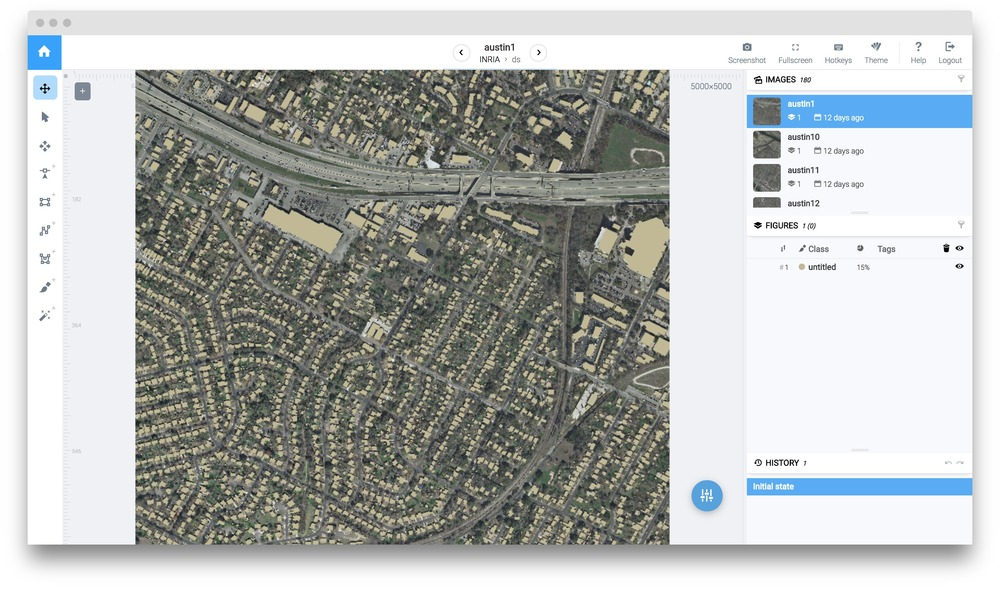
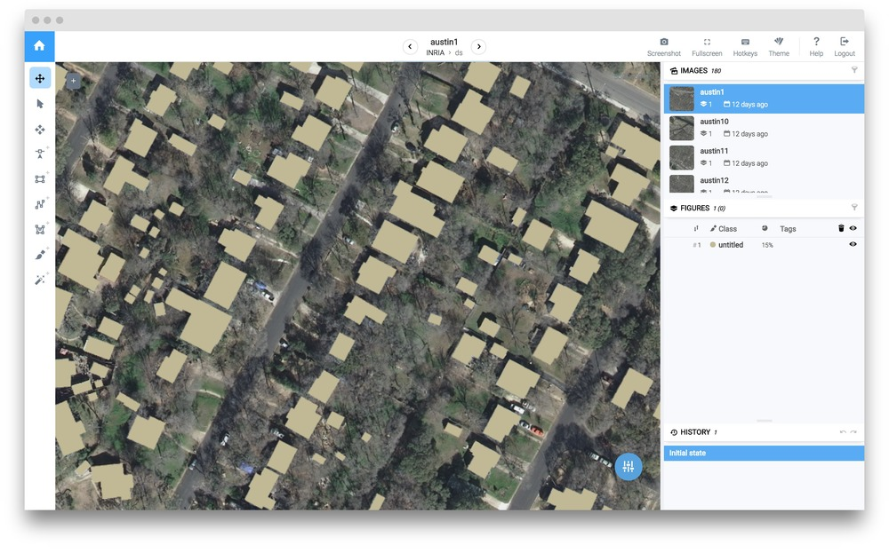
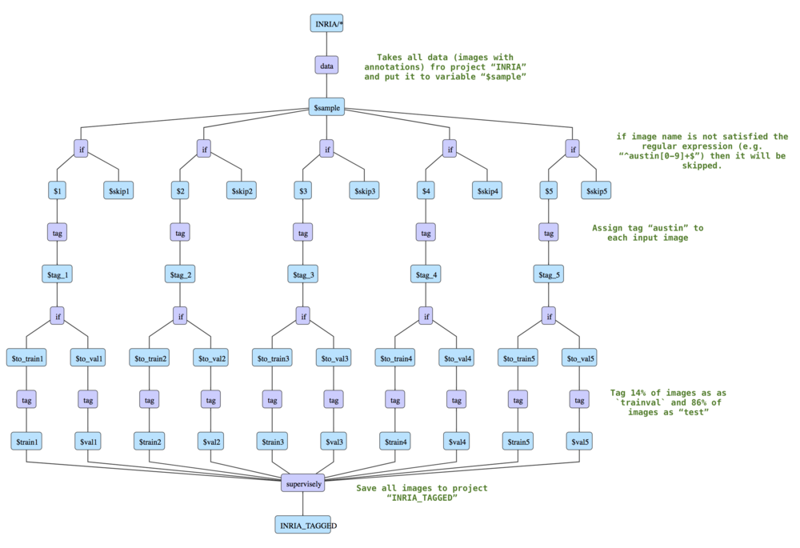
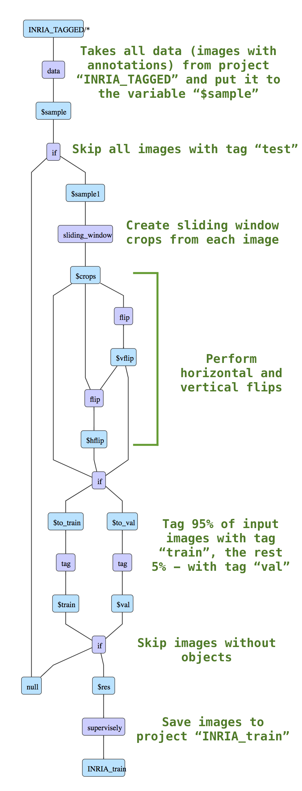
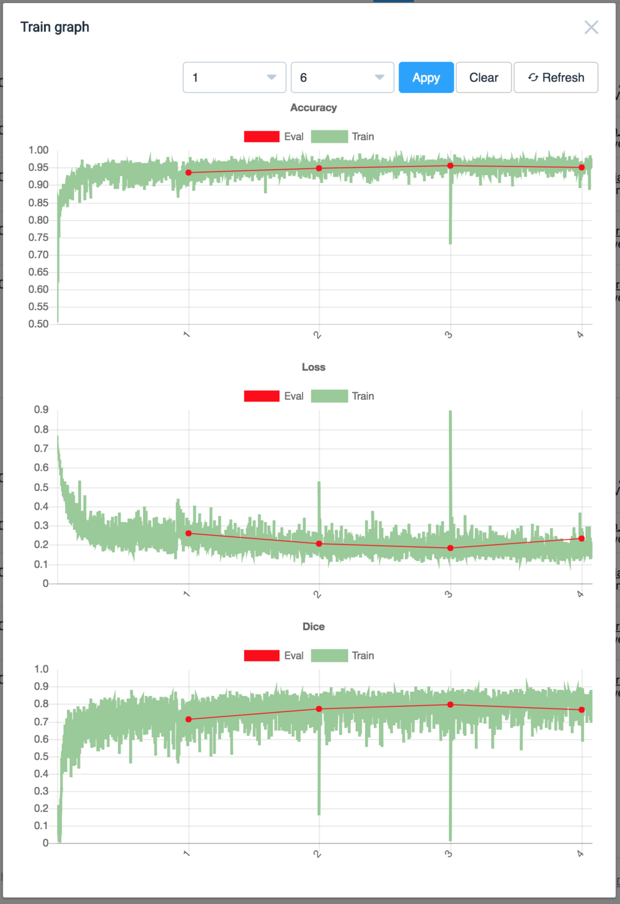
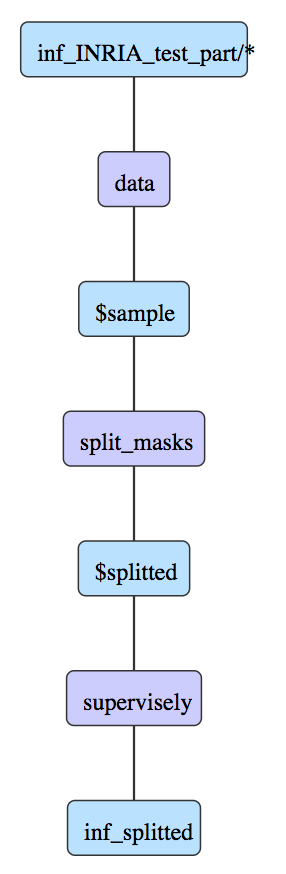

## Introduction

This guide addresses a core topic in remote sensing: the automatic pixelwise labeling of aerial imagery. There are many use cases for analytics on satellite data ranging from tracking of different objects to segmenting houses, roads, etc. Today Deep Learning approaches are at the core of many production solutions. When applying machine learning (ML) to satellite data there are a few typical challenges that often arise:

* The size of images: Images may have high resolution, so data will be in the tens of gigabytes. With continuous data updates image collection can quickly reach multiple terabytes.

* Custom machine learning: many out-of-the-box solutions do not achive acceptable accuracies without customization. In addition sometimes unconventional pre- and post- processing steps are required. 

## Task description

Today we are going to demonstrate how users can build a custom neural network for buildings segmentation inside Supervisely. 


We will show how to perform special training data preparations (DTL layer: sliding window crops), train a neural network, apply it to test images in a sliding window manner and then postprocess predictions (split single prediction mask into separate objects).


For this tutorial we will use [The Inria Aerial Image Labeling Dataset](https://project.inria.fr/aerialimagelabeling/). 






You can download the data and reproduce the entire research yourself. The data may only be used for non-commercial purposes.



## Step 1. Upload INRIA dataset

1. Download [original dataset](https://project.inria.fr/aerialimagelabeling/)

2. Unzip the archive, open the `train` folder and rename the `gt` folder to `ann`

3. Choose the `binary_masks` import option 

4. Drag `images` and `ann` dirs to the upload window

5. Name this project `INRIA`

## Step 2. DTL #1 to split data to train/val/test

This DTL query splits the original dataset into train-validation and test subsets taking approximately the same number of images from each town (around 5 images per town).

1. Layer #1 (`"action": "data"`) takes all data from project `INRIA` and keeps classes as they are.
Then there are five indentical branches for each town (Austin, Chicago, Kitsap County, Vienna and West Tyrol), so we will describe only one of them for Austin.

2. Layer #2 (`"action": "if"`) selects the data related to `austin`, other data is sent to `$null1`.

2. Layer #3 (`"action": "tag"`) adds tag `austin` to each input image.

3. Layer #4 (`"action": "if"`) randomly splits the data into two branches: first branch - 14% (will be tagged as `trainval`) and second branch - 86% (will be tagged as `test`). We decreased the number of training images to demonstrate that entire pipline can be passed with a small number of annotated images. 

4. Layer #5 (`"action": "tag"`) adds tag `train` to all input images.

5. Layer #6 (`"action": "tag"`) adds tag `val` to all input images .

6. Layer #7 (`"action": "supervisely"`) saves results to the new project `INRIA_TAGGED`.  


```json
[
  {
    "dst": "$sample",
    "src": [
      "INRIA/*"
    ],
    "action": "data",
    "settings": {
      "classes_mapping": "default"
    }
  },
  {
    "dst": [
      "$1",
      "null"
    ],
    "src": [
      "$sample"
    ],
    "action": "if",
    "settings": {
      "condition": {
        "regex_names": [
          "^austin[0-9]+$"
        ]
      }
    }
  },
  {
    "dst": "$tag_1",
    "src": [
      "$1"
    ],
    "action": "tag",
    "settings": {
      "tag": "austin",
      "action": "add"
    }
  },
  {
    "dst": [
      "$to_train1",
      "$to_val1"
    ],
    "src": [
      "$tag_1"
    ],
    "action": "if",
    "settings": {
      "condition": {
        "probability": 0.14
      }
    }
  },
  {
    "dst": "$train1",
    "src": [
      "$to_train1"
    ],
    "action": "tag",
    "settings": {
      "tag": "trainval",
      "action": "add"
    }
  },
  {
    "dst": "$val1",
    "src": [
      "$to_val1"
    ],
    "action": "tag",
    "settings": {
      "tag": "test",
      "action": "add"
    }
  },
  {
    "dst": [
      "$2",
      "null"
    ],
    "src": [
      "$sample"
    ],
    "action": "if",
    "settings": {
      "condition": {
        "regex_names": [
          "^chicago[0-9]+$"
        ]
      }
    }
  },
  {
    "dst": "$tag_2",
    "src": [
      "$2"
    ],
    "action": "tag",
    "settings": {
      "tag": "chicago",
      "action": "add"
    }
  },
  {
    "dst": [
      "$to_train2",
      "$to_val2"
    ],
    "src": [
      "$tag_2"
    ],
    "action": "if",
    "settings": {
      "condition": {
        "probability": 0.14
      }
    }
  },
  {
    "dst": "$train2",
    "src": [
      "$to_train2"
    ],
    "action": "tag",
    "settings": {
      "tag": "trainval",
      "action": "add"
    }
  },
  {
    "dst": "$val2",
    "src": [
      "$to_val2"
    ],
    "action": "tag",
    "settings": {
      "tag": "test",
      "action": "add"
    }
  },
  {
    "dst": [
      "$3",
      "null"
    ],
    "src": [
      "$sample"
    ],
    "action": "if",
    "settings": {
      "condition": {
        "regex_names": [
          "^kitsap[0-9]+$"
        ]
      }
    }
  },
  {
    "dst": "$tag_3",
    "src": [
      "$3"
    ],
    "action": "tag",
    "settings": {
      "tag": "kitsap",
      "action": "add"
    }
  },
  {
    "dst": [
      "$to_train3",
      "$to_val3"
    ],
    "src": [
      "$tag_3"
    ],
    "action": "if",
    "settings": {
      "condition": {
        "probability": 0.14
      }
    }
  },
  {
    "dst": "$train3",
    "src": [
      "$to_train3"
    ],
    "action": "tag",
    "settings": {
      "tag": "trainval",
      "action": "add"
    }
  },
  {
    "dst": "$val3",
    "src": [
      "$to_val3"
    ],
    "action": "tag",
    "settings": {
      "tag": "test",
      "action": "add"
    }
  },
  {
    "dst": [
      "$4",
      "null"
    ],
    "src": [
      "$sample"
    ],
    "action": "if",
    "settings": {
      "condition": {
        "regex_names": [
          "^tyrol-w[0-9]+$"
        ]
      }
    }
  },
  {
    "dst": "$tag_4",
    "src": [
      "$4"
    ],
    "action": "tag",
    "settings": {
      "tag": "tyrol-w",
      "action": "add"
    }
  },
  {
    "dst": [
      "$to_train4",
      "$to_val4"
    ],
    "src": [
      "$tag_4"
    ],
    "action": "if",
    "settings": {
      "condition": {
        "probability": 0.14
      }
    }
  },
  {
    "dst": "$train4",
    "src": [
      "$to_train4"
    ],
    "action": "tag",
    "settings": {
      "tag": "trainval",
      "action": "add"
    }
  },
  {
    "dst": "$val4",
    "src": [
      "$to_val4"
    ],
    "action": "tag",
    "settings": {
      "tag": "test",
      "action": "add"
    }
  },
  {
    "dst": [
      "$5",
      "null"
    ],
    "src": [
      "$sample"
    ],
    "action": "if",
    "settings": {
      "condition": {
        "regex_names": [
          "^vienna[0-9]+$"
        ]
      }
    }
  },
  {
    "dst": "$tag_5",
    "src": [
      "$5"
    ],
    "action": "tag",
    "settings": {
      "tag": "vienna",
      "action": "add"
    }
  },
  {
    "dst": [
      "$to_train5",
      "$to_val5"
    ],
    "src": [
      "$tag_5"
    ],
    "action": "if",
    "settings": {
      "condition": {
        "probability": 0.14
      }
    }
  },
  {
    "dst": "$train5",
    "src": [
      "$to_train5"
    ],
    "action": "tag",
    "settings": {
      "tag": "trainval",
      "action": "add"
    }
  },
  {
    "dst": "$val5",
    "src": [
      "$to_val5"
    ],
    "action": "tag",
    "settings": {
      "tag": "test",
      "action": "add"
    }
  },
  {
    "dst": "INRIA_TAGGED",
    "src": [
      "$train1",
      "$val1",
      "$train2",
      "$val2",
      "$train3",
      "$val3",
      "$train4",
      "$val4",
      "$train5",
      "$val5"
    ],
    "action": "supervisely",
    "settings": {}
  }
]
```



## Step 3. DTL #2 prepare training project

In this DTL query we filter images, apply transformations and split them into train and validation sets.

1. Layer #1 (`"action": "data"`) takes all data from project `INRIA_TAGGED` and keeps classes as they are.

2. Layer #2 (`"action": "if"`) splits the data into two branches based on tags. Further we will work only with the images which have tag `trainval`, other images will be sent to `null`.

3. Layer #3 (`"action": "sliding_window"`) creates crops of size 512x512 from the images using sliding window approach.

4. Layer #4 (`"action": "flip"`) flips data horisontally. 

5. Layer #5 (`"action": "flip"`) flips data vertically. 

6. Layer #6 (`"action": "if"`) randomly splits the data into two branches: first branch - 95% (will be tagged as `train`) and second branch - 5% (will be tagged as `val`).

7. Layer #7 (`"action": "tag"`) adds the tag `train` to all input images .

8. Layer #8 (`"action": "tag"`) adds the tag `val` to all input images.

9. Layer #9 (`"action": "if"`) filters the data (images without objects will be skipped).

10. Layer #10 (`"action": "supervisely"`) saves results to the new project `INRIA_train`. As a result we got around 7000 images for training.


```json
[
  {
    "dst": "$sample",
    "src": [
      "INRIA_TAGGED/*"
    ],
    "action": "data",
    "settings": {
      "classes_mapping": "default"
    }
  },
  {
    "dst": [
      "$sample1",
      "null"
    ],
    "src": [
      "$sample"
    ],
    "action": "if",
    "settings": {
      "condition": {
        "tags": [
          "trainval"
        ]
      }
    }
  },
  {
    "dst": "$crops",
    "src": [
      "$sample1"
    ],
    "action": "sliding_window",
    "settings": {
      "window": {
        "width": 512,
        "height": 512
      },
      "min_overlap": {
        "x": 0,
        "y": 0
      }
    }
  },
  {
    "dst": "$vflip",
    "src": [
      "$crops"
    ],
    "action": "flip",
    "settings": {
      "axis": "vertical"
    }
  },
  {
    "dst": "$hflip",
    "src": [
      "$crops",
      "$vflip"
    ],
    "action": "flip",
    "settings": {
      "axis": "horizontal"
    }
  },
  {
    "dst": [
      "$to_train",
      "$to_val"
    ],
    "src": [
      "$crops",
      "$hflip",
      "$vflip"
    ],
    "action": "if",
    "settings": {
      "condition": {
        "probability": 0.95
      }
    }
  },
  {
    "dst": "$train",
    "src": [
      "$to_train"
    ],
    "action": "tag",
    "settings": {
      "tag": "train",
      "action": "add"
    }
  },
  {
    "dst": "$val",
    "src": [
      "$to_val"
    ],
    "action": "tag",
    "settings": {
      "tag": "val",
      "action": "add"
    }
  },
  {
    "dst": [
      "$res",
      "null"
    ],
    "src": [
      "$train",
      "$val"
    ],
    "action": "if",
    "settings": {
      "condition": {
        "min_objects_count": 1
      }
    }
  },
  {
    "dst": "INRIA_train",
    "src": [
      "$res"
    ],
    "action": "supervisely",
    "settings": {}
  }
]

```



## Step 3. UNet training

Basic step by step training guide is [here](../../neural-networks/training/training.md). It is the same for all models inside Supervisely. Detailed information regarding training configs is [here](../../neural-networks/configs/train_config.md). 

UNetV2's encoder weights were initialized from corresponding model from Model Zoo (UNetV2 with VGG weigths that was pretrained on ImageNet).

Training config:

```json
{
  "lr": 0.001,
  "epochs": 5,
  "val_every": 1,
  "batch_size": {
    "val": 3,
    "train": 3
  },
  "input_size": {
    "width": 512,
    "height": 512
  },
  "gpu_devices": [
    0,
    1,
    2
  ],
  "data_workers": {
    "val": 3,
    "train": 3
  },
  "dataset_tags": {
    "val": "val",
    "train": "train"
  },
  "special_classes": {
    "neutral": "neutral",
    "background": "bg"
  },
  "weights_init_type": "transfer_learning"
}

```

Training took ~ 1 hour. 

Here are the training charts:



## Step 4. Inference

Sliding window inference:

```json
{
  "mode": {
    "save": false,
    "source": "sliding_window",
    "window": {
      "width": 512,
      "height": 512
    },
    "min_overlap": {
      "x": 128,
      "y": 128
    }
  },
  "gpu_devices": [
    0
  ],
  "model_classes": {
    "add_suffix": "_dl",
    "save_classes": "__all__"
  },
  "existing_objects": {
    "add_suffix": "",
    "save_classes": []
  }
}
```

Here is an example of NN predictions:


## Step 5. DTL #3 to split prediction mask to separate objects

Before splitting all buildings are on a single mask:


After the DTL query all buildings are split into different masks:


Here is a simple example of the DTL query:

```json
[
  {
    "dst": "$sample",
    "src": [
      "inf_INRIA_test_part/*"
    ],
    "action": "data",
    "settings": {
      "classes_mapping": "default"
    }
  },
  {
    "dst": "$splitted",
    "src": [
      "$sample"
    ],
    "action": "split_masks",
    "settings": {
      "classes": [
        "untitled_dl"
      ]
    }
  },
  {
    "dst": "inf_splitted",
    "src": [
      "$splitted"
    ],
    "action": "supervisely",
    "settings": {}
  }
]
```

Here is the visualization of DTL query:




